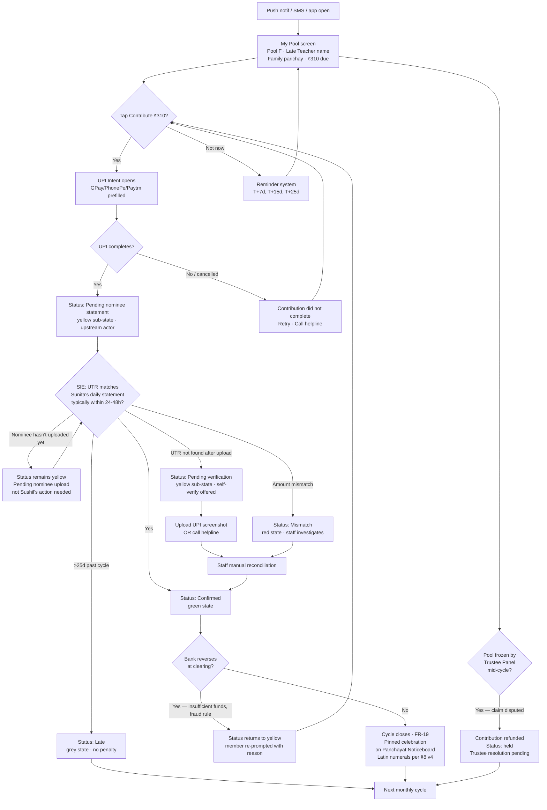
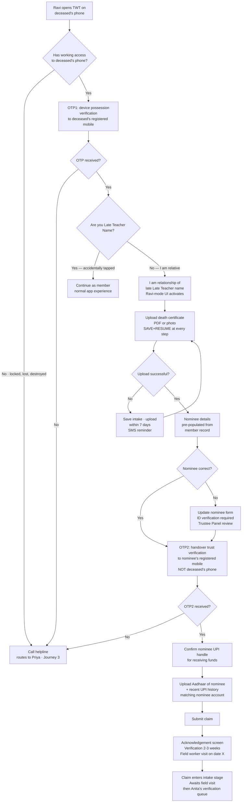
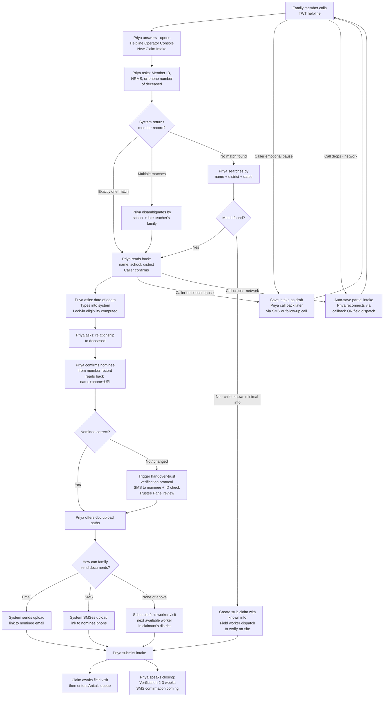
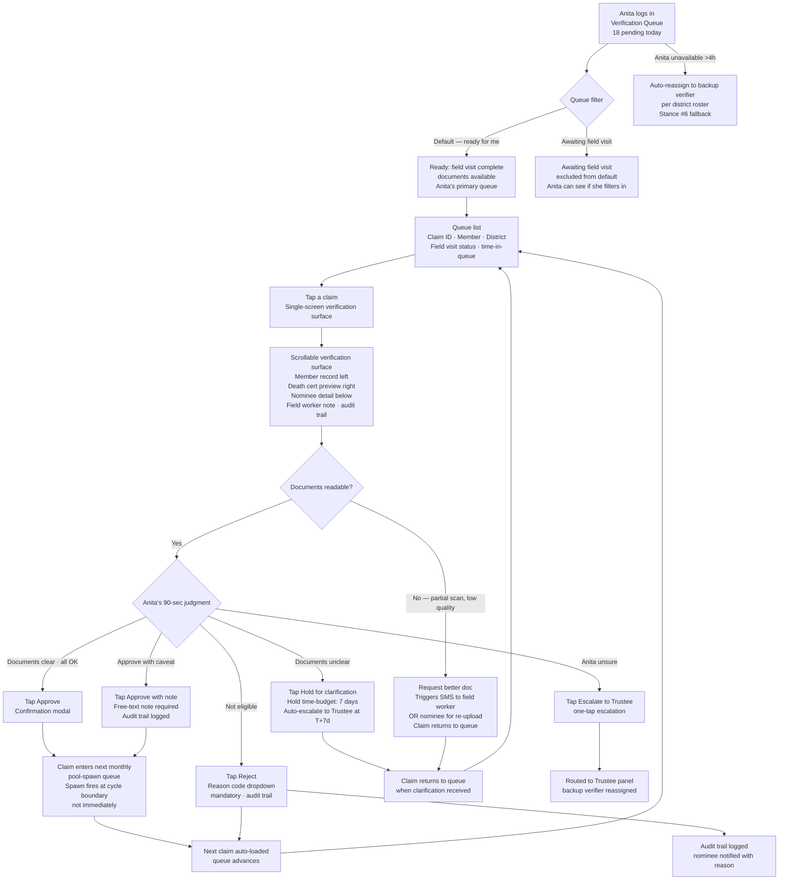
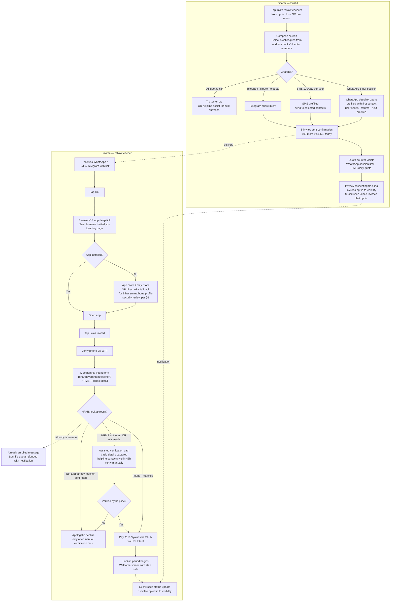

# UX Design Specification — TWT

**Author:** BigDev
**Date:** 2026-05-23

<!-- UX design content will be appended sequentially through collaborative workflow steps -->

## Executive Summary

### Project Vision

TWT v1 is a **mobile-first member app + admin UI + public website + helpline operator console** for a Bihar government-teachers mutual-aid trust. Members pay a mandatory ₹110/year Vyawastha Shulk and, after lock-in, contribute a trustee-set fixed amount (~₹310–400) each month directly to the nominee of a deceased colleague via UPI Intent — no payment gateway, no trust intermediation of support money. The system spawns one pool per approved claim per cycle, deterministically assigns every active member to exactly one pool, and reconciles contributions through a **nominee-mediated daily statement upload** with a four-color state model (yellow / green / red / grey) and staff-fallback at every node.

Architecturally, v1 is the **first instance of a multi-tenant Pariwar Platform**: `pariwar_id` is first-class on every multi-tenant table from day one, branding is externalized to per-Pariwar bundles, and the build pipeline produces a separate app per Pariwar from a single codebase. Bihar is the only live Pariwar in v1; future tenants (Rail Parivar, Bank Parivar, Public Servants Parivar) are provisioning jobs, not rewrites — *subject to* the multi-tenant scaffolding ROI gate (OQ-UX-14).

TWT operates a **paid-staff operational model with software leverage** — the software exists to make paid staff productive at scale, and humans remain present at every fallback path. Whether the staff layer remains small or grows substantially as member count scales is an organizational question (HR, governance, performance management) that lives outside this UX spec's scope. The spec commits to the operational model (staff-fallback as capability per Stance #6) but does not commit the trust to any specific team size or organizational shape.

The ship gate is **SM-1**: the first end-to-end claim closes without manual heroics. Calendar does not dictate. Patience is the discipline.

### Reading the Spec

Every requirement is one of two kinds. **Capability statements** describe what the system MUST be able to do (e.g., staff-fallback available at every loop node; friction-budget enforceable per persona; SIE wired for non-punitive state transitions). **Load statements** describe what the system routinely does at steady state (e.g., expected ~1.5% reconciliation mismatch rate, ~80% of which resolve via donor self-dispute without staff call). Capability drives design completeness; load drives operational sizing. The two are sized separately. NFR ceilings are capability; observed rates are load. Confusing them produces phantom unit-economics crises.

**Loop-first is a UX-spec-local organizing discipline, not a universal reorganization.** The PRD remains FR-organized (FR-1..FR-99); the brief and brainstorm remain theme-organized. This UX spec organizes around trust loops because UX decisions cascade from actor-signal-budget reasoning that FR-organization obscures. Mapping table commitment: §1 Trust Loops includes an explicit "Realizes FR-X" annotation on every loop, and an appendix "PRD FR ↔ Trust Loop" cross-reference table. Future agents reading FR-30 can find the corresponding loop and persona-scene in one lookup.

### Surface Priority

The spec sequences four live surfaces deliberately. **Tier 1 (member-class experience)** — designed for the cognitive load of a non-power-user transacting under emotional weight: Sushil's member app loop, Reena's margin-of-error constraint, the relative-as-deceased claim filing session (Ravi), the nominee reconciliation console (Sunita), Anita's claim-triage screen (lives in admin but receives member-class design care). **Tier 2 (operator surfaces)** — Helpline Operator intake console (Priya), Trustee-Lite signals panel, staff console, field-worker dispatch app, Trustee tooling. **Tier 3 (public website)** — Sahyog Drive (active + archive + detail), Member Directory, In Memoriam, Niyamavali with version diff.

Engineering build order differs from surface priority: **RBAC + audit → Claim pipeline → Pool engine → Reconciliation → Admin harness → Anita triage → Member shell → Public website.** Admin scaffolding ships first as a developer surface; polished member UI follows.

### Target Users

Seven load-bearing personas plus two persona-modes:

- **Sushil** (primary member) — 38, Hindi-first, smartphone-primary, intermittent 4G, transacts on bus commute in ~2 minutes. Not a UPI power user. Not a Telegram heavy.
- **Reena** (margin-of-error member) — Shikshakamitra, ₹15k/mo, scrutinizes every ₹. The named design constraint — any UX that works for Sushil but fails Reena is a net failure (SM-C1 anti-pattern). JTBD: *"know my status without having to ask anyone."*
- **Anita** (district admin / verifier) — paid trust staff (not volunteer; PRD §2.3 framing is wrong). Processes 15-30 verification packets a day. Design driver: confidence-under-volume, 90-second informed judgment with one-tap reason-code audit trail.
- **Vikram** (field worker) — paid acquirer, ₹65/qualified acquisition, mid-range Android.
- **Bereaved family** (claim-time only) — typically not the screen-operator. Grief-paced (~1 month after death). Reaches TWT either through a relative using the deceased's phone (Ravi-mode) or through the helpline (Priya).
- **Trustees + Trust Staff** — split into two roles: trustees (low-volume, high-authority) and staff (high-volume, lower-authority). All paid.
- **Helpline Operator** (Persona #7) — paid trust staff at HQ, first TWT-side actor on any phone-initiated claim or dispute. Embodied as Priya.

Persona-modes (designed flows, not separate personas):

- **Ravi-mode (relative-as-deceased)** — a relative logs into TWT using the deceased member's phone+OTP to file the death claim through the app. First-class designed flow with explicit consent affordance and account-freeze trigger.
- **Sunita-mode (nominee post-claim)** — the validated beneficiary operating the Nominee Reconciliation Console during the 15-day pool window. Active engagement (lakhs flowing to her account) with grief-respectful cadence ("fursat" tone, witness-not-bailiff stance).

### Foundational Design Stances

Six stances govern every design decision downstream.

1. **Trust posture, codified in surface copy (not fine print).** Three FRs (FR-33 Contribution Note naming, FR-19 close-of-cycle celebration framing, FR-74 ledger-private + verifier-public) are the same "facilitator, not guarantor" stance shown in three places. Weakening one weakens all three.

   **Legal caveat:** the PRD's adversarial review (review-adversarial.md §C-1) flags this posture as fragile under Indian consumer-protection law, because the mandatory ₹110 fee creates consideration that may make the trust-member relationship judicially enforceable. TSCT preserved this stance under a *voluntary* fee model; TWT's mandatory fee weakens the legal foundation. Legal counsel is engaged from spec-drafting forward, with concurrent-review scope; their findings shape the spec, not just check it. A standing footnote acknowledging fragility while the underlying posture is unchanged would, in hostile litigation, be entered as evidence that the trust knew its T&C was unenforceable — worse than no footnote. Either the posture is defended substantively (legal counsel hardens the language and operational practices to match) or it is changed. The hedge is not a third option.

   **Module Shelf grief-context exclusion (enforced rule):** the Module Shelf is suppressed in all account-frozen states — claim-filed-frozen, disbursed-frozen-readable, disabled-T+90, public-record-∞. A relative opening the deceased's phone three days after the funeral never sees a partner-marketing card. Enforced by the Account State Machine, not by reviewer discretion.

   **Claim-time DPDPA consent capture (enforced rule):** at claim-time, the nominee/family captures explicit DPDPA consent for (a) public contributor-list rendering of their case, (b) verifier-name publication on the Sahyog Vivran page for their claim, (c) In Memoriam inclusion of the deceased member with the designated public fields. Default opt-in is unacceptable; explicit consent + opt-out path required. A bereaved family that wants no public memorial must be able to choose private processing of the claim without compromising disbursement.

2. **Friction budget with named payers.** Friction is a deliberately budgeted resource paid by specific personas to protect specific subsystems (UTR-mismatch friction paid by Sushil to protect Reconciliation; manual-KYC friction paid by relative to protect "facilitator" posture; over-payment recovery loaded on Anita's judgment to protect Pool Engine). Every new friction surface must declare: paid by whom, protects what.

   **Implementation discipline:** every PR touching a member-facing form or interaction adds a `friction-budget.md` line declaring `payer: <persona>, protects: <subsystem>, event_type: <forced|optional>`. CI enforces. Without the gate, the stance becomes philosophy theater and Reena pays the silent tax.

3. **Claim topology forks by claimant-state, not category name.** For death-support (v1 sole category): claimant absent → dual-path intake (relative-as-deceased via app OR helpline). For future living-claimant _daan (Kanyadaan, Retirementdaan, Jivandaan v2-v3): member self-serves in-app. Jivandaan adds shepherd-fallback edge due to acute distress.

4. **Software-primary, human-fallback at every node.** Every loop node carries `{primary_actor, fallback_actor, escalation_trigger}`. Staff is a parallel safety lane, not a tier-2 feature. Madad lives on the Contact page as the emotional doorway into this lane (Contact-page card visible above existing contact content; inline "Is step mein madad chahiye?" link below every form). Software-primary does not mean software-imposed: console designs must be validated by shadowing real small-trust workflows before specification.

5. **No punitive auto-action.** Time-as-actor (Silent-Inference Edges, SIE) is permitted for non-punitive state transitions only (lock-in expiry, renewal grace close, pool window close). Suspensions, accusations, and asset actions always require a human edge. No 24h-or-suspend timers.

6. **No loop node ships without a named, funded, on-rota fallback handler.** The capability of Stance #4 is enforced as a launch-gate. Every Phase-1 loop node's `fallback_handler` role must be populated with a named individual (or contracted backup), assigned a rota, and reachable within the node's declared fallback SLA before that loop is considered Phase-1-ready. Capability without funded capacity is a promise the system cannot keep on the first hard day.

### Phase-0 Prerequisites (launch-blockers)

These cannot be deferred to Open Questions because the spec materially depends on them before any v1 surface ships:

- **P0-1:** Every Phase-1 loop node has a named, funded, on-rota `fallback_handler` role assigned, with SLA + contact rota published.

  **Operational ownership note:** this work cannot be discharged on a 3-trustee volunteer panel's monthly-meeting bandwidth. The spec strongly recommends a **pre-launch Operations Lead hire** (scope: own operational readiness across all v1 loops; report to Trustee Panel; bridge between BigDev's engineering work and the staff layer). If the Operations Lead hire is not made, the spec surfaces P0-1 as a launch-blocker that cannot be resolved at the existing capability level. Owner: Trustee Panel (hire decision) + Operations Lead (execution post-hire).

- **P0-2:** Empathy field work completed and findings integrated.
  - **Member-class empathy** — 5 Shikshakamitra (Reena-class) conversations + 1 bereaved-spouse conversation in Vaishali district + **at minimum one Hindi-using visually-impaired or low-vision member's interaction with TWT surfaces** (recruited through Hindi-language disability NGOs or government welfare offices, to validate Devanagari screen reader behavior — engineering validation of TalkBack/VoiceOver Hindi alone is insufficient), no artifacts in the room, written up.
  - **Staff-workflow empathy** — minimum 4 hours of observation shadowing an actual small-trust helpline operator (TSCT, NSCT, or analogous Indian welfare/cooperative trust). Document the actual workflow.
  - No nominee-facing surface, relative-as-deceased flow, or Helpline Operator console ships in v1 without these conversations + observation on record.
  - Cost: one Saturday + one weekday afternoon. Cost of skipping: rebuilding the wrong product.

- **P0-3:** Spec-to-Cadence Reality Check. Before §1 Trust Loops is drafted, BigDev commits to a single-engineer-month estimate per loop + per Tier-N surface, and reconciles against the SM-1 target. Rough back-of-envelope from this Executive Summary's scope lands at ~22-34 single-engineer-months at solo cadence; SM-1 target is 6-9 months. The 3-4× mismatch must be resolved via cut scope, moved SM-1 target, or changed build model (contract help, staged team-up). Silent acceptance of the gap is not an option. Owner: BigDev.

- **P0-4:** Legal counsel onboarded with concurrent-review scope before §1 Trust Loops drafting begins. Scope includes: trust-posture copy review during drafting (not after); DPDPA consent flow design review; denial-appeal flow procedural-fairness review; Account State Machine transition-table review for notice/service formalities; dual-path claim authority-to-file evidentiary specification. Owner: Trustee Panel (engagement) + Legal Counsel (review).

- **P0-5:** Native-stack validation experiment. RN + Tamagui is the working assumption for the native member-app substrate; a bounded ~2-week engineering experiment validates the assumption with explicit pass/fail criteria before substrate-dependent engineering work begins. Full experiment specification lives in §6 Design System Foundation → *Phase-0 Native-Stack Validation Experiment*. Working assumption ratifies on pass; substrate pivot is last resort after exhausted mitigation per FM-2 tiered escalation. Owner: BigDev. Gate: before §1 Trust Loops engineering work begins.

### Key Design Challenges

Anchored to JTBDs and the foundational stances above:

1. **Dual-path death-claim intake convergence.** Both relative-as-deceased (app, via deceased's phone+OTP) and helpline-mediated (phone) paths must converge on a single case object and fire the same account freeze. Dedup semantics, in-flight session visibility across channels, override semantics under race conditions are explicit specification requirements.

2. **Account State Machine as a UX surface, not just a backend lifecycle.** States: `active → claim-filed-frozen → disbursed-frozen-readable → disabled-T+90 → public-record-∞`. Every screen reads `accountState` and renders accordingly. Specified as a formal transition table.

3. **Nominee-mediated reconciliation with heterogeneous inputs.** Sunita's console handles four contributor states (yellow pending / green matched / red mismatch escalated / grey staff-takeover when nominee disengaged), bank statement uploads across 5+ bank formats (SBI/PNB/BoB/BoI + 1 cooperative bank in Bihar v1), and date-overlap dedup (visible, never silent). An ingestion-and-normalization sub-stage isolates parser fragility from match logic. Staff-fallback affordance ("Hum aapke liye padh lenge") on parser failure with 24-48h SLA. **Nominee non-engagement triggers staff-takeover by day N** — operator pulls daily statements via the nominee's bank-linked WhatsApp share or a direct staff visit; donors never see false-yellow forever because the human silently picked up the work.

4. **Staff-discretionary dispute resolution, not auto-suspend.** Red-flagged donors are called by HQ staff. Suspension requires staff outcome of "unsatisfactory" or "unreachable after escalation." The dispute screen reads "Humari team aapse baat karna chahti hai," never "respond in 24h or be suspended." Tiered escalation, never punitive timer.

5. **Anticipatory care for Reena.** The system owes her a heads-up before she misses something, not a penalty after. Renewal reminders escalate pre-grace; lapsed nudges include an outbound call from Pariwar staff.

6. **Helpline Operator intake console as primary claim-time UX.** Priya's screen: identify member, capture story (not a form), dispatch verification packet — call closes in ~8 minutes with the family having done nothing but speak.

7. **Grief-aware design for Ravi and Sunita.** Ravi opens Ramesh's phone three days after the funeral — the home screen does not pretend to be Ramesh's normal feed. Black-bordered photo, soft consent, witnessed declaration of relationship. Sunita's console uses "fursat" cadence, never "complete your task." **Veranda test:** every loop section in §1 must end with a "Reena/Sunita, on her veranda, will…" sentence. If you can't write that sentence, the loop is fiction.

8. **Reena's data-cost ceiling.** Page-weight budget baked into design review (KB-per-screen declared; reviewer cannot approve without the number). Sahyog Vivran "memorial moment" media is opt-in, not autoplay.

9. **Hindi-first bilingual parity.** Devanagari renders with equal affordance to English; Hindi is default for Bihar v1; copy density calibrated to Reena, not Sushil.

10. **PII shielding as a UX rule.** Public-vs-Private matrix governs every surface. First-name + last-initial public; nominee bank visible only inside auth + active-alert window; member-detail noindex; never expose mobile/email/address/DOB anywhere public.

11. **District Admin Verifier Console — design budget proportional to financial exposure.** Anita's daily workflow processes 15-30 verification packets across years, each authorizing a disbursement of ~₹50 lakh. At those stakes the console requires its own specification depth. Mandatory surfaces:
    - Prior verifier comments per case (transcripts, not just counts)
    - Peer-verification-mesh responses with the verifying member's brief annotation (not just thumbs-up/down)
    - Ground inspection notes + photos from the field-worker
    - Similar-case precedents (latest 3 with outcomes and rationale)
    - One-tap structured reason-code on every decision (categories agreed upfront by Trustee Panel, not free text)
    - Trustee-side audit UI: "show me all decisions Anita made last month with reason-code X" reviewable in a single view
    - Cross-Pariwar scope handling: active scope unmistakable on every screen
    Design budget equal to or greater than the Helpline Operator console.

### Design Opportunities

1. **Mahabharata pool naming as emotional anchor.** Per-Pariwar curation makes future tenants ownable.
2. **Sahyog Vivran storytelling** with human-written family narratives + verifier hyperlinks. No AI-generated narratives in v1.
3. **Close-of-cycle celebration framing** turns mutual-aid math into emotional payoff without ever saying "shortfall."
4. **Module Shelf below My Pool** funds operations without taxing the teacher beyond ₹110 (suppressed in all account-frozen states per Stance #1).
5. **Verifier social-accountability** via public profile pages with claim-verified counts (gated on Stance #1 DPDPA claim-time consent).
6. **Per-Pariwar branding bundles** for future tenants — subject to OQ-UX-14 ROI gate.
7. **Warm-formal salutation system** (सम्मानित साथी / colleague, never "user").
8. **Tagline as ambient brand voice** — "आज का सहयोग कल का सहारा" on home, public footers, Contribution Note PDFs.
9. **Member self-visibility via FR-12A** on member's own profile.
10. **Smaran strip** — death notifications + Sahyog Vivran moments rendered in a sibling surface so respect doesn't compete with a Pay button.

### Topology Primitives to Carry Forward

The set is deliberately small. Concepts surfaced during stress-testing that collapse to standard patterns (channel handoffs, escalation paths, ingestion sub-stages, timer transitions) are described in plain language inline, not promoted to vocabulary.

- **ICP (Intake Convergence Point)** — nodes where multiple upstream channels collapse into one downstream pipeline (e.g., death-claim intake from app-path or phone-path converges on a single case object). Earns first-class status because dedup semantics + idempotency guard + channel-tag-for-provenance are non-trivial to specify. Every ICP must specify: dedup key, in-flight session visibility across channels, override semantics when two paths file within seconds.

- **SIE (Silent-Inference Edge)** — time-as-actor edges for state transitions any calendar observer would predict. Permitted only for non-punitive transitions (lock-in expiry, renewal grace close, pool window close). Never for suspensions, accusations, or asset actions.

- **5-stage Claim topology** — Intake → Document → Verify → HQ Approve → Disburse. Invariant across categories; only the Intake first-mover forks by claimant-state.

- **Account State Machine** — first-class screen-mode parameter. Specified as a formal transition table with columns `current_state | event | next_state | side_effects | reversible_by | ux_surface_change`. Five known failure modes serve as mandatory test cases: phone-paperwork separation, duplicate filing, rejected-claim un-freeze, mid-cycle pool assignment when freeze fires, 90-day disable preserving nominee long-term receipts portal.

**Terms deliberately not promoted to primitives:** channel transitions (plain language: "this signal moves from voice to screen, with a named handoff owner and SLA"); staff-fallback at every node (lives as Stance #6, not a topology term); ingestion-and-normalization sub-stage (described inline in the Reconciliation loop).

### Open Questions Surfaced

- **OQ-UX-1:** Loop inventory & numbering, including a **Death Discovery loop** as a v1 must-include. The Claim loop's Intake stage assumes the family already knows TWT exists; the prior step (how does the trust learn a member died, and how does the family learn of TWT's existence) is unspecified. Plausible first-movers: peer-verification mesh, missed-contribution + missed-renewal pattern, field-worker hearing through community, direct phone call from a colleague.
- **OQ-UX-2:** Per-loop primary actor mapping (which actor at each of the 5 Claim-topology stages, per loop).
- **OQ-UX-3:** Phase-1 vs Phase-2 loop scope line.
- *OQ-UX-4: vacated — promoted to P0-1.*
- **OQ-UX-5:** Total ops headcount layered across Helpline + Verifier + HQ Finance + IT against the 12-month cash runway scenario.
- *OQ-UX-6: vacated — promoted to P0-2.*
- **OQ-UX-7:** Bulk-confirm for Sunita's yellow entries — lasso-select with audit log vs per-row confirm. At 13k+ contributors, the difference is one hour of work vs one week with abandonment risk.
- **OQ-UX-8:** Nominee long-term receipts portal — separately credentialed by nominee's own phone+OTP, registered at claim time. Survives the 90-day account-disable.
- **OQ-UX-9:** Transferable-credential proxy patterns beyond relative-as-deceased (donor's spouse responding to a dispute on their behalf, shepherd-as-proxy for low-literacy members).
- **OQ-UX-10:** Page-weight budget added to design review checklist this sprint, before more Sahyog Vivran media gets built.
- **OQ-UX-11:** App-path vs phone-path predicted split for death claims.
- **OQ-UX-12:** Channel-fit validation — app vs WhatsApp-bot as primary member channel. TSCT serves 4L+ members on non-app channels; before v1 commits to native-app-as-primary, validate device/literacy/bandwidth fit. If WhatsApp-bot is sufficient for v1, the spec re-scopes substantially — but SM-1 may ship in 3-4 months instead of 9-12. Owner: BigDev + Trustee Panel. Target: before §1 drafts the Reconciliation loop.
- *OQ-UX-13: vacated — payment-channel inclusivity declined.*
- **OQ-UX-14:** Multi-tenant scaffolding ROI gate, per area (data model, UX bundles, deployment, branding). Decision logged in a written "Multi-Tenant Scaffolding Inventory" appendix readable by future tenant architects. Channel-primary (OQ-UX-12 resolution) is explicitly classified as parameter, not topology.

- **OQ-UX-15:** Shared-phone scenarios for living members. The Defining Core Experience section (§7) surfaced a real Bihar reality the spec doesn't currently address: members of the same family commonly share one smartphone. The relative-as-deceased flow (Ravi-mode) handles the case where a deceased member's phone is used by a living relative, but the living-member shared-phone case is unspec'd. Examples: father and adult son share one phone; husband holds the SIM, wife wants to check her contribution status; multiple Shikshakamitra women in a joint family share devices. The session model assumes one phone = one member; the OTP-based authentication makes this implicit. **Owner: account/session architecture (likely landing in §6 Account State Machine refinement or a forward-looking architecture spec).** Target: before §1 Trust Loops drafts the Onboarding loop, since onboarding choices may affect how the shared-phone case is supported.

### What's Decided vs What's Pending

Decided after the 9-round stress-test + 4-pass elicitation:

- Loop-first as UX-spec-local discipline (PRD FR organization preserved with cross-reference mapping)
- 5-stage Claim topology with HQ Approve, forked by claimant-state
- Account State Machine as first-class UX surface with formal transition table requirement
- Topology primitives: ICP, SIE, Claim topology, State Machine (others demoted to plain language)
- Dual-path death-claim intake converging at a single case
- Nominee-mediated reconciliation with yellow/green/red/grey states + staff-takeover on disengagement
- No auto-suspend; staff-discretionary after outbound call
- Module Shelf grief-context exclusion (enforced state-machine rule)
- Claim-time DPDPA consent for contributor list / verifier names / In Memoriam
- Veranda test as drafting discipline for §1
- 5-bank parser allowlist + 50 golden-file tests per bank for Bihar v1
- Capability-vs-Load discipline as the spec's reading rule
- Madad on Contact page; bottom bar is Home / My Pool / Module Shelf / Sahyog / Contact
- Helpline Operator as Persona #7; Anita re-cast as paid staff with 90-second informed judgment + structured reason-code audit
- Verifier Console design budget recalibrated to ₹50L-per-decision stakes
- Friction-budget PR-gate (CI-enforced attribution)
- Multi-tenant scaffolding ROI gate per area + written inventory appendix
- Project vision framed as "paid-staff operational model" (org-shape out-of-scope for UX spec)

Pending before §1 Trust Loops can be drafted: OQ-UX-1, -2, -3, plus discharge of P0-1 through P0-4.

**First-loop drafting order, committed:** §1 Trust Loops drafts the **Reconciliation loop first** (most novel topology validates methodology fastest), then the Claim loop, then remaining loops.

## Core User Experience

### Defining Experience

**The defining moment of TWT is the monthly contribution loop.** Sushil opens TWT on his bus commute, sees his "My Pool" card at the top of the home screen, taps **Pay via UPI**, completes the payment in his UPI app, returns and pastes the UTR. Within hours the contribution status flips to confirmed (green). The loop closes in under two minutes, ~12 times per year, for every active member. If this loop is friction-free and dignified, the rest of the product cascades. If it is not, every other surface fails — because nothing else matters to a member who cannot contribute reliably.

Every secondary loop (signup, claim filing, reconciliation, admin work, dispute resolution) exists to make the core monthly loop reliable and meaningful. The signup loop must end with the member at the threshold of being able to participate; the claim loop must end with the pool spawned so members have someone to contribute to; the reconciliation loop must end with contributions visibly delivered to the nominee. The product's job is to make the core loop *feel like an act of honorable mutual aid* and the surrounding loops *feel like trust-keeping infrastructure that doesn't get in the way*.

Alongside the core contribution loop sits a **secondary growth loop**: a member who has completed signup and made their first contribution can invite fellow teachers via the OS share sheet — SMS or WhatsApp, with the inviter's name embedded in the message and their member identifier in the deep link. When an invitee signs up using that link, the Adopter Chain attribution (FR-87) is captured for Phase B activation. The growth loop is member-driven, not field-worker-driven; it complements the paid field-worker channel without competing with it. v1 caps keep the loop honest: up to 5 WhatsApp shares per share action, up to 100 SMS shares per member per day before a friendly quota-met message redirects to WhatsApp or tomorrow. The invite mechanism promotes FR-87's `[v1-S]` share path to v1-M while leaving the Phase-B adopter commission flow on its original v2 schedule (commission flow activates at ≥1L members).

### Platform Strategy

TWT v1 ships **four surfaces across two platform classes**, with deliberate split between member-facing and staff-facing form factors:

**Member-facing — native + web:**
- **Native mobile app (Android + iOS)** built on React Native or Flutter (decision deferred to architecture spec). Primary surface for Sushil, Reena, Ravi-mode (relative-as-deceased), Sunita-mode (nominee reconciliation console). Deep links to UPI apps work cleanly; push notifications fire reliably; phone+OTP transferable authentication is first-class; the invite share flow uses native OS share sheets. Multi-Pariwar build pipeline produces N store listings from one codebase.
- **Member web (responsive)** as a parallel surface for member-facing flows. Accommodates members who haven't installed the app, the small iOS minority pre-launch, browsing from a laptop, and the public-page bleed into member-only views (e.g., a public visitor lands on Sahyog Vivran and chooses to log in). Also serves as the deep-link landing target for invitees who don't yet have the native app installed. Same backend, responsive UI.

**Staff-facing — web-responsive (mobile + desktop):**
- **Admin UI** (Anita's Verifier Console, Trustee-Lite signals panel, bulk operations, audit log, reports, news/blog authoring). Mobile-first IA but desktop-grade affordances when on a laptop — multi-pane layouts, keyboard shortcuts, batch operations more ergonomic with more screen real estate.
- **Helpline Operator Console** (Priya's intake screen). Web-responsive. At HQ on a dual-monitor desktop the operator gets a richer view (script panel + intake form + case timeline side-by-side); on a phone the same console collapses to a single-column flow.
- **Trustee tooling** (Niyamavali amendment workflow, fixed-amount setter, R9 voting workflow, audit-of-Anita UI). Web-responsive. Trustees often work from home on a laptop reviewing audit history; the tooling must serve that workflow.

**Public website** — responsive web. Member Directory, Sahyog Drive (active + archive + detail), In Memoriam, Niyamavali with version diff, About, Contact (with Madad card). Also hosts the invite-link landing pages for invitees who tap a share link without the app installed.

**Platform commitments:**
- **Hindi-first bilingual** across all surfaces. Devanagari rendering parity with English. Hindi default for Bihar v1; language switcher in profile.
- **Mid-range Android target** (Snapdragon 4-series, 3 GB RAM, intermittent 4G). All performance budgets calibrated to this device class.
- **Read-only offline support** for the member native app: cached view of "My Pool," contribution history, account status, claim status (if Ravi-mode). Payment itself requires network — UPI Intent + UTR submission don't queue. On signal loss the app shows cached state with a graceful "we'll refresh when you're back online" cue, never an error wall.
- **Multi-Pariwar build pipeline**: branding bundles + per-Pariwar config produce separate Play Store / App Store listings, separate web domains, separate operator/admin tenancies from a single codebase. Per OQ-UX-14, what's compound-built vs ship-single-tenant-retrofit is decided per-area.

### Effortless Interactions

Seven interactions are explicitly designed to require zero thought. Each one *spends* a deliberate engineering investment to *save* a member or staff person's cognitive load.

1. **UPI Intent pre-fill.** When Sushil taps Pay via UPI, the UPI app launches with VPA + amount + transaction reference + transaction note all pre-populated. He confirms in his UPI app. He does not type. He does not double-check. The pre-fill is the entire interaction surface — every other field is a friction surface that earns its place or doesn't ship.

2. **UTR self-attest.** After returning from the UPI app, the UTR field is the only thing on the screen. Long-press paste from clipboard works reliably. Validation is permissive (12-digit numeric OR 22-char alphanumeric NEFT/RTGS). Submission is one tap. The matcher does the verification work asynchronously; Sushil moves on.

3. **"My Pool" as the single home-screen surface.** During an active alert, the home screen is dominated by the My Pool card — pool name, nominee dignity (first-name + last-initial + "family of"), trustee-set amount, days remaining, primary CTA. The card handles its own state transitions (assigned → submitted → pending_match → confirmed | mismatch | grey-staff-takeover). Sushil never navigates to find his status.

4. **Account state machine drives screen mode automatically.** When Ravi opens Ramesh's phone three days after the funeral, no one chose "switch to memorial mode" — the app reads the account state and renders the appropriate UX surface. Sunita's reconciliation console appears when she's logged in as the validated nominee and a pool is active. Module Shelf disappears in account-frozen states without anyone configuring an exclusion. The state machine is invisible; its consequences are everywhere.

5. **Phone+OTP transferability.** Ravi grabs Ramesh's phone, OTP arrives on Ramesh's number, Ravi logs in. The app responds with the relative-as-deceased flow — explicit consent, witnessed declaration of relationship, then the claim filing surface. No proxy-account setup. No memorial-access permission grant. The authentication mechanism itself carries the transfer.

6. **Member self-visibility (FR-12A).** Reena opens her profile and sees her current validity status, contribution history, R7/R8 sub-clause state, days until next renewal. She does not need to ask anyone. The validity service renders her own status without staff involvement, addressing her named JTBD directly.

7. **Invite-a-fellow-teacher share.** From the member home screen, after first contribution is confirmed, a single tap on **"Invite a fellow teacher"** opens the OS share sheet pre-loaded with a templated bilingual message — *"Namaste, main {Sushil} hoon, ek bharosemand teachers' welfare trust ka member. Aapko bhi judna chahiye — yahan dekhein: {deep-link}"* — with the inviter's member ID baked into the deep link as Reference Code. The invitee taps the link, lands in TWT (installed app via deep link or member-web via fallback), and signup auto-populates the Reference Code field. The inviter does not type anything; the invitee does not type a referral code. WhatsApp share is capped at **5 contacts per share action** (multi-select with a visible "5 of 5" counter; further invites require another share batch); SMS share is metered at **100 per member per day** with a friendly quota-met message that redirects to WhatsApp or tomorrow. Both caps are anti-spam, not engagement-suppression. Invites that convert produce Adopter Chain attribution captured for Phase B activation when the trust scales past the 1-lakh threshold; v1 does not pay a commission on these (per FR-87 — commission flow remains v2).

**Deliberate non-effortless surfaces** (friction-budget per Stance #2): UTR mismatch screenshot upload (Sushil pays to protect Reconciliation integrity), manual KYC fallback (relative pays to protect "facilitator" posture), over-payment recovery (Anita's judgment pays to protect Pool Engine), nominee bank statement upload (Sunita pays to protect the trust posture of facilitator-not-intermediary). Each friction surface is named in the friction-budget ledger; each PR adding friction declares payer and protected subsystem.

### Critical Success Moments

Five moments determine whether TWT works. Each is a make-or-break user signal.

1. **First contribution turns green** (Day 3-5 of Sushil's first cycle). The moment Sushil sees the "Confirmed" state on his card, he knows his money reached the right family. The matcher worked; the trust held. *If this moment fails for a first-time member, they will not return for cycle two.* Design implication: the reconciliation cycle for first-time contributors must be prioritized in the matcher queue.

2. **First end-to-end claim closes** (SM-1, 6-9 months from v1 ship). The full loop — death notification → relative files via app or helpline → documents collected → district verification → HQ approval → pool spawned → 16,000 contributions reconciled → ~₹49 lakh delivered to Sunita's two bank accounts — closes without manual heroics. *This is the moment TWT becomes real as a product, not just an aspiration.*

3. **Anita's first 90-second informed judgment** (Day 30+ post-launch). Anita opens a claim packet, reads the signals panel (KYC + contribution history + prior verifier comments + ground inspection notes + similar-case precedents), taps Approve with a structured reason code, moves to the next packet. Decision quality matches a decision she'd have made with two hours of investigation. *This moment validates the verifier console design budget.*

4. **Sunita's first batch turning yellow → green.** Day 5 of her first nominee cycle. She uploads yesterday's bank statement, the matcher confirms 800 of 1,200 yellow entries, she sees them flip to green in real time. *This moment validates the entire nominee-mediated reconciliation reframe* — the work is meaningful and bounded, not infinite.

5. **Reena receives a heads-up before missing a renewal.** Day -30 from her Vyawastha Shulk expiry. A push + in-app card: *"Reena-ji, aapki sadasyata 30 din mein renew karni hai. Aaram se, jab fursat ho."* She renews in 90 seconds. *This moment validates anticipatory care* — the system honored her JTBD of "told before I miss, not penalized after."

### Experience Principles

Six principles distilled from 9 rounds of party mode and 4 elicitation passes. These govern every UX decision downstream.

1. **Participate honorably; don't operate software.** Members are *सम्मानित साथी* — colleagues in a mutual-aid trust. Never "users," "customers," "donors." The verb the member performs is *contribute*, not *transact*. Every copy choice, every IA decision, every micro-interaction is tested against this frame.

2. **Friction is budgeted; happy path is effortless.** The principle is not "friction is bad" — it's that friction is a resource paid by a named persona to protect a named subsystem. Default state: zero friction. Friction is added only with declared attribution. CI-enforced via the friction-budget ledger.

3. **Status is always visible to whoever has standing to see it.** Sushil sees his contributions and validity. Anita sees her queue and audit trail. Sunita sees the pool's daily progress and per-contributor status. Ravi sees Ramesh's account in memorial mode. Trustees see Anita's decisions and the cycle close. No one has to ask anyone for information they have the right to see.

4. **Grief is held, not processed.** The bereaved-family surface (Ravi-mode, Sunita-mode, the deceased's account in memorial state) is designed with explicit emotional register awareness. Black-bordered photos, "fursat" cadence ("when you have leisure"), witness-not-bailiff tone, no marketing surfaces in account-frozen states, no countdowns under emotional load, no penalties under grief. The system absorbs the burden the family cannot.

5. **Staff is a parallel lane, not an escalation.** Madad on the Contact page is the front door, not a fallback after software failure. The Helpline Operator console, the Verifier Console, the trustee tooling — all are first-class surfaces, not consolation prizes for users who couldn't navigate the app. Software-primary, human-fallback at every node.

6. **The system anticipates; the member relaxes.** Reena gets her renewal heads-up before she misses. The lock-in clock counts down without her having to track dates. The pool assignment appears when the cycle opens. The state machine drives the screen mode automatically. The member's cognitive load is the trust's responsibility, not the member's.

**Anti-principle (explicitly rejected):** *delight through novelty*. TWT is not a consumer product competing for attention. Animations, novel interactions, gamification, streak counters, achievement badges — all rejected. Delight comes from reliability, dignity, and the felt sense of community participation. Not from product-design cleverness.

## Desired Emotional Response

### Primary Emotional Goals

TWT's emotional design is **deliberately quiet**. The product does not seek delight, surprise, novelty, or engagement-as-end-in-itself. It seeks four feelings, in roughly this priority order:

1. **Dignified belonging** — Sushil feels he is part of *something honorable*, not a user of *a service*. The relationship is colleague-to-colleague within a community of mutual obligation. The Hindi address *सम्मानित साथी* is not branding decoration; it names the felt relationship.

2. **Quiet trust** — at every interaction the member feels that *the system is keeping its end of the bargain.* When Sushil contributes, his money reaches the right family. When Reena checks her status, she sees the truth. When Ravi files for his deceased brother, the system absorbs the burden. Trust is built through reliability, transparency where appropriate, and the visible presence of humans behind the software (staff is the parallel lane, not the escape hatch).

3. **Agency without anxiety** — the member knows where they stand and what they owe, without the system manufacturing urgency. The lock-in clock counts down calmly. The renewal heads-up arrives early. The pool deadline is shown but not theatricalized. The member has full information and feels in control; the system never tries to provoke action through fear.

4. **Held-ness under grief** — for Ravi, Sunita, and the bereaved family more broadly, the felt experience must be *the system is holding me.* Not "processing my case," not "managing my workflow." Holding. Black-bordered photos, "fursat" cadence, witness-not-bailiff tone, no marketing in frozen states, no countdowns under emotional load. The system is the trustworthy neighbor sitting with you, not the bureaucracy moving you through a queue.

### Emotional Journey Mapping

Per primary persona / persona-mode, the felt arc the system must produce:

**Sushil (active member, normal cycle):**
- *Signup* — cautious curiosity → confident first step ("a colleague pulled me in; this looks real")
- *Lock-in waiting* — patient anticipation (the clock is a friendly presence, not an obstacle)
- *First pool assignment* — small pride ("I'm part of this now")
- *First contribution* — quiet satisfaction (confirmation green; brief, undramatic)
- *Cycle 2+ contributions* — settled rhythm ("this is just what we do")
- *Reading an alert about a deceased member* — solidarity + gravity, not entertainment
- *Browsing Sahyog Vivran of a closed pool* — meaningful participation, sense of community

**Reena (margin-of-error member):**
- *Signup* — cautious trust ("will this respect my time and my ₹15k?")
- *Pre-renewal heads-up* — relief and being-thought-of ("they reminded me before I missed")
- *Contribution confirmed* — validated, not anxious (no false alarms, no friction surprises)
- *Status check on her profile* — agency ("I know where I stand without asking anyone")

**Anita (paid district admin / verifier):**
- *Opening daily queue* — focused readiness ("the tooling helps me do this well")
- *Approving a claim* — confident certainty ("I have what I need to decide; the audit trail will hold up")
- *Tough case (R9, ambiguous documentation)* — supported escalation ("State Trustee voting is available; I am not alone")
- *Reviewed by trustees later* — trust in the process ("my decisions are honored, not second-guessed without context")

**Ravi (relative-as-deceased, claim-filing session):**
- *Opening Ramesh's phone, OTP arrives, app launches* — gentle acknowledgment ("the app sees what happened")
- *Soft consent screen with photo of Ramesh* — witnessed, not interrogated
- *Filing the claim* — held, not processed (the system absorbs the burden)
- *Confirmation: "we will call within 24 hours"* — reassurance (a named human is now responsible)
- *Subsequent visits in read-only-frozen mode* — quiet memorial, never marketing or pressure

**Sunita (nominee, post-claim reconciliation):**
- *First login as nominee* — dignified responsibility ("I am the witness, not the collections officer")
- *"Fursat" cadence prompt at 7pm* — respected, not pressured
- *First batch confirms yellow → green* — small relief ("the work is bounded; this is doable")
- *Red entry handled by staff* — protected ("they will reach Sushil-ji; I do not chase him")
- *Watching the pool close near target* — honored grief (the community showed up for my family)

**Helpline Operator Priya (paid staff intake):**
- *Inbound call connects* — calm-readiness (the console anticipates her need)
- *Capturing the family's story* — empathy + competence (script panel guides; she listens first)
- *Dispatching verification packet* — confident closure (one button triggers the right downstream events)

### Micro-Emotions

The subtle states that matter most for TWT's success — and the ones to actively prevent:

**Critical to cultivate:**
- **Confidence** (especially Reena's confidence that her status is accurate) → drives renewal
- **Trust** (especially that the system will not punish under genuine confusion) → drives long-term retention
- **Belonging** (the felt sense of being a *सम्मानित साथी*, not a user) → drives organic invites and Adopter Chain growth
- **Being-held** (for grief-context surfaces) → drives the trust capital that survives the first hard claim
- **Quiet pride** (for the routine contributor) → drives the steady-state cycle

**Critical to prevent:**
- **Anxiety** from manufactured urgency (countdowns under load, threat of suspension, "act now or lose")
- **Shame** from public-facing penalties or failures (lapsed-member badges, missed-contribution call-outs)
- **Loneliness** from orphaned states with no one to call (Madad always present as the front door, not the fallback)
- **Spectacle** from gamification (no achievement unlocks, no streak counters, no leaderboards)
- **Coldness** from process-before-person (forms before condolence; ticket numbers before names; "case 4471" before "Sunita-ji")
- **Surveillance** for Anita and other paid staff (audit-of-Anita is for trustee review, not real-time monitoring)
- **Confusion** about own status (FR-12A renders Reena's status as her birthright, not a feature)

### Design Implications

How the desired emotions translate into specific UX choices already committed in this spec:

| Emotion to produce | UX choice that produces it |
|---|---|
| Dignified belonging | *सम्मानित साथी* address; no "user/customer/donor"; warm-formal tone; "आज का सहयोग कल का सहारा" tagline |
| Quiet trust | No-auto-action stance (Stance #5); staff calls before suspension; transparent contribution history; verifier names public |
| Agency without anxiety | FR-12A self-visibility; lock-in clock as calm presence; pre-grace renewal nudges; no urgency theater |
| Held-ness under grief | Black-bordered memorial mode; "fursat" cadence; Module Shelf grief exclusion; no countdowns in frozen states; named human shepherd per claim |
| Quiet pride | Undramatic confirmation states; close-of-cycle celebration framing (no shortfall narrative); Sahyog Vivran as meaningful story |
| Anti-spectacle | No gamification; no streaks; no badges; no achievement unlocks; no leaderboards; invite mechanism is a quiet share, not a viral mechanic |
| Anti-shame | No public penalties; lapsed members nudged via outbound call, not in-app branding; failure-mode UX never accusatory |
| Anti-surveillance | Audit logs available to trustees on review, not as real-time dashboards over Anita |

### Emotional Design Principles

Five principles that govern emotion-shaping decisions across surfaces:

1. **Calm is the default state.** Every surface defaults to calm and surfaces urgency only when genuinely time-bounded and consequence-bearing. No false alarms; no manufactured deadlines; no notification-anxiety patterns. If a screen does not need to provoke action, it does not.

2. **Dignity over delight.** Where delight and dignity conflict, dignity wins. A celebratory animation when Sushil's first contribution confirms would feel infantilizing in a death-support context. The confirmation is a brief, undramatic green state. The product's emotional reward is the *quiet sense of having done the right thing*, not a dopamine hit.

3. **Hold the user, don't process them.** Every grief-context surface (Ravi, Sunita, the deceased's frozen account, the bereaved family's contact with Priya) is designed for *being held*, not *being managed*. The system absorbs the bureaucratic burden so the family doesn't experience bureaucracy at all. Process is invisible; the felt experience is human presence.

4. **Anticipate; don't surveil.** The system anticipates the member's needs (renewal heads-up, lock-in transition, pool assignment) without surveilling them. Staff have audit logs available for trustee review, never as a real-time monitor over Anita. The line between care and surveillance is: *care arrives before you ask; surveillance arrives uninvited and watches you.* TWT cares; never surveils.

5. **The community is the emotional anchor.** TWT's deepest emotional design choice is that the felt experience of using the product is the felt experience of *participating in a community of mutual obligation*. Not using a service. Not benefiting from a platform. Participating. This shapes every copy decision, every notification, every closed-pool announcement. Sushil doesn't *transact with* TWT; he *contributes to* his Pariwar. Every emotional design choice serves this frame or it is wrong.

## UX Pattern Analysis & Inspiration

### The Reference Reset

The first draft of this section cited five inspiring products: PhonePe, DigiLocker, WhatsApp, Indian Postal IPO Tracker, Charity: Water. Party-mode review surfaced that three of those (DigiLocker, IPO Tracker, Charity: Water) are *designer's bookshelf* rather than the lived visual grammar of the Bihar government-teacher cadre. The revised reference list grounds the spec in Indian civic-trust visual primitives the cadre already trusts the shape of: the passbook, the haazri (attendance) register, the Hindi-belt newspaper obituary, the panchayat noticeboard, the govt scheme certificate. PhonePe and WhatsApp survive — for specific, narrow reasons. The others are gone.

The repositioned thesis at the end of this section follows the same discipline: the original four-adjective "UX signature" (govt-grade conservatism + community warmth + calm state machines + held-ness under grief) is replaced with a sharper, operationally testable thesis that decouples accountability from memorial.

This section commits the *grammar* — what patterns we adopt, what hierarchy and rhythm govern them, what we reject. Specific implementation values (typography stack, palette, type scale, exact spacing and dimensions, border thicknesses) are deferred to the Step 6 visual system. Where reference values appear in this section they are *grammatical directions*, not commitments.

### Inspiring Products & Traditions

Two products kept from the original list; five traditions added. Each chosen because the target cadre already trusts the shape, not because the design team finds it inspiring.

**Kept — for narrow integration-alignment reasons only:**

- **PhonePe / GPay / BHIM — UPI muscle-memory only.** UPI Intent return + UTR display conventions inform TWT's My Pool → Pay via UPI → return → paste UTR loop. Sushil's existing UPI muscle memory is the only thing borrowed; the accent-color spectacle and consumer-fintech aesthetics are explicitly not.
- **WhatsApp — interaction model only.** Universal in the cadre; the OS share-sheet integration informs the invite-a-fellow-teacher flow; WhatsApp Business template structure informs Priya's outbound staff messages. Tone reference, not visual reference.

**New — Indian civic-trust visual primitives:**

- **Bihar State Cooperative Bank / Gramin Bank passbook apps** — the visual grammar of the ledger. Date column left, narration middle, amount right, running total at bottom, hairline rules between rows, tabular numerics. This is what financial trust looks like to a Bihar teacher. The Yogdaan Bahi pattern derives from this reference.
- **School haazri / attendance register** — the physical object every government teacher touches daily. Ruled rows, name + signature + date, red ink for absent, blue stamp for present. The "who paid this cycle" surfaces borrow this grammar.
- **Hindi-belt newspapers (Jagran, Dainik Hindustan, Dainik Bhaskar)** — vernacular Devanagari typography, real Hindi-belt headline weight, the way the script breathes in body copy. Not Latin-translated-to-Hindi. The masthead-and-ruled-strip layout informs the Panchayat Noticeboard pattern.
- **Bihar govt scheme portals (RTPS Bihar, Mukhyamantri Kanya Utthan, Bihar Public Service Commission)** — what "govt-grade" actually looks like to a Bihar teacher: certificate with watermark, serial number, *सत्यापित* stamp, conservative palette, dense information layout. This is the visual register the Contribution Note PDF should match.
- **Kisan Credit Card passbook / PACS (Primary Agricultural Cooperative Society) receipts** — the carbon-copy receipt aesthetic: triplicate, stamped, dated. The grief-receipt metaphor when a nominee receives funds borrows this grammar.

**Indian narrative tradition** (replacing the original Charity: Water reference):

- **Shradhanjali — the newspaper obituary as architecture.** The form is already wept-into-shape by a century of small-town presses: black-bordered photograph (the face, never a logo), name in bold, dates as twin pillars (जन्म–स्वर्गवास), the *parichay* identifying village/school/years of service, the kinship lattice (*दुःखी परिवार: धर्मपत्नी श्रीमती... पुत्र... पुत्री...*), the *bhavpurna shraddhanjali* line. This is the narrative arc Sahyog Vivran borrows: **presence → loss → gathering → continuance** — not the Western *problem → donor → solution*.
- **Mahabharata oral storytelling — the *sutradhar*'s voice.** Vyasa narrates as witness: *"sunoह — listen, this is what came to pass."* No donor-ego, no impact-metric strutting. *"Seen by us all"* is the *sakshi-bhava*, the courtroom of the village square. Claim narration in TWT speaks in this register: *"In Pool Karna, 14,800 members of the Pariwar contributed; the family of Ramesh-ji, dharmpatni Smt. Sunita and children, received ₹45.8 lakh; verified by Anita-ji of Patna district and seen by us all."*
- **Shok sabha — the village remembrance.** When a teacher dies in a village, the school gathers, colleagues speak, each one signs *"मैं उपस्थित था।"* The digital echo: a scrollable column of contributor names, *सम्मानित साथी* by *सम्मानित साथी*, district beside name. No comment box. One field only: *दो शब्द स्मृति में* — two words in memory, character-capped, moderated, displayed as a quiet litany.

### Three Named Patterns

These three patterns name and ship the convergent direction. Each is described as grammar — Step 6 visual system finalizes specific values.

**1. Yogdaan Bahi (contribution history as digital bahi-khata)**

Sushil's Profile → contribution history is rendered as a passbook page, not a fintech transaction list. Reference: PACS receipt book + KCC passbook. Not borrowed: paper-texture backgrounds, faux-ink fonts, carbon-copy blue, staple-hole graphics (those are costume drama).

Visual grammar:
- Double-rule at top — the passbook's "this is a ledger" signal
- Header row labels in Devanagari + Latin (`तिथि | विवरण | राशि`), all-caps with generous tracking
- Rows separated by single hairlines in a warm off-white (not cold grey)
- Date column left, fixed-width, tabular numerics, Hindi digits stacked over Gregorian (Gregorian muted as secondary)
- Narration column flexes
- Amount column right-aligned in a tabular monospace face, weighted heavier than narration
- Every fifth row uses a slightly heavier rule — the bahi-khata's visual breath
- Sticky footer with running tally: `कुल योगदान: ₹ [total] · [count] आहुति` — *tally*, not "balance" (TWT does not owe Sushil; he gave)
- A small circular *mudra* (Pariwar seal glyph) at row right — the stamp; present, not loud

Explicitly absent: card shadows, rounded corners, zebra striping, gradients, accent-color highlights on amounts.

**2. Shradhanjali Sahyog Vivran (per-claim memorial page)**

The per-claim public memorial page is rendered as a Hindi newspaper obituary column, not a fundraising landing page. Reference: Jagran's शोक संदेश page + temple parichay board. Not borrowed: marigold borders, diya animations, sepia photo filters.

Visual grammar:
- Memorial surfaces preserve a restrained reading width and visual focus across mobile and desktop — they do not expand to fill available space
- Full-bleed black rule at top
- Centered square portrait wrapped in a black border with a white inset (the classic black-border-on-white funeral frame, rendered as nested borders — not box-shadow)
- Name in serif Devanagari display weight
- Dates muted, en-dash separator
- Parichay block: left-aligned, three short sentences max — village, school, years of service
- Kinship lattice as a simple two-column key-value list (NOT a family-tree diagram): `पत्नी` · सुनीता देवी | `पुत्र` · अमित, राहुल
- *Bhavpurna shraddhanjali* line, centered, italic, letter-spaced
- *दो शब्द स्मृति में* field: single-line input, character-capped, live counter, placeholder *"एक स्मृति, एक पंक्ति"*
- Display below as vertical scroll of entries: line + contributor name + district, hairline-separated, no avatars, no minute-precision timestamps (month-year only)
- *"योगदान दें"* action is a text link in the ledger footer rule — quiet and inevitable. Not a primary-blue button.

Three-second test: viewer's eye lands on the photograph → name in serif Devanagari → *स्मरण में* → contribution ledger. If anything else (tab bar, CTA button, progress ring) registers first, the design has failed.

**3. Panchayat Noticeboard (home screen for non-alert moments)**

When no alert is live, the home screen renders as a village panchayat noticeboard, not a feed. Reference: panchayat bhavan noticeboard + RTPS portal's scheme-list page + Jagran front-page density discipline. Not borrowed: feed-style infinite scroll, engagement metrics, "trending," slightly-askew pinned-paper aesthetics.

Visual grammar:
- Top strip: Pariwar seal left, *परिवार की नब्ज़* center
- Single quiet stat-line, no card: `[total] सदस्य · [districts] ज़िले · इस माह [N] आहुति पूर्ण`
- Hairline
- **Pinned section** header *सूचना पट्ट* (Notice Board); 2-3 items maximum; each row has a small left-stub colored by type (saffron/green/black per category); tap → detail
- Hairline
- **हाल की आहुति** (Recent closings): last 5 closed pools as ruled rows — name + district + contributor count
- Hairline
- Footer: next monthly Pariwar meeting date

Orthogonal layout throughout. Full-width strips, vertical stack, one typeface family at a small set of sizes and weights. The *unrandomness* is the point — real noticeboards in Bihar are ruthlessly orthogonal.

### Visual Discipline Guard-Rails

These guard-rails govern every screen in the spec. Step 6 visual system locks the specific palette, typography stack, and type scale; this section names the disciplines that pre-bind those choices.

- **Hairlines over shadows.** No drop shadows on cards. No elevation. Hairline rules separate content; shadows are a fintech tell.
- **Serif Devanagari for display moments.** Inter and Roboto are wrong for member-facing display type. Use a serif Devanagari face for headlines, names, ceremonial copy. A sans Devanagari for body. A tabular monospace Devanagari face for numerics. Specific faces deferred to Step 6.
- **Ruled rhythm over cards.** Content separated by hairlines, not card boundaries. The card aesthetic belongs to fintech and ad units; TWT belongs to the ledger and the noticeboard.
- **Information hierarchy should prioritize clarity over spaciousness while respecting low-end devices and Hindi readability.** Generous whitespace signals luxury — wrong register for TWT. Density carries seriousness — but too much density becomes bureaucratic. The balance must serve Reena reading on a mid-range Android with intermittent 4G in Devanagari script.
- **Orthogonal layout.** No askew. No rotation. No artificial asymmetry. Real noticeboards are ruthlessly orthogonal; so is TWT.
- **Two-color logic.** Primary palette directionally ink-on-cream (prototype direction — Step 6 visual system decides whether to commit). One accent reserved for action. No three-color schemes, no gradients.
- **Tabular monospace numerics.** Amounts always right-aligned in a monospace tabular face. The discipline is a passbook discipline.

### Recognition Without Gamification

TWT's anti-gamification stance is preserved — no badges, no streaks, no leaderboards, no achievement unlocks. But "no rewards" is not the same as "no recognition." Recognition mechanisms that respect the dignity stance:

1. **Quiet honorifics, private to self.** The system writes a sentence about you, visible only to you on your own profile: *"You have stood with 12 families."* No badge icon, no color, no public display. The dignity is that nobody else sees it.
2. **Witness-mode language.** Instead of "you earned X," the system says "Family Y received your contribution on Z date." Recognition flows outward to whom you helped, not inward to the contributor's ego.
3. **Smriti page (year-end private summary).** Generated annually as Hindi prose, written like a letter: *"Is varsh aap teen pariwaaron ke saath khade rahe…"* Print-friendly, frame-able. Not a dashboard.
4. **The threshold of silence (recognition migrates offline).** At meaningful contribution counts, nothing happens in-app. Instead, the local Pariwar secretary gets a quiet notification to mention the member's name at the next monthly meeting. Recognition moves out of the phone and into the village hall — where it belongs.

A fifth pattern (Tulsi-pot plant illustration that grows leaf-by-leaf without named stages) is held in reserve for Step 6 visual system to decide whether it survives the discipline gauntlet.

### Anti-Patterns to Avoid

Each anti-pattern named with the product that exemplifies it, and the TWT decision it would violate:

**Engagement / spectacle:**
- CRED's celebratory animations → violates "dignity over delight"
- Duolingo's streak counters and badge unlocks → violates anti-gamification
- Snapchat / LinkedIn notification anxiety → violates "calm is the default state"
- PayTM's cluttered home → violates Sushil's bus-commute attention budget

**Visual costume:**
- Paper-texture backgrounds + faux rubber stamps → nostalgia cosplay; not the passbook's actual grammar
- Shadowed cards in memorial contexts → ad unit, not memorial
- Slightly-askew or rotated layouts → toy, not panchayat
- Marigold borders, diya autoplay, sepia photo filters → costume drama, not dignity
- Bright primary-blue CTA buttons in grief context → donation funnel, not condolence

**Trust erosion:**
- Insurance apps' fine-print disclosure → violates "trust posture codified in surface copy"
- Ketto / GoFundMe's progress-meter-against-target framing → violates FR-19 (close-of-cycle celebration framing)
- Aggressive in-app upsell during sensitive moments → violates Module Shelf grief-context exclusion

**Anxiety / coercion:**
- 24-hour-or-suspended timer patterns → violates Stance #5 (no punitive auto-action)
- WhatsApp's read-receipt anxiety patterns → TWT contributor lists never show "seen but didn't pay"
- LinkedIn's vague urgency prompts → TWT uses specific, factual prompts

**Bureaucracy:**
- Ticket-number-before-name greetings → violates "hold the user, don't process them"
- Insurance claim multi-step forms in grief contexts → reversed for Ravi-mode and Sunita-mode

**Cultural / linguistic:**
- Hindi-as-translation-layer (transliterated Hindi, mixed scripts, English UI with Hindi subtitles) → violates Hindi-first parity
- Western SaaS-CRM tone in Indian staff tools → P0-2 staff-workflow shadowing exists to prevent this
- Charity: Water-style donor-impact storytelling for Sahyog Vivran → wrong narrative tradition; use shradhanjali arc instead

### Design Inspiration Strategy

**What to adopt directly (without modification):**
- UPI Intent return + UTR display conventions from PhonePe/GPay/BHIM
- OS share-sheet integration with WhatsApp-style multi-select cap for invite-a-fellow-teacher
- Passbook row discipline (date | narration | amount | running tally) for Yogdaan Bahi
- Hindi newspaper obituary arc (black-bordered photo → parichay → kinship → contributor scroll → memory) for Shradhanjali Sahyog Vivran
- Govt scheme certificate visual register for Contribution Note PDF
- Orthogonal noticeboard layout for the Panchayat Noticeboard home

**What to adapt:**
- *Sutradhar* narrator voice from Mahabharata oral tradition for claim narration ("seen by us all") — adapt to digital prose
- Haazri register row grammar for the "who paid this cycle" surfaces
- Panchayat noticeboard density discipline for the home screen — adapt to mobile-first responsive rhythm without becoming bureaucratic
- WhatsApp Business templates for staff outbound messages — adapt to TWT's warm-formal *सम्मानित साथी* address

**What to reject:**
- All gamification mechanics (badges, streaks, leaderboards, achievement unlocks)
- Visual costume drama (paper-texture backgrounds, faux ink, staple-hole graphics)
- Western donor-impact storytelling patterns (Charity: Water / GoFundMe)
- Notification anxiety, read-receipt social pressure, urgency theater
- Bureaucratic ticket-number-first greetings
- Material Design / fintech card aesthetics for memorial surfaces
- Asymmetric / rotated / "playful" layouts
- Hindi-as-translation-layer

### TWT's Repositioned Thesis

The original "TWT UX signature" claim — *govt-grade visual conservatism + community-warmth in copy + calm state machines + held-ness under grief* — was four adjectives in a trench coat pretending to be positioning. Stress-testing replaced it with a sharper, operationally testable thesis:

> **Every rupee verifiable. Every family honored. Ledger mandatory. Memorial consented. Accountability never depends on public disclosure.**

Two surfaces, one promise:
- **The ledger is mandatory** — every contribution, every disbursement, every verifier name, every closed-pool total is auditable. This surface is non-negotiable; the trust's "facilitator, not guarantor" posture survives only if accountability is structurally visible. Auditability is the trust capital.
- **The memorial is consented** — the public Shradhanjali Sahyog Vivran page is rendered only with explicit DPDPA consent from the bereaved family (per Stance #1). Families that prefer private processing can choose it without compromising disbursement. The memorial is for those who want it.
- **Accountability never depends on public disclosure** — the ledger's auditability is independent of any individual family's memorial choice. A family opting out of the public Shradhanjali does not weaken the ledger's verifiability; the audit trail, the verifier names, the disbursement record exist within the trust's accountability surfaces regardless of public memorial rendering. This protects the opt-out path from becoming a structural threat to the accountability thesis.

The differentiation is structural, not aesthetic.

**Strategy canvas (Blue Ocean test):**
- **Eliminate** — the WhatsApp-PDF-receipt-screenshot ritual; the "did my contribution reach?" anxiety loop
- **Reduce** — trustee discretion in disbursement timing; time-to-disbursement after a verified death
- **Raise** — auditability of every rupee; family dignity at the worst moment
- **Create** — a public ledger of trust-keeping (the contribution ledger, not the memorial) and an opt-in shradhanjali memorial that honors families who choose to be honored

**Multi-tenant transferability — cultural motifs are theme-layer, not architecture.** The meta-pattern (visual conservatism + tabular ledger + community witness + vernacular salutation slot) transfers cleanly to Rail Parivar, Bank Parivar, Public Servants Parivar. The cultural surface motifs (shradhanjali specifically, Mahabharata pool names, *सम्मानित साथी* salutation) are **tenant-configurable theme layers**, not core. Rail Parivar plugs in its own motifs (railway-service-record aesthetic, secular condolence vocabulary). The meta-pattern is invariant; the motifs are parameters.

### Operational Commitments

Three commitments that fall out of the synthesis above:

1. **Memorial opt-out instrumented from day one.** Track the family-opt-out fraction per closed claim from launch. Quarterly review by Trustee Panel. The thesis (accountability never depends on public disclosure) makes the opt-out fraction a watchable signal, not a launch-blocker. Measure and observe; do not gate launch.

2. **Typography stack, palette, and exact spacing deferred to Step 6 visual system.** This section commits the *grammar* (serif Devanagari for display, hairlines over shadows, tabular numerics on amounts, orthogonal layout, two-color logic, ink-on-cream as a prototype direction). Step 6 finalizes specific faces, the cream value, the accent color, the type scale, spacing units, and dimensional commitments.

3. **Cultural surface as tenant-configurable theme layer.** The TWT-Bihar cultural motifs (shradhanjali, Mahabharata pool names, *सम्मानित साथी*) are not architecture. They are Pariwar parameters living in the branding bundle (per OQ-UX-14 multi-tenant scaffolding ROI gate).

## Design System Foundation

### Trustee Summary

In plain language: the app will be built native (Android + iOS) with a parallel web version for staff and members. The visual design draws from Indian civic-trust traditions (passbook, haazri register, newspaper obituary, panchayat noticeboard) and is enforced at build time, not by reviewer discipline alone. Before substantive engineering on member-facing features begins, a roughly two-week validation experiment confirms the chosen technology works on a representative set of Bihar Android phones (a mid-range device, an older lower-spec device, and an entry-level current device — chosen to span the cadre's likely device profile); if problems surface, mitigation work happens first, with substrate change as the last resort. Multi-tenant architecture is preserved without spending engineering budget on features (like cross-platform token compilation) that aren't needed until a second Pariwar arrives. These decisions affect engineering velocity and the long-term visual consistency of the app; they do not change the trust's regulatory posture, financial obligations, or operational commitments to members.

### Decision Status

At-a-glance state of every commitment in this section.

| Decision area | Status | Owner | Trigger / Gate |
|---|---|---|---|
| Native mobile stack — React Native + Tamagui | Working assumption; ratifies via Phase-0 experiment | BigDev | Substrate pivot is last resort per FM-2 tiered escalation |
| Web stack — Tailwind CSS + Radix UI | Committed | BigDev | — |
| Token system — staged path | Hand-rolled TS module for v1; Style Dictionary at tenant-2 or first non-TS consumer | BigDev | Per OQ-UX-14 multi-tenant scaffolding ROI gate |
| Typography roles + character | Committed (serif Devanagari display / sans Devanagari body / monospace Devanagari numerics) | BigDev | Specific faces substitutable per P0-2 field validation |
| Visual discipline enforcement (FM-3) | Committed | BigDev | Build-time (ESLint + Tailwind config) + PR-review; no periodic audits |
| Failure-mode hardening commitments | All seven (FM-1, FM-2, FM-3, FM-4, FM-5, FM-6, FM-14) committed | BigDev | Each commitment names its own enforcement mechanism |
| Phase-0 Native-Stack Validation Experiment | Pending — runs before §1 Trust Loops engineering work | BigDev | Pass/fail criteria defined (P1-P6, F1-F5); outcome logged in `.decision-log.md` |
| Component library (atoms, molecules, organisms, pattern primitives) | Architecture committed; specific atoms and molecules to be enumerated as built | BigDev | FM-6 governance applies to additions |
| FuneralFrame as reusable pattern primitive | Committed | BigDev | Documented composition technique; not a typed atom |
| List virtualization as platform requirement | Committed | BigDev | Library choice deferred to architecture spec |
| Centralized locale/formatting utilities (`@twt/i18n`) | Committed | BigDev | CI lint against inline formatting outside the module |
| Palette + type scale + spacing values | Deferred to prototype | BigDev | Informed by P0-2 field work |
| Tulsi-pot recognition pattern | Deferred — held in reserve | BigDev | Subject to dignity-stance review during prototype |
| Cross-Pariwar branding bundles + per-tenant override layer | Architecture supports; second-tenant productization deferred | BigDev + Trustee Panel | Triggers per OQ-UX-14 ROI gate |
| iOS App Store assets, app icon design | Deferred to per-Pariwar branding work | BigDev | Out of scope for this section |

### Design System Choice

TWT v1 adopts a **custom design system built on headless primitive libraries, parameterized per Pariwar via a single token source of truth.** The choice rejects both off-the-shelf established systems (Material Design, Cupertino, Ant Design) and pure from-scratch construction. The third path borrows accessibility and interaction behaviors from headless libraries (which ship zero default styling) while owning the entire visual grammar from token to component.

**Stack commitments:**

- **Native mobile (Android + iOS): React Native + Tamagui.** Tamagui provides the headless primitive layer + a mature token system with strong performance characteristics on mid-range Android. Shared TS/JS mental model with web. Solo-build friendly.
- **Web (member responsive + staff admin + helpline console + public website): Tailwind CSS + Radix UI.** Tailwind's utility discipline naturally enforces visual rules — if shadow utilities are not used, no shadows ship. Radix UI provides WCAG-grade accessibility primitives with zero default visual styling.
- **Single token source: staged path.** For v1 (single tenant, all-TS consumers), tokens ship as a hand-rolled TS module (`@twt/tokens`) consumed directly by Tailwind config (web) and Tamagui theme (native); per-tenant overrides via TS module merging. **Migration to Style Dictionary triggers at:** (a) second-Pariwar provisioning where the per-tenant override layer must be production-grade, OR (b) first non-TS consumer entering the stack (Flutter migration per FM-2 escalation path; native iOS Swift; native Android XML). FM-14 token-governance discipline applies regardless of compilation tool.
- **List virtualization is a platform requirement, not a stack choice.** Long lists — the Yogdaan Bahi contribution history (50-500 entries), the Shradhanjali contributor scroll (200-13,000+ entries), the Sahyog Drive archive, the In Memoriam roll — render without jank on target devices only with proper virtualization. Both native and web platforms must use virtualization for any list whose row count exceeds the visible viewport. This is a platform-level requirement that the implementation must honor regardless of which list library is chosen (FlatList tuning on native; TanStack Virtual / react-virtuoso / react-window on web — specific choice deferred to the architecture spec).
- **Custom component library** spans the platforms via shared specifications, even though native and web implementations are stack-specific. The three named patterns from Step 5 (Yogdaan Bahi, Shradhanjali Sahyog Vivran, Panchayat Noticeboard) anchor the custom component set.

### Rationale for Selection

**Why not Material Design (RN Paper, MUI default, Flutter Material):** Material's defaults are elevation/shadows/cards/accent palette/rounded corners — precisely the visual grammar §5 rejects as anti-patterns. Adopting Material and "theming it away" leaks defaults across every screen. The stance ("Material Design with Devanagari is costume drama") rules this out structurally, not just stylistically.

**Why not pure custom from scratch:** Reinventing accessibility primitives (focus management, keyboard navigation, screen reader announcements, gesture handling, ARIA semantics) is months of solo-build work that does not differentiate TWT. The trust's distinctiveness lives in the visual grammar and the loop topology, not in re-implementing what Radix UI and React Native Accessibility already do correctly.

**Why React Native + Tamagui (not Flutter):** Ecosystem alignment with web is the deciding factor for solo build. Shared TS mental model, shared token format, shared developer mental model across member native + member web + staff web. Solo-build cadence punishes context switches between Dart and TS. Tamagui's performance + token system is mature enough for production at the target device class. Flutter's Devanagari rendering advantage is real but doesn't outweigh the cross-stack cognitive cost for a solo engineer — unless mitigation work fails, at which point FM-2 tiered escalation enters scope.

**Why Tailwind + Radix (web):** Tailwind's utility model maps cleanly to a token-driven design system; Radix UI is the de facto headless primitive library for React with strong accessibility defaults. The shadcn/ui pattern (Tailwind + Radix + custom components in your own repo) is the closest existing analog to what TWT needs and demonstrates the approach scales.

**Why staged tokens (hand-rolled TS for v1; Style Dictionary at tenant-2 or non-TS expansion):** For v1 with one tenant and all-TS consumers, a hand-rolled TS token module gives ~90% of Style Dictionary's benefit at ~30% of the cost. Per OQ-UX-14 multi-tenant scaffolding ROI gate, this is exactly the kind of decision where compound-build-vs-single-tenant-retrofit must be made consciously — and for the token compilation tool specifically, the honest answer at v1 is that the multi-target compilation infrastructure has no consumer that needs it yet. Style Dictionary becomes the right answer when a second Pariwar is being provisioned (production-grade override layer), or when a non-TS consumer enters the stack (Flutter via FM-2 escalation, native iOS Swift, native Android XML). The discipline that matters — FM-14 token-governance (semantic naming, no magic numbers, addition justification, deprecation) — applies regardless of compilation tool. The tool is the implementation; the discipline is the moat.

### Implementation Approach

**Token layer (v1: hand-rolled TS module; Style Dictionary deferred):**

- **Color tokens** — semantic role names (`ink-primary`, `surface-base`, `surface-accent`, `rule-hairline`, `stamp-mudra`, `border-funeral`), with per-Pariwar overrides for tenant theming. The ink-on-cream direction from §5 is the prototype default for TWT-Bihar; the token layer accommodates a different default for Rail Parivar without forking the codebase.
- **Type tokens** — semantic roles (`display-name`, `display-parichay`, `body-ledger`, `numeric-tabular`, `caption-stamp`) mapped to typefaces by character (see Typography below).
- **Spacing tokens** — a small set of named values on a consistent scale (e.g., `space-hairline`, `space-row`, `space-block`, `space-page-gutter`). Discrete; not a free continuous scale.
- **Border tokens** — `border-hairline`, `border-rule`, `border-double-rule`, `border-funeral-frame`. Shadows do not exist as tokens (intentional — Tailwind users cannot accidentally apply one because no utility exists).
- **Motion tokens** — minimal set; TWT's discipline is "no celebratory animations, no transitions on grief surfaces." Motion tokens cover state-change feedback (yellow → green confirmation pulse on contribution match) and nothing more.

**Component library (custom, on headless primitives):**

- **Atoms** (built directly on Radix / Tamagui primitives): Button (text-link, secondary, never primary-blue on memorial surfaces); Input (single-line, multi-line, character-capped); Stamp (Pariwar seal glyph); Rule (hairline, double, heavy-fifth-row); LabelTag.
- **Molecules**: LedgerRow (the passbook row primitive used in Yogdaan Bahi and the contributor scroll); StatStrip (the quiet stat-line on Panchayat Noticeboard); PinnedNotice (the noticeboard row with left colored stub); ConsentMoment (the dual-acknowledgment pattern used in Ravi-mode and DPDPA claim-time consent).
- **Organisms — the three named patterns from §5 are first-class components:** `YogdaanBahi` (member contribution history page), `ShradhanjaliSahyogVivran` (per-claim memorial page), `PanchayatNoticeboard` (home screen for non-alert moments). Each composes the molecules above; each respects the visual discipline guard-rails from §5 by construction (not by reviewer discretion).

**Accessibility (from headless primitives):**

- Radix UI provides WCAG 2.1 AA primitives out of the box for web: focus management, keyboard navigation, ARIA semantics, screen reader announcements, dismissable dialogs, focus-trapping menus, accessible form patterns.
- React Native Accessibility primitives (accessibilityLabel, accessibilityRole, accessibilityHint, accessibilityLiveRegion) are wrapped consistently in the atom layer.
- WCAG 2.1 AA is a launch blocker per PRD §8 NFR for member-app primary flows. Headless primitives discharge most of this; remaining responsibility is contrast ratios (token-layer enforcement: every color token pair declares its WCAG contrast result) and Devanagari readability (typography commitment + empathy field work per P0-2).

**Centralized locale and formatting utilities.** All locale-aware rendering lives in a centralized utility module (`@twt/i18n` or equivalent), not per-component. Per-component formatting drifts; a single source preserves consistency across surfaces. The utility provides:

- `toHindiNumeral(n)` / `toGregorianNumeral(n)` — numeral conversion
- `formatCurrency(amount, locale)` — `₹` rendering with locale-aware numerals and grouping
- `formatDate(date, locale, format)` — date rendering with optional stacked Hindi/Gregorian display (the Yogdaan Bahi date column pattern)
- `formatRelativeTime(date, locale)` — "3 दिन पहले" style relative rendering
- `pluralize(count, locale, forms)` — grammatically correct plurals across Hindi and English
- Additional locale-specific utilities added as needed; same governance discipline as token additions (FM-14).

Components consume these utilities; they do not implement formatting themselves. CI lint can detect inline locale formatting (e.g., manual `toLocaleString` calls, hardcoded numeral mappings) outside the utility module and flag for refactor.

**Reusable pattern primitives** sit below atoms in the design system. They're documented composition techniques (not typed components) that ensure consistent implementation when a pattern recurs across components. The atom layer stays focused on truly atomic typed components; pattern primitives give recurring patterns a single canonical definition without proliferating the atom inventory.

The named pattern primitive set for v1:

- **FuneralFrame** — the black-bordered-white-inset funeral frame around a portrait, rendered as nested wrappers (View → View → Image on native; div → div → img on web). Used in Shradhanjali memorial page, In Memoriam thumbnails, Ravi-mode home, and any future deceased-member visual surface. The pattern, not a typed atom.

Additional pattern primitives (the running-tally footer treatment, the section-header letter-spaced caps, the stacked-Hindi-Gregorian date cell) may be documented in §7+ as components surface recurring needs. Pattern primitives are documented in the design system but implemented inline by consuming components.

### Typography

**Commitment:** roles + character. Specific faces are strong defaults; prototype work may substitute equivalents if Devanagari rendering on target devices (Snapdragon 4-series Android, low-bandwidth Hindi-belt context) surfaces issues.

- **Display (serif Devanagari)** — for memorial names, claim titles, ceremonial copy. Default face: **Tiro Devanagari Hindi**. Character: humanist serif Devanagari with strong matra rendering; ceremonial gravity without ornate calligraphy. Substitute candidates: Yatra One (display weight only), Mukta Mahee (lighter weight serif).
- **Body (sans Devanagari)** — for body copy, navigation, button labels, form fields. Default face: **Noto Sans Devanagari**. Character: highly legible at small sizes; mature OpenType Devanagari shaping; Google-supported (free, no licensing complexity). Substitute candidates: Hind, Mukta.
- **Tabular numerics (monospace Devanagari)** — for the Yogdaan Bahi amount column, contribution counts, dates, all ledger surfaces. Default face: **IBM Plex Mono Devanagari** (or IBM Plex Sans Devanagari with `font-feature-settings: "tnum"` if monospace Devanagari proves unavailable at quality). Character: fixed-width tabular alignment; passbook discipline.

**Discipline (non-deferrable):**
- Hindi numerals are **not** rendered when displayed alongside Latin numerals at the same hierarchy level — choose one per surface (Hindi numerals for ceremonial surfaces like Yogdaan Bahi date column; Latin numerals for technical surfaces like UTR fields). Mixed-numeral surfaces are anti-pattern.
- Devanagari and Latin at the same hierarchy level must be **visually balanced** (no perception of one as primary, one as translated). Type scale chooses optical sizes that work for both scripts.
- Tabular numerics are right-aligned on the decimal across every ledger surface.
- Serif Devanagari for display; sans for body; monospace for numerics. Substituting one role's character for another is not permitted — the Yogdaan Bahi header cannot be set in the display serif; the Shradhanjali memorial name cannot be set in the sans body face.

### Per-Pariwar Customization Strategy

The trust's multi-tenant architecture (per OQ-UX-14 multi-tenant scaffolding ROI gate) lands cleanly on the token layer:

- **Compound (built once, shared across all Pariwars):** the token system, the headless primitive layer, the atom + molecule + organism component library, the visual discipline guard-rails, the accessibility primitives, the centralized locale utilities, the documented pattern primitives.
- **Per-tenant (branding bundle):** the token override values (palette, typeface choices within the role-character commitment, salutation strings like *सम्मानित साथी*, cultural motif strings like Mahabharata pool names, app icon, store metadata, Niyamavali reference).
- **Per-tenant (bespoke components, if needed):** the cultural surface motifs that don't generalize. For TWT-Bihar this is the Shradhanjali Sahyog Vivran specifically (the newspaper-obituary form rooted in Hindi-belt tradition). Rail Parivar may plug in a railway-service-record-aesthetic equivalent that composes the same molecules with different surface motifs.

The meta-pattern (visual conservatism + tabular ledger + community witness + vernacular salutation slot) is invariant across tenants. The motifs are parameters. Future Pariwars do not fork the codebase to ship; they ship a token bundle + (occasionally) a bespoke per-Pariwar memorial component.

### What's Deferred

Step 6 commits the system architecture, typography roles and character with strong default faces, and the token taxonomy (color roles, type roles, spacing scale, border kinds, motion budget).

Step 6 does not commit:

- Specific palette values (ink-on-cream is the prototype direction; the cream value, the ink value, the accent color are decided during prototype with empathy-field-work input)
- Exact type scale (specific sizes for display/body/caption/numeric on each platform — these depend on Devanagari rendering tests on target devices)
- Exact spacing scale values (the named tokens are committed; their pixel values are prototype-decided)
- Specific border thickness values
- Specific motion durations
- The Tulsi-pot recognition pattern (held in reserve; survives or doesn't based on whether it can be implemented without violating the dignity stance)
- Final iOS App Store listing assets, app icon design (per-Pariwar branding work that follows from the system, not from this spec)

These deferrals are intentional: the system is load-bearing and committed; the specific values are prototype outputs, informed by P0-2 empathy field work and on-device Devanagari readability testing.

### Operational Commitments

1. **Token system is the single source of truth.** For v1: a hand-rolled TS module (`@twt/tokens`) exports tokens as constants; Tailwind config (web) and Tamagui theme (native) import directly; per-tenant overrides via TS module merging. At second-Pariwar provisioning OR first non-TS consumer addition, migrate to Style Dictionary. Web and native always consume from the same token source. FM-14 token-governance applies throughout.
2. **Headless-primitive layer is non-negotiable.** No team member adds a Material Design component or styled component library to bypass the token system. CI lints against forbidden imports (e.g., `react-native-paper`, `@mui/material`).
3. **Three named patterns ship as canonical custom components.** Yogdaan Bahi, Shradhanjali Sahyog Vivran, and Panchayat Noticeboard are anchor components in the library — their specifications carry directly from §5 grammar into Step 6 component definitions.
4. **Accessibility WCAG 2.1 AA via headless primitives is the floor.** Token-layer color tokens declare their WCAG contrast result; CI fails if a token pair drops below AA.
5. **Per-Pariwar override layer is parameterizable from day one.** Even with only TWT-Bihar live in v1, the token system supports a second tenant configuration as a smoke test that ensures the override layer is real, not aspirational.

### Failure-Mode Hardening Commitments

Seven commitments harden the system against the highest-risk failure modes surfaced in stress-test. Discipline is enforced at build time and PR review, not via periodic audits.

**FM-1 — Tamagui escape valve.** Tamagui is consumed exclusively through a thin adapter layer named `@twt/native-primitives` that wraps Tamagui's components with TWT's own component contract. If Tamagui changes direction, introduces breaking changes, or has to be swapped (alternatives: hand-rolled token consumer over RN primitives, React Native Skia, future libraries), the swap target replaces the adapter — not every consumer of every component. ~3 days upfront discipline; saves weeks of rework if it fires.

**FM-2 — Devanagari validation gate + tiered escalation (empirical, no hardcoded ladder, no auto-pivot).** The three default typography faces (serif display, sans body, monospace numerics) are validated on target devices as part of P0-2 field work: render the three named patterns + a Niyamavali paragraph on at least three target Android devices (mid-range Snapdragon 4-series, an older 3GB-RAM device, an entry-level current device). Validation produces a per-role per-device fallback specification documented in the token system — the specific fallback ladder is a prototype output, not a spec commitment.

**If validation surfaces rendering issues with the serif display face on target devices, the response follows a tiered escalation:**

1. **First response — mitigation work.** Alternative font face evaluation within the role-character commitment (substitute candidates per typography spec), font-loading strategy tuning, render-engine configuration adjustment, system font fallback ladder refinement, RN text library version/patch evaluation.
2. **Second response — partial-surface fallback.** If the serif display face fails specifically for one surface (e.g., the Shradhanjali memorial name) but works for other display contexts, document the per-surface fallback in the token system.
3. **Last resort — substrate pivot evaluation.** Only if mitigation work fails to deliver acceptable rendering across reasonable engineering effort does the substrate pivot evaluation (Flutter migration) enter scope. This is not an automatic trigger; it is a carefully-considered evaluation when the cheaper paths have been exhausted. Decision authority remains BigDev; evidence of exhausted mitigation is mandatory before the evaluation runs.

Substrate pivots are expensive and the spec does not treat them as the first response to any rendering issue. Mitigation work is always tried first.

**Relationship to the Phase-0 Native-Stack Validation Experiment:** FM-2 specifies the discipline (Devanagari validation is mandatory; tiered escalation; substrate pivot is last resort). The Phase-0 experiment specifies the structured implementation of that discipline — its P1 pass criterion is FM-2's validation gate executed against the experiment's device set, alongside the other substrate-pass criteria (P2-P6). FM-2 and the Phase-0 experiment are complementary, not duplicative: FM-2 is the rule, the experiment is the rule's v1 execution.

**FM-3 — Visual discipline enforcement (build-time only).** Three layered enforcement mechanisms ship with v1:

1. **ESLint rules** forbid `boxShadow`, `shadow*` props, `elevation`, inline `style` arrays containing shadow properties, and imports from forbidden libraries (`react-native-paper`, `@mui/material`, any Material-Design-originated library).
2. **Custom Tailwind config** removes the `boxShadow` utilities from the generated CSS entirely — `shadow-md` literally does not compile. Same treatment for any utility that contradicts the visual discipline (gradient utilities, default rounded-card utilities used outside the atom layer).
3. **Component-library gate** — new visual components compose from atoms; inline style escape hatches go through code review with a single reviewer-allowed exception path. Custom components live in the design-system package; consumers do not define new visual primitives.

No periodic visual-audit process is mandated; the discipline is structural at build time and at PR review.

**FM-4 — Token sync CI gate.** Compiled token outputs (CSS variables for web, TS constants for native) are committed to the repo alongside source token JSON/TS. A pre-commit hook regenerates outputs from source; the build fails if compiled outputs are out of sync with the source. The token source is canonical; compiled outputs are tracked artifacts. ~1 hour of setup eliminates a class of "why does web look different from native" bugs.

**FM-5 — Devanagari-aware contrast validation (empirical, no universal AAA floor).** Token-pair declarations capture contrast outcomes for both Latin and Devanagari script families. Devanagari readability is validated empirically during P0-2 typography validation; if Devanagari legibility issues surface at AA contrast ratios, the specific affected token pairs are tightened until legible. No universal contrast floor above WCAG 2.1 AA is committed; the discipline is "validate per Devanagari surface, tighten where needed," not "blanket AAA everywhere."

**FM-6 — Component governance (PR-review, not periodic).** New custom components require written justification in the PR description: one paragraph naming why does this exist; why can't existing atoms + molecules compose to handle this; what other component is this generalizing or replacing. Components used in only one place are either inlined or generalized within one quarter. Component governance lives in the PR-review workflow; no separate periodic-review process is mandated.

**FM-14 — Token governance discipline.** The token system itself is governed by four rules to prevent token-soup over 18+ months:

1. **Semantic role naming, not arbitrary slugs.** Token names express the role (`ink-primary`, `surface-base`, `rule-hairline`, `stamp-mudra`), not arbitrary indices (`color-1`, `color-2`). The taxonomy is owned by the design-system maintainer.
2. **No magic numbers in component code.** Spacing values, color values, border widths, font sizes that appear in component definitions must come from token references. CI lint detects hardcoded values in component files and flags them for review.
3. **Token additions require justification.** A new token in the source requires a brief comment naming its purpose and the component(s) that consume it. Prevents token proliferation by anyone-who-needs-a-slightly-different-shade.
4. **Deprecation before removal.** Tokens marked deprecated before being removed from the source; consumers given a release-cycle window to migrate. Compiled outputs retain deprecated tokens with deprecation warnings during the migration window.

### Phase-0 Native-Stack Validation Experiment

The Design System Foundation commits RN + Tamagui as the native stack working assumption. The Self-Consistency Validation in Step 6 surfaced that the visual + token + component layer is robust to the substrate choice, but the native commitment itself carries load-bearing assumptions that have not been empirically tested. A bounded Phase-0 engineering experiment validates the assumption with explicit pass/fail criteria before substrate-dependent engineering work begins.

**Working assumption:** RN + Tamagui ratifies unless the experiment surfaces a failure condition below. The experiment is *validate-or-pivot*, not *decide-from-scratch*.

**Experiment scope** (target timebox: ~2 weeks of focused engineering work; BigDev refines per solo cadence reality):

Build a working prototype on RN + Tamagui that renders the three named patterns:

1. **Yogdaan Bahi** — contribution history list with at least 50 row entries, scrollable, on target Android device, with Hindi/English numerals stacked, tabular monospace amounts, hairline rules between rows.
2. **Shradhanjali Sahyog Vivran** — a single closed-pool memorial page with bordered portrait, parichay, kinship lattice, contributor scroll rendered at 200+ entries (test list virtualization), and the *दो शब्द स्मृति में* input field.
3. **Panchayat Noticeboard** — home-screen layout with pinned notices, recent-closings rows, stat strip.

Render on three test devices:
- Mid-range Snapdragon 4-series Android (target device class; 3 GB RAM)
- Older entry-level Android (2 GB RAM, Android 11)
- iPhone at the target iOS minimum version

**Pass criteria — all must hold:**

P1. **Devanagari rendering.** Serif Devanagari display face renders matras, conjuncts, and ligatures correctly across all three devices. Visual inspection by BigDev + at least one Hindi-belt reader (recruit during P0-2 field work). Where issues surface on a specific face, per-role fallback ladder is documented in the token system. This is FM-2's validation gate executed against the experiment's device set.

P2. **UPI Intent integration.** `upi://pay?` URL launches the user's default UPI app cleanly on the Android target device; return-handoff to TWT preserves the session state and the My Pool context; UTR clipboard paste works reliably in the TWT app's UTR field. Verified with three UPI apps: PhonePe, GPay, and BHIM (or the recipient bank's own UPI app).

P3. **Push notifications.** Firebase Cloud Messaging (Android) and APNs (iOS) deliver test notifications reliably on target devices over intermittent 4G simulation. Delivery success rate ≥ 95%; p95 delivery latency ≤ 5 seconds when network is available.

P4. **Offline cache.** Read-only My Pool + contribution history + claim status accessible after initial sync without network; pull-to-refresh on reconnect updates correctly without data loss.

P5. **List performance.** Shradhanjali contributor scroll at 200+ entries renders without dropped frames at 60 fps target / 30 fps minimum on the older entry-level Android device.

P6. **No blocking external dependencies.** The prototype completes without requiring blocking external debugging cycles — i.e., without waiting on Tamagui or React Native community responses to issues that prevent forward progress. Internal mitigation work (substituting library versions, working around known bugs) is acceptable; blocking waits are not. Engineering velocity overall is handled separately by F4; P6 specifically targets external dependency risk.

**Fail criteria — any one triggers pivot evaluation per FM-2 tiered escalation:**

F1. *Devanagari rendering fails on the serif display face* on any target device, AND mitigation attempts (alternative font face within the role-character commitment, font-loading tuning, render configuration, system fallback ladder refinement) fail to resolve the issue within reasonable engineering effort.
**Response path:** follows the FM-2 tiered escalation. The Phase-0 experiment surfaces the issue and documents mitigation outcomes; it does not auto-trigger substrate pivot. Substrate pivot is last resort after exhausted mitigation, not first response.

F2. *UPI Intent integration is materially worse than acceptable* — return-handoff loses state, UTR paste fails, or the URL scheme is unreliable on the Android target device.
**Pivot evaluation:** PWA-only stack via Android Chrome URL scheme, which has its own substrate-level implications (Service Worker offline cache, Web Push reliability, dropping the native stack entirely).

F3. *Push notification delivery is unreliable* (>5% failure rate or >30-second p95 latency on target devices).
**Pivot evaluation:** augmented push strategy (FCM topic-based fallbacks, server-side retry, SMS bridge for critical alerts) OR PWA Web Push for Android with SMS bridge for iOS minority.

F4. *Engineering velocity in the timebox is materially below* what's needed to ship v1 in the SM-1 window — defined as: the prototype takes >3× the target timebox to complete the three named patterns.
**Pivot evaluation:** simpler substrate (PWA-only stack) OR delayed SM-1 ship target (per P0-3 Spec-to-Cadence Reality Check — this is exactly the load-bearing-unknown the reality check exists to catch).

F5. *Tamagui or RN community direction shifts* during the timebox in ways that materially affect long-term viability (breaking release announced, maintainer departure, license change).
**Pivot evaluation:** hand-rolled native primitives via the FM-1 adapter swap, OR Flutter migration per FM-2 tiered escalation.

**Decision authority:** BigDev. Decision logged in `.decision-log.md` with experiment evidence (screenshots, performance measurements, fallback ladder if applicable, pivot rationale if applicable). The decision is binding for v1 substrate.

**Timing:** the experiment runs *before* §1 Trust Loops engineering work begins — i.e., before any of the three named patterns ship to production infrastructure. Engineering substrate is uncommitted until the experiment ratifies. Design spec work (Steps 7+) proceeds in parallel; the experiment does not gate spec work, only substrate implementation.

**What the experiment is NOT:**
- Not a "decide native vs PWA from scratch" exercise. The working assumption is RN + Tamagui. The experiment validates or pivots.
- Not a deep accessibility audit (handled by WCAG 2.1 AA requirements + Radix primitives independently).
- Not a security review (handled separately per PRD §4.13).
- Not a full functional test — the three named patterns are representative samples, not a complete app.
- Not optional. Substrate-dependent engineering does not begin without the experiment's ratify decision.

## Defining Core Experience

### Defining Experience

**The defining experience is the monthly contribution loop.**

> Open TWT on the bus. See My Pool. Tap Pay via UPI. Pay in your UPI app. Return. Paste UTR. See it turn green.

Six steps, under two minutes, twelve times a year, for every active member of every Pariwar. The single sentence Sushil would describe to a colleague at school: *"मैंने अपने मोबाइल से Sharma-ji के परिवार को ₹310 भेजा — दो मिनट में।"*

Everything else in the product — signup, claim filing, reconciliation, admin work, dispute resolution, the Helpline Operator console, the staff-side workflows — exists to make this single loop reliable and dignified. If this loop works flawlessly for Sushil month after month, the trust is real. If it doesn't, no other surface compensates.

There is a parallel emotional defining moment — but it depends on a path that may not always be open. The most resonant emotional confirmation is the first time Sushil opens a Sahyog Vivran for a closed pool he contributed to, sees the bordered portrait, reads the family's parichay, scrolls the contributor list and finds his own name (first-name + last-initial + district) among the *सम्मानित साथी*. This is what makes the contribution *feel like* mutual aid rather than transaction.

However, per Stance #1, the public Shradhanjali Sahyog Vivran is rendered only with the bereaved family's explicit DPDPA consent at claim-time. Prior stress-test (§5) flagged that opt-out rates may run 15-35% in the target population. A member contributing to twelve consecutive pools across a year may encounter several opt-out cases; the emotional payoff isn't guaranteed. The design therefore relies on an **always-available emotional anchor**: the **Yogdaan Bahi** (the passbook-format contribution history per §5) entry itself — when Sushil opens his contribution history and sees the ledger entry for *"Pool Karna · Sharma-ji के परिवार के साथ · ₹310 · पुष्ट,"* that record is itself the meaning-bearer, available regardless of any single family's memorial-consent choice. The Sahyog Vivran amplifies the emotional moment when families consent; the Yogdaan Bahi guarantees the emotional moment regardless. Design the contribution loop, the ledger, *and* the conditional memorial path; the meaning lands across all of them.

**Scope note.** This section's "defining experience" is the *member* defining experience — what makes TWT the thing it is to the people the trust serves. Staff surfaces (Anita's verifier console, Priya's helpline intake, Vikram's field-worker dashboard, trustee tooling) are operationally critical to SM-1 but are not the *understanding surface* in the sense that members' contribution loop is. Their experiences are specified per surface in §6 and subsequent steps; they're not retried at Step 7's defining-experience level.

### Tenant-Invariant vs Per-Tenant

The defining experience as a *shape* — push → open → tap → UPI → return → paste → green; ~90 seconds; ~12 times/year — is tenant-invariant. Every Pariwar's members traverse this shape. The *cultural motifs* that appear in this section (Mahabharata pool names, *सम्मानित साथी* salutation, *चैत्र* calendar dates stacked with Gregorian, Hindi numerals) are per-tenant per the §6 branding-bundle pattern. Rail Parivar's defining experience is structurally identical but ships with railway-cadre motifs; Bank Parivar with banking-cadre motifs. The loop shape, mental model, success criteria, and mechanics are committed once; the cultural surface is per-tenant configurable.

### User Mental Model

The working hypothesis for the cadre's mental model — to validate during P0-2 empathy field work — is *chanda with rules and a phone reminder*:

- **Chanda (community contribution)** — Sushil already understands collecting money for a colleague's family. It's a culturally familiar practice in the Hindi-belt government-teacher cadre — informal collections happen at deaths in his school, his union, his neighborhood. TWT formalizes the practice without making it feel formal. The phrase Sushil uses internally is not *"making a payment"* — it's *"giving my chanda."*

  *The cadre's chanda tradition also includes personally-known direct gifts that fall outside TWT's Intent flow — a member learning of a colleague's death and sending money directly to the family rather than through the assigned Pool. The trust's policy for this is named below in the Out-of-Band Contribution Policy subsection.*

- **Rules** — the trust has a rulebook (Niyamavali), a fixed amount per cycle, a schedule, a deadline. This is welcome, not burdensome — informal chanda is exhausting because each event is negotiated; TWT's pre-agreed rules remove negotiation friction. The rules feel like *protection* (you know what you owe, you know what you'll receive), not *constraint*.
- **A phone reminder** — Sushil's mental model assumes the system tells him when to act. He does not check the app proactively to see if there's a contribution due. He waits for the in-app push (or WhatsApp mirror) that says *"Pool Karna is open — your contribution is ₹310, deadline 15 days."* Without the reminder, the contribution drops. The push is not a notification feature; it is *load-bearing infrastructure* for the entire model.

The working hypothesis is that the mental model does NOT include:
- *Tracking balances* — Sushil's bank balance and his TWT participation are separate mental ledgers. He never wonders "how much have I given to TWT this year" the way he might track investment performance. He may glance at his Yogdaan Bahi annually but his decision to contribute is per-cycle, not portfolio-based.
- *Optimizing contribution amount* — the fixed-amount design means there is nothing to optimize. He never thinks "should I give more this cycle, less this cycle." The mental model is *binary*: did I contribute on time, or didn't I.
- *Comparing to other members* — Sushil doesn't think about whether his contribution is bigger or smaller than other members' (they're all the same). He doesn't think about his standing in the Pariwar. The community model is *equal participation*, not *competitive participation*.

**Fixed-amount policy note.** The fixed-amount design is committed intentional policy — Pool Engine discipline + simplicity + perceived fairness across the membership. The policy is not up for debate. What's not yet validated is whether the *social fit* holds in practice: will higher-earning members accept that they cannot contribute more in solidarity, and will Reena-class members accept that the amount does not flex in lean months? Both are empirical questions for P0-2 field work, not design questions. The policy stays; the assumptions about social acceptance become validation targets, not philosophical openings.

Where confusion currently happens with similar products:
- **TSCT's screenshot-receipt model** — Sushil takes a screenshot, sends to the WhatsApp group, waits for acknowledgment. The friction is real but the mental model handles it. TWT's UTR self-attestation replaces the screenshot but the *mental model* (action → confirmation) is preserved.
- **UPI apps for general payments** — Sushil's UPI mental model includes typing recipient name, verifying the recipient before sending. TWT's UPI Intent pre-fills VPA and amount, which removes that verification step. The first time, this may feel less careful; by the third contribution, it feels right.
- **Banking apps for any reason** — Sushil's banking mental model includes anxiety about errors and reversibility. TWT's "wrong-pool contribution = invalid, no refund" rule (FR-16) is a friction surface that violates this mental model on purpose, to enforce the Pool Engine's discipline. The friction must be designed dignifiedly — see Experience Mechanics below.

**Research questions for P0-2 validation.** These mental-model claims are the spec's working hypothesis. P0-2 empathy field work validates them with explicit research questions: (a) Is *chanda* the dominant frame, or is something else more present (insurance, savings, obligation, prayer)? (b) Do members actively track balances or amounts contrary to the working hypothesis? (c) Does informal peer-comparison happen at school and union halls, and if so what would members want TWT to do or not do about it? (d) What's the fourth mental-model element the working hypothesis missed? Field-work findings revise this section after P0-2 completes.

### Success Criteria

The monthly contribution loop succeeds when these conditions all hold:

**Operational success (the loop closes cleanly):**

- Sushil completes the loop in under two minutes on a bus commute with intermittent 4G
- UPI Intent launches the correct UPI app cleanly; return-handoff preserves the My Pool context
- UTR self-attestation accepts paste-from-clipboard without validation friction
- Status flips to "Confirmed" (green) within hours, not days, during the 15-day alert window
- Sushil does not need to ask anyone — not Anita, not the helpline, not a colleague — about whether his contribution registered

**Mental success (the loop feels right):**

- Sushil's affective register at completion is *quiet satisfaction*, not *relief* or *achievement*. The contribution is a small honorable act; the system honors the *small* and *honorable* without dramatizing the *act*.
- The confirmation is undramatic — a green state, an unobtrusive *"योगदान पुष्ट"* line, no animation, no celebration. The dignity of the act is the reward.
- Sushil never feels surveilled (no nagging notifications, no "you have not contributed yet" social-pressure language)
- Sushil never feels stupid (no error messages that imply he did something wrong; failures route to "let us help you" not "you failed validation")
- The next month, the loop feels familiar but not boring — the Mahabharata pool name shifts (Pool Bhishma, Pool Yudhishthira, Pool Arjuna) and the nominee changes, so each cycle is the same shape but a different specific honor

**Trust success (the loop reinforces the relationship):**

- Sushil's status (Yogdaan Bahi entries, confirmation states, contribution history) is visible to him without asking — anytime, any device, FR-12A self-visibility
- The loop closes a small implicit promise: *the system received your contribution, the family will receive the pool, your name will appear on the Sahyog Vivran*. None of this is announced as a promise; all of it is delivered as a quiet fact.
- Twelve loops a year compound into trust capital — by year two, Sushil's relationship with TWT is *participatory* rather than *transactional*. He may invite a colleague (per the invite-a-fellow-teacher pattern from Step 3). He may answer a peer-verification mesh ping for a different member's claim. He may attend the monthly Pariwar meeting. The contribution loop is the gateway to all of this.

**Counter-success indicators (what we explicitly do NOT optimize):**

- Speed-of-contribution beyond two minutes is not an optimization target. *Fast enough* is the target; *fastest* is the wrong frame (and would push toward gamification).
- Frequency of app opening is not optimized. Sushil opens TWT once a month for ~2 minutes; possibly once more to check status; possibly once to read a Sahyog Vivran. ~3-5 monthly opens is the *healthy* signal, not the *low* one. Higher counts indicate anxiety, not engagement.
- Streak counts, daily check-ins, push-notification opens — all anti-metrics. Tracking them at all risks shifting the design toward engagement-maximization.

**Measurement requirement.** The counter-success indicators above (~3-5 monthly opens healthy; no streak counts; no daily-check-in optimization; contribution timing as observation not target) require measurement infrastructure to be assertable in production — without it, future product-pressure to "increase engagement" has no counter-evidence to push back against. The spec commits the requirement: per-persona open-count histogram, contribution-timing distribution, status-check frequency, all tracked from launch; quarterly review by the Operations Lead against the bands named above. If observed values drift materially from the named bands, the gap is investigated as a real behavior signal (does Reena open more anxiously than expected? Does Sushil open less than expected?) rather than auto-treated as bad metrics. Specific tooling deferred to architecture spec; the requirement is committed here.

### Novel vs Established Patterns

The defining experience composes mostly **established patterns** with **two novel choices**:

**Established (adopted directly):**

- **UPI Intent return + UTR display** — the convention PhonePe / GPay / BHIM established. TWT inherits it without modification. Sushil's existing UPI muscle memory carries through.
- **Long-press paste from clipboard** — Android's standard interaction. Used for UTR self-attestation. Zero learning curve.
- **In-app push notification with a tap-to-open card** — the standard convention across messaging and consumer apps. Used for alert-published, contribution-confirmed, deadline-reminder.
- **List + card composition** — My Pool as a single home-screen card; navigation via bottom-bar tabs (Home / My Pool / Module Shelf / Sahyog / Contact per Step 3). All familiar.
- **Receipt artifact** — Sushil's mental model expects a confirmation document. TWT delivers a Contribution Note PDF (downloadable from Yogdaan Bahi), familiar in shape, distinct in legal framing (Contribution Note, never Receipt — per FR-33).

**Novel (TWT-specific, requires light user-education):**

- **Pool-bound payment with no refund on wrong-pool** (FR-16). This violates the banking-app mental model of "you can fix mistakes." TWT's Pool Engine treats wrong-pool contributions as invalid; the trust facilitates recovery via the helpline but does not enforce it (FR-36).

  User education is required — and committed as a Phase-1 launch-blocker. A first-time onboarding tutorial includes a mandatory "How Pool Engine Works" moment — three screens explaining that (a) contributions are pool-bound, (b) the app pre-fills the correct VPA so wrong-pool errors are structurally unlikely, and (c) contributions sent outside the app's Intent flow are not integrated into the Pool ledger (the app's UPI Intent pre-fills the correct VPA so this rarely arises by accident, and out-of-band gifts are honored separately per the Out-of-Band Contribution Policy below). The tutorial specification is to be drafted in a subsequent step (Step 8 or 9 likely); naming it here ensures the requirement does not slip into "user education is needed" hand-waving. Pool Engine's discipline depends on members understanding the rule before they encounter it.

- **Status visible to self without asking** (FR-12A Member Validity Service). Most apps surface status through query (you check your bank balance, you check your messaging inbox, you check your order). TWT surfaces status as *ambient context* on the home screen — the My Pool card shows status; the profile shows Vyawastha Shulk validity; the renewal nudge surfaces 30 days before lapse. The novelty is that Sushil never *checks* his status; the status is *presented*. This addresses Reena's named JTBD directly ("know my status without having to ask anyone") and reduces helpline volume by structurally not requiring members to ask.

The composition uses established patterns where Sushil's existing mental model handles them, and reserves novelty for the two surfaces where the model honestly requires it (Pool Engine discipline + status-as-ambient).

### Experience Mechanics

**The mechanics below trace Sushil's 90-second loop in detail.** Reena's variant — distinct constraints, same shape — is specified in *The Defining Experience for Reena* subsection further below. Reading order is deliberate: Sushil's narrative establishes the canonical loop shape; Reena's variant shows where the same shape lives under different constraints. Designs that work for Sushil's narrative below must also work for Reena's constraints; failures of that fit are SM-C1 anti-pattern violations.

**Note on the mechanics below:** these describe the happy path on the working assumption that the Phase-0 Native-Stack Validation Experiment (per §6) ratifies the stack. Variations across UPI apps, Android versions, and device classes are part of P2 validation. Failure modes for each step are designed for in the closing *Failure modes* subsection; the happy path narrated here is the projection, not the observation. Sentences in past-tense form are spec narrative, not empirical claim.

**Push visibility validation (added to P0-2 scope).** The Phase-0 Native-Stack Validation Experiment's P3 covers push *delivery* reliability. Independently, P0-2 empathy field work validates push *visibility* on power-saver-enabled Bihar Android devices — many low-end Android phones default to aggressive battery-saver settings that kill background app processes, suppressing pushes at the OS level even when delivery succeeds. The validation asks: do members on representative target devices actually see TWT pushes in their notification tray, lock screen, and notification history? If suppression is widespread, the design must compensate (in-app banner on next-open; SMS bridge for cycle-open alerts; targeted help in the onboarding tutorial showing members how to whitelist TWT on common device skins like MIUI, OneUI, ColorOS).

**My Pool card tone gradient across the 15-day window.** The card respects "calm is the default" but acknowledges natural time-bound context:
- Day 0-10: calm, factual (*"Pool Karna — आपका योगदान ₹310 — 12 दिन शेष"*)
- Day 11-13: factual-precise (*"3 दिन शेष — आज सुविधाजनक समय में"*)
- Day 14-15: gently urgent, never panicked (*"कल अंतिम दिन — कृपया जल्द योगदान करें"*)
- Day 15 close: card moves to "matching in progress" framing

The principle: calm is default; precision tightens as deadlines approach; never panic. Manufactured urgency theater (countdowns at 3-day, red alerts, animations) is anti-pattern. Honest factual remaining time is not urgency theater.

**Initiation — the push and the open.** 7:30 AM. Sushil's phone vibrates while he's drinking chai. In-app push lands: *"Pool Karna खुल गया है — आपका योगदान ₹310 — 15 दिन शेष।"* The push card shows the pool name, the amount (no hidden numbers), the deadline (no urgency theater, just the fact). Sushil reads it, doesn't act, finishes chai. 7:42 AM. On the bus, he opens TWT.

**App open — the home surface.** TWT opens to the home tab. The My Pool card dominates: *"Pool Karna"* in serif Devanagari at top; below, the nominee dignity line — *"Sharma-ji के परिवार के साथ"*; below, the contribution amount in tabular monospace — `₹ 310`; below, the days remaining — `12 दिन शेष`; the primary action — a text link, not a primary-blue button — *"योगदान दें →"*. The card is rendered as a single full-width strip with hairline rules above and below. No shadow. No rounded corners. The visual register is *passbook entry*, not *fintech card*. Sushil reads it. He knows everything he needs in three seconds.

**Tap — the UPI Intent launch.** Sushil taps *"योगदान दें →"*. The Pay confirmation moment is a brief intermediate screen: *"आप ₹310 भेज रहे हैं — Sharma-ji के परिवार के दो बैंक खातों में से किसी एक में।"* Two recipient options listed (per FR-31 dual nominee bank accounts), both pre-selected by default. Sushil leaves the default. He taps *"UPI में आगे बढ़ें →"*. UPI Intent fires. The system invocation hands off to Sushil's default UPI app — say, PhonePe — with VPA + amount + transaction reference (`tr=`) + transaction note (`tn=`) all pre-populated per FR-27. Sushil sees PhonePe's familiar confirmation screen. He authenticates with his UPI PIN. PhonePe shows success: *"₹310 sent. UTR: 412345678901."*

**Return — the UTR paste.** Sushil taps PhonePe's back button. TWT is in the foreground. The screen has changed: a single text input field, pre-focused, with placeholder *"UTR यहाँ डालें"*. Long-press the field; Android's paste menu offers the UTR Sushil just copied. Sushil pastes. The field accepts. He taps *"पुष्ट करें →"*. A spinner. Two seconds. The screen returns to the My Pool card, now with a yellow status pill: *"पुष्टि के लिए प्रतीक्षारत"*. Sushil's bus reaches the school. He puts the phone away.

**Async — the matcher confirms.** Three hours later, the reconciliation engine matches Sushil's UTR against the nominee's daily bank statement (per FR-30). The My Pool card's status pill flips from yellow to green: *"योगदान पुष्ट"*. A small push lands on Sushil's phone, undramatic: *"आपका योगदान Pool Karna में पहुँच गया।"* Sushil glances at it during lunch break, nods, puts the phone away. The dignity of the act is honored without drama.

**Completion — the loop closes.** Day 15. Pool Karna closes. A close-of-cycle message lands per FR-19: *"Pool Karna बंद हो गया। 14,800 सदस्यों के योगदान से Sharma-ji के परिवार को ₹45.8 लाख दिए गए।"* The message celebrates the actual outcome (per Pool-Reality #2), never the shortfall. Sushil reads, feels quiet satisfaction. The next day, the Sahyog Vivran for Pool Karna goes live with the shradhanjali memorial page (per the §5 narrative-tradition reference and DPDPA-consented per Stance #1). Sushil opens it, sees Sharma-ji's bordered portrait, scrolls the contributor list, finds his name. He closes the app. Even if the Sahyog Vivran wasn't rendered (the family declined the public memorial per Stance #1's DPDPA consent provision), his Yogdaan Bahi entry — *Pool Karna · Sharma-ji के परिवार के साथ · ₹310 · पुष्ट* — is the always-available record. The act completed. The next morning he tells his colleague at school, *"Sharma-ji के परिवार को paisa पहुँच गया।"*

**Fixed-amount transition pattern.** When the Trustee Panel announces a fixed-amount change (per FR-15, 12+ month notice), the My Pool card adapts gradually rather than via a sudden banner:

> ⚠ **Note appended 2026-08-16 (Story 7.11, Decision `2026-08-16-124`).** The *"12+ month notice"* premise above is **superseded** and is left in place only as the record of what this pattern was designed against. The notice floor is now **90 days** — `2026-08-16-123` clause 6 shortened it to 60, at which the Month−3 stage below **could never fire**, and `2026-08-16-124` clause 1 superseded that to 90 **for this reason**: three calendar months is 90–92 days, so at a 90-day floor a minimum-notice change fires the Month−3 stage on the day it is announced. ⇒ **The four-stage pattern below is intact and guaranteed by policy**, at its natural size. ⛔ It is still **unbuilt** — the live card renders a single un-staged line — and is owned by `8-15-fixed-amount-transition-staged-card`. ⛔ An **emergency** adjustment has no stages at all, because it has no notice.

- Month -3 onwards: small explanatory line below the existing amount (*"3 चक्र बाद नया योगदान: ₹400"*)
- Month -1: tighter line (*"अगले महीने: ₹400"*)
- Month 0 (new amount's first cycle): card renders ₹400 with a brief inline note (*"नया योगदान आज से"*) that disappears after that cycle
- Subsequent cycles: ₹400 renders normally without commentary

Calm precision throughout; no announcement banner; the My Pool card itself carries the news. Consistent with "status is always visible" and "no urgency theater" principles. The Trustee Panel's separate announcement workflow (FR-55) handles broader-channel communication to members; the My Pool card carries the in-context information.

**Calendar-aware close-of-cycle timing.** Day 15 (alert close) is mechanically hard per FR-22, but reconciliation tail extends a calendar-aware window beyond it. On normal weeks, matching completes within 1-2 days. On Bihar holiday windows (Chhath Puja, Holi, Diwali, Eid, Republic Day, Independence Day), bank operations slow and nominee statement intake lags; matching tail may extend to 5-7 days post-close.

During the matching tail:
- Sushil's My Pool card shows `pending_match` with calm copy: *"छुट्टी के कारण मिलान में देरी — कुछ दिन में पूरा होगा"* (no manufactured urgency)
- The Sahyog Vivran for the closed Pool does not auto-publish at Day 15; it publishes when matching completes (typically Day 16-17 on normal cycles, Day 18-22 on holiday-affected cycles)
- The cycle-close announcement (per FR-19) waits for matching to settle; "X members contributed, the family received ₹Y" is published only after the matched total is final
- Late-arrived UTRs that match within the calendar-aware tail are counted toward the closed Pool; UTRs that don't match within ~7 days post-close are not retro-added (cycle is mechanically closed)

The principle: the system honors Bihar's lived calendar reality rather than treating holiday-affected matching delays as failures. **Other Pariwars will have their own holiday windows per their region** (Rail Parivar's calendar of railway-cadre-affecting holidays will differ; Bank Parivar's regional banking holiday patterns will differ); the principle is Pariwar-local rather than universal.

**The shape, summarized:**

| Stage | Time elapsed | Sushil's affect | System state |
|---|---|---|---|
| Push lands | 0 sec | Acknowledged | Alert published; My Pool card live |
| Open TWT | 12 min later | Calm focus | Home shows My Pool card |
| Read card | 3 sec | Comprehension | (no state change) |
| Tap Pay via UPI | 1 sec | Decision made | Intermediate confirmation screen |
| UPI Intent launches | 1 sec | Familiar handoff | PhonePe opens with pre-fill |
| PIN, send | 8 sec | Routine | PhonePe sends; UTR generated |
| Return to TWT | 1 sec | Returning | TWT shows UTR-paste screen |
| Paste UTR | 2 sec | Pasting | Status becomes `pending_match` |
| Confirm tap | 1 sec | Done | Yellow pill renders |
| Total | ~90 seconds | Quiet satisfaction | Reconciliation queued |
| Async match | 3-6 hours | (not looking) | Status flips to green |
| Confirmation push | passive | Quiet acknowledgment | Member status updated |
| Cycle close (Day 15) | 15 days | Solidarity | Pool closes; Sahyog Vivran publishes when matching completes |

90 seconds of active engagement. 12 times a year. Twelve hundred and fifty seconds — twenty minutes — of total active app time per member per year, on the defining experience. Every other surface in the product (signup, claim, admin, helpline, Sahyog Vivran browsing, Module Shelf) exists alongside or in service of this twenty minutes.

### The Defining Experience for Reena

The mechanics above are calibrated to Sushil. Reena's defining experience is structurally the same but has distinct constraints that must shape the design — per SM-C1 — the spec's Step 2 counter-metric defining "UX that works for Sushil but fails Reena" as a net failure.

**What's different for Reena:**

- **Data-cost sensitivity.** Reena's mobile data is metered tightly; her monthly data pack is often nearly exhausted by day 22. The contribution loop must work at extremely low bandwidth (text-only push, lightweight My Pool card render, deferred image loads). The page-weight budget discipline (per Step 3) is calibrated to her cap, not Sushil's.
- **Renewal pre-emption.** Reena's mental model assumes the system tells her before she'd miss something. The renewal heads-up at 30 days pre-grace (per Step 3 critical success moment) is load-bearing for her trust; without it, her cadence breaks.
- **Two-minute timing window may not be a bus commute.** Reena's routine is different from Sushil's — possibly the evening break between an earner-job and household responsibilities, possibly a lunch-time moment at the school where she works as Shikshakamitra. The mechanics should not assume the bus commute; they assume *any 90-second window of focused attention*, which may occur at unexpected times of day.
- **Wrong-pool tolerance is lower.** Reena's ₹310 is harder-earned. The wrong-pool no-refund pattern is structurally the same for her as for Sushil, but the *consequence* of an unrecovered ₹310 is materially higher in her household budget. The onboarding tutorial (per the Novel Patterns section) must land for her especially, since her cost of wrong-pool is highest.
- **Status anxiety is higher.** Reena's FR-12A self-visibility need ("know my status without having to ask anyone") is *load-bearing* in a way it isn't for Sushil. The contribution-status surface must be reliably reachable on cached/offline state; must not require a fresh fetch to display.

**What's the same for Reena:**

- The 90-second loop shape (push → open → tap → UPI → return → paste → green)
- The mental-model frame (chanda + rules + phone reminder), as a working hypothesis for her as well
- The success criteria (operational + mental + trust)
- The counter-success indicators (no streaks, no daily-check-in optimization)

The defining experience is one experience; Reena and Sushil traverse it differently. Design decisions in this section that work for Sushil but fail Reena are net failures per SM-C1.

### Out-of-Band Contribution Policy

A real Bihar cadre dynamic the spec recognizes and designs for: a member, learning of a colleague's death personally (school staffroom, union meeting, family connection), chooses to send money directly to the bereaved family rather than through TWT's assigned pool. The act is honorable; it is also outside the Pool Engine's reconciliation surface.

**TWT's stance is structural, not punitive:**

- **The contribution itself is honored as a personal act of mutual aid.** The trust does not characterize it as wrong, failure, or rule-violation. The member did something dignified that the Pool Engine cannot capture.
- **It cannot count toward the family's Pool collection.** Pool Engine reconciliation requires the matched UTR via TWT's UPI Intent + nominee statement intake. Direct UPI transfers outside the Intent flow do not appear in the matcher's input.
- **It cannot be retroactively integrated.** The Pool's contributor list is built from matched contributions; a direct transfer cannot be retrofit into that ledger after the fact (audit integrity, FR-47).
- **It does not appear in the member's Yogdaan Bahi.** The Yogdaan Bahi reflects matched, attested contributions. Out-of-band gifts are not in scope.
- **Staff facilitate dignified resolution.** When the member raises the situation via Madad (Contact page), the Helpline Operator: (a) acknowledges the act and confirms the member's standing with the trust is not diminished; (b) clarifies that the assigned Pool's contribution for this cycle is still expected separately if the member wants to remain in good contribution-discipline standing per the Niyamavali (R7 sub-clauses); (c) offers to add a privately-visible note to the member's own profile recording the out-of-band gift, for the member's own record-keeping; (d) does not contact the receiving family to "reconcile" the gift — that family's relationship with the gift-giver is theirs to hold, not TWT's to mediate.

The language matters. Members making out-of-band contributions are not "failing" the Pool Engine; the Pool Engine is structurally narrower than the cadre's natural impulses toward mutual aid. The trust honors both — the assigned-Pool contribution as the trust's structural mechanism, and the out-of-band gift as the cadre's deeper tradition. Neither is treated as the wrong choice. Only the *combination* (out-of-band gift + skipped assigned-Pool contribution) creates contribution-discipline consequences per R7 sub-clauses, and those consequences land on the *missed assigned-Pool contribution*, not on the act of personal mutual aid.

This policy is named here because the defining experience's mechanics (pool-bound, Intent-mediated) are structurally narrower than the cadre's chanda tradition, and the spec must hold both honestly.

### Failure Modes

Designed-for, not edge-cases:

- **UTR mismatch** — yellow → red. Sushil receives a soft notification (per Stance #5, no auto-suspend) that HQ staff will call within 24 hours to confirm. The mechanics are the dispute-screen pattern from Sally's §5 scene — *"Humari team aapse baat karna chahti hai"* — no countdown, no threat. Staff calls, Sushil confirms, status resolves.
- **Network failure during UPI Intent** — Sushil sees a graceful retry surface: *"नेटवर्क की समस्या — कनेक्शन लौटने पर हम कोशिश करेंगे।"* Read-only My Pool state remains visible (per Step 3 offline-cache commitment). When network returns, the UPI Intent can be re-launched.
- **Orphan UTR (app crash mid-flow).** UPI Intent completed, UTR copied to clipboard by the UPI app, but TWT crashed or was force-closed before the paste step. On next-open, the app detects the orphan — by combining the most recent UPI Intent reference (`tr=`) it issued with the system clipboard's current content — and prompts: *"लगता है आपने Pool Karna को ₹310 भेजे थे — UTR यहाँ है, पुष्ट करें?"* Member confirms; reconciliation proceeds normally. If the clipboard is no longer holding the UTR (member has copied something else, or the OS cleared it), the member is prompted to retrieve the UTR from their UPI app's transaction history and paste manually.
- **Out-of-band contribution** — when a member sends money outside TWT's Intent flow (e.g., directly to a colleague's family's bank), the act is handled by the **Out-of-Band Contribution Policy** subsection above. It is not a failure mode and is not characterized as one; it is a recognized cultural pattern with staff-assisted dignified resolution.
- **Late payment (past Day 15)** — the loop is closed; the contribution is not accepted; the impact on Sushil's contribution-discipline standing follows the Niyamavali (R7 sub-clauses). The next-cycle alert is unaffected. There is no dramatic failure surface; the system simply moves on.

## Visual Design Foundation

The visual foundation builds on §5 (UX Pattern Analysis — Indian civic-trust visual grammar) and §6 (Design System Foundation — token roles, typography roles + character, validation discipline). Step 8 makes directional commitments for color and typography (specific values stay validation targets per FM-5 + P0-2) and ships concrete values for spacing and border. The spec's discipline holds: commit the grammar (load-bearing), commit specific values where validation risk is low, hold specific values open where validation surfaces them.

### Color System

**Palette direction (specific values finalized during prototype + P0-2):**

- **Ink primary** — a warm near-black, slightly warmed toward umber rather than pure black. Recalls fountain-pen ink and the slightly-warm ink of older govt scheme certificates. NOT pure `#000`. Direction: ~`#1d1a16` to `#2a2520` range; specific value validated during prototype against the cream surface for contrast and aesthetic.
- **Surface base — warm cream.** Paper-warm but not yellowed. Reads as "documentary surface" rather than "startup white" or "religious yellow." The aesthetic register of unbleached notebook stock or slightly-aged passbook page. Direction: ~`#faf6ec` to `#fdf9f0` range; specific value finalized with on-device WCAG-AA contrast validation against ink primary and against accent.
- **Surface accent — warm red / sienna.** The passbook-stamp tradition. Recalls the red ink of bank-passbook stamps and KCC receipt seals; familiar to the Bihar government-teacher cadre as the "official trust mark." Warm rather than alarm-red — closer to terracotta or sienna than to pure fire-engine red. Direction: ~`#c1431f` to `#a83a18` range; specific value validated for contrast and cultural-resonance during prototype + P0-2.
- **Rule hairline** — a warm off-white slightly darker than the surface base. Reads as "ruled line on paper" rather than "1px border." Direction: ~`#e8e4d8` to `#ddd8c9` range.
- **Status colors** (reconciliation state per §6):
  - *Green (confirmed)* — a calm-confirmed green, not celebratory. Direction: muted forest or sage green, ~`#4a7a4a` to `#5f8f5f` range. Reads as "this is fine, the contribution landed" rather than "achievement unlocked."
  - *Yellow (pending)* — a warm muted yellow, similar in temperature to the cream surface but more saturated. Direction: ~`#d4a843` to `#c89832` range. Reads as "in progress" rather than "warning."
  - *Status-mismatch* — uses a distinct **warm umber or saffron-brown** tone, NOT the same warm-red family as the surface-accent (the mudra stamp). The Yogdaan Bahi may display hundreds of mudra stamps per member's history; a single mismatch entry rendered in the same warm-red is visually swamped. Status-mismatch therefore takes a tonally-adjacent but distinct color — warm umber / saffron-brown — that reads as "attention needed" without alarm-red coding and without competing with the mudra stamps. Pairs with the *"Humari team aapse baat karna chahti hai"* tone from the dispute-screen pattern in §5. Direction: ~`#a35d2a` to `#8d4a1e` range; specific value validated during prototype + P0-2.
  - *Grey (staff-takeover, nominee disengaged)* — a warm grey aligned with the rule-hairline tone. Reads as "the system is quietly handling this" rather than "disabled."

**Cross-section terminology note.** Earlier sections (§6 Failure-Mode Hardening Commitments, §7 Defining Core Experience reconciliation references) refer to this mismatch state generically as "red." The Visual Foundation commits a specific tone (warm umber/saffron-brown) for that state — the conceptual "red" name in earlier sections refers to this same state, not to a literal warm-red hue. The accent (warm red, passbook-stamp tradition) and the status-mismatch (warm umber) are deliberately distinct colors despite the conceptual naming overlap.

**Semantic token mapping:** `ink-primary`, `surface-base`, `surface-accent`, `rule-hairline`, `rule-heavy`, `stamp-mudra` (warm red), `status-pending` (yellow), `status-confirmed` (green), `status-mismatch` (warm umber), `status-grey-takeover`. Per FM-14, semantic names; no `color-1` slugs.

**Accent reservation rules.** The warm-red accent is reserved for **action** moments — the mudra stamp on each Yogdaan Bahi row, the *सत्यापित* watermark on Contribution Notes, and the *"योगदान दें"* primary text-link in My Pool cards. Never used for decorative emphasis, marketing surfaces, or attention-grabbing. **One accent per surface** — if a screen has the mudra stamps on ledger rows, it does NOT also have the warm-red CTA elsewhere. Two-color logic per §5 visual discipline.

**Per-Pariwar accent substitutability.** The warm-red passbook-stamp value committed above is TWT-Bihar's specific accent — culturally rooted in the bank-passbook / KCC receipt aesthetic of the Hindi-belt government-teacher cadre. The accent COLOR is per-tenant per §6 multi-tenant strategy; Rail Parivar's branding bundle may substitute a different value appropriate to the railway-cadre's visual register (aluminum-blue, perhaps); Bank Parivar's may pick a different value again. The accent reservation RULE (one accent per surface; reserved for action moments; never decorative; never multiple accents on one surface) is tenant-invariant.

**Cultural-validation gate for the accent value.** The specific accent value committed for TWT-Bihar (warm-red passbook-stamp tradition) is validated for cultural appropriateness during P0-2 field work alongside the rendering validation. The validation explicitly checks: does the chosen tone read as "trust mark / passbook stamp" to the cadre, or does it read with unintended association (auspicious-religious, political-party-coded, alarm/warning, mismatched-to-cadre)? If validation surfaces unintended associations, the specific accent value shifts within the warm-red/sienna family (e.g., toward terracotta or sienna brown) while preserving the passbook-stamp grammar. Same gate applies to each new Pariwar's accent value per the substitutability rule above.

**Validation gate** (FM-5 + P0-2): every committed token-pair declares its WCAG AA contrast outcome for both Latin and Devanagari script families. Devanagari readability validated empirically on target devices during P0-2; if Devanagari legibility issues surface at AA contrast ratios, the specific token pairs are tightened until legible (no universal AAA floor). Final palette values for v1 commit at end of prototype.

### Typography System

**Type scale direction (specific sizes finalized during prototype + P0-2):**

The scale uses relative ratios rather than committed px values. Body size is the anchor (validated on-device); other roles size relative to body. Approximate relationships:

- **Display large** (Shradhanjali memorial name; Contribution Note heading) — 1.8× to 2.2× body, serif Devanagari (Tiro Devanagari Hindi default), weight 500
- **Display medium** (section headers in major surfaces; Sahyog Vivran parichay opening) — 1.4× to 1.6× body, serif Devanagari weight 500
- **Body large** (primary content; Niyamavali paragraphs) — 1.0× body baseline, sans Devanagari (Noto Sans Devanagari default), weight 400, 1.5 line-height
- **Body** (default reading text; My Pool card content; nav labels) — 1.0× body baseline, sans Devanagari weight 400
- **Body small** (secondary content; muted labels) — 0.875× body, sans Devanagari weight 400
- **Caption** (metadata; timestamps; row labels) — 0.75× body, sans Devanagari weight 400, slightly looser tracking
- **Numeric tabular** (amounts, counts, dates, UTRs) — body-size monospace Devanagari (IBM Plex Mono Devanagari default), tabular features enabled, right-aligned on decimal
- **Stamp / mudra label** (the "सत्यापित" watermark; passbook-style row stamps) — 0.875× body, mono or condensed-sans Devanagari, letter-spaced

**Type scale validation gate:** the body-size anchor (likely in the 15-16pt range on mobile, 16-18pt on desktop) is validated on target devices during P0-2 for Devanagari readability. Once body is committed, all other sizes derive from it via the ratios above.

**Numeral handling (operational vs ceremonial split, per amendment A2):**

- **Operational data — Gregorian dates + Latin numerals.** Sahyog List table (donor names, schools, districts, blocks, pool codes, dates), Yogdaan Bahi date column and amount column, search and filter inputs, transaction reference codes (UTRs), all data tables, Panchayat Noticeboard operational stat-strip, transaction history surfaces, member directory listings. This is the canonical operational register — the rule the cadre actually trusts the shape of (TSCT's public Sahyog List uses Gregorian + Latin for the same reason).
- **Ceremonial / festival / memorial — Hindi numerals (०१२३४५६७८९) + Devanagari permitted.** Shradhanjali memorial header dates (जन्म १९६२ · स्वर्गवास २०२६); FR-19 close-of-cycle celebration framing inside pinned notices (*"१४,८०० सहयोगियों ने हाथ बढ़ाया"*); festival-context surfaces (Chhath, Holi, Diwali greetings); memorial inscription text; commemorative wall content. Hindi numerals carry cultural weight in these contexts and the spec preserves it.
- **Mixed-register surfaces are permitted** where the surface genuinely hosts both registers. The Panchayat Noticeboard is the canonical example: the operational stat-strip uses Latin (*"52,340 members · 8 districts · 3 closings this month"*), the ceremonial pinned closing notices use Hindi (*"समस्तीपुर पूल पूर्ण — पासवान-जी के परिवार को ₹४५,८८,००० दिए गए"*), the section headers can be bilingual. The split is clean per-element, not per-surface.
- **Never mixed at the same hierarchy level within a single element** — a single row, a single label, a single stat-value uses one numeral system, not both.
- **Tabular numerics always right-aligned on decimal; monospace face.**

The operational-vs-ceremonial split corrects a v1-Step-8 drift where Hindi numerals were proposed for Yogdaan Bahi date columns. Per amendment A2 and the v4 numeral tightening, operational surfaces (Yogdaan Bahi, Sahyog List, transaction tables, Panchayat Noticeboard including its FR-19 celebration framing) use Gregorian + Latin — the register the cadre reads as "trustworthy record-keeping," not "ceremonial display." Hindi numerals are reserved **exclusively** for memorial Devanagari prose on the Shradhanjali surface (e.g., "३४ वर्षों की सेवा" embedded in narrative copy). Standalone counts, amounts, and dates always render in Latin — even on memorial pages ("14,800 सहयोगियों", "₹ 45,88,000", "Born: 1962 · Passed: 2026"). The earlier carve-out for "FR-19 close-of-cycle celebration framing in pinned notices" is closed: Noticeboard celebration framing uses Latin numerals.

**Face substitution policy** (FM-2): Tiro Devanagari Hindi (display), Noto Sans Devanagari (body), IBM Plex Mono Devanagari (numerics) are strong defaults. Per-role per-device fallback ladder is a P0-2 validation output, not a spec commitment — if validation surfaces rendering issues on target devices, alternative faces within the same role-character substitute (Yatra One or Mukta Mahee for display; Hind or Mukta for body; IBM Plex Sans with `tnum` feature for monospace if monospace Devanagari proves unavailable at quality). Substrate pivot to Flutter (per FM-2 tiered escalation) is the last resort after exhausted mitigation.

### Spacing & Layout Foundation

**Specific values committed for v1** (low validation risk; needed for prototype work to begin):

**Base unit: 4pt.** All spacing is a multiple of 4pt. Scale: 4, 8, 12, 16, 20, 24, 32, 40, 48, 64, 80, 96.

**Spacing tokens:**
- `space-hairline` — 1px (border only; not a layout-spacing token)
- `space-tight` — 4pt (internal padding within tight elements, label-to-value spacing)
- `space-row-padding` — 8pt (within a list row, around content)
- `space-row-height-default` — 56pt (the passbook/haazri-register row height; Sally's spec from §5)
- `space-row-height-compact` — 44pt (touch-target minimum; used for short utility rows)
- `space-block` — 24pt (between content blocks within a section)
- `space-section` — 48pt (between major sections)
- `space-page-gutter` — 16pt on mobile, 24pt on tablet, 32pt on desktop (responsive)

**Border thickness tokens:**
- `border-hairline` — 1px (most rules between rows, section dividers)
- `border-rule` — 2px (header bars, section opens, double-rule top of Yogdaan Bahi)
- `border-double-rule` — composition: 1px rule + 8pt gap + 2px rule (the passbook "this is a ledger" signal at top of Yogdaan Bahi)
- `border-funeral-frame` — composition: 2px outer ink-primary + 6pt cream inset + image (the FuneralFrame pattern primitive from §6 Implementation Approach)
- Heavier-fifth-row rule: 1.5px in `rule-hairline` color (the bahi-khata visual breath every 5 rows in Yogdaan Bahi)

**Layout primitives:**
- **Searchable transparency table** (added per amendment A1/A5 as the primary public surface). Full-width responsive table; aggregate stat-cards row above the table; search + filter + sort controls in a single control strip; column headers in label-case caps. **Public column inventory:** `Donation ID | Member ID | HRMS | Donor Name | School | District | Block | Pool | Late Teacher | Date`. Table rows with hairline separators + 5th-row heavier rule (passbook discipline preserved); cross-reference cells (Member ID, Late Teacher name) styled as links in the warm-red accent; identifier cells (Donation ID, HRMS) visible in monospace but not styled as primary actions; mixed-density support (default / tight / roomy variants for the Real Data Test). Used by the **Sahyog List** as the primary public trust surface. This pattern is a modernized adaptation of TSCT's Ongoing Sahyog List public table — same field set, refined typography, restrained chrome, visual discipline applied. *The canonical source-of-truth chain is claim → pool → reconciliation → ledger; the Sahyog List is the primary public trust **surface** that publishes the ledger in searchable form — not the ledger itself, not the source of truth.* **Identifier semantics:** *Donation ID* is the permanent sequential contribution reference (internal name, also surfaced publicly). *Member ID* is TWT's internal canonical member identifier and the canonical clickable lookup. *HRMS* is the government Human Resource Management System identifier — visible for cross-reference and verification when donor names collide, but not the primary action. **The HRMS column label is per-Pariwar configurable:** TWT-Bihar renders "HRMS" (Bihar's name for the system); other states' Pariwars may render "eHRMS"; Rail Parivar may render "PF Number" / "Railway ID"; Bank Parivar may render "Employee Code". The semantic is "government-issued service identifier for cross-reference"; the label adapts to the Pariwar's host system. **Pool column shows letter code only** (F, D, J, H, B…) — Mahabharata naming dropped; the cultural-naming overlay was vetoed during amendment review. Cross-section note: §5/§6/§7 references to Mahabharata pool names should be read as "letter-coded pool names" pending consistency cleanup.
- **Passbook row** — 56pt fixed height with hairline rule separator; column structure (date 100pt fixed | sahyog flex | pool 64pt | amount 96pt fixed); 5th-row heavier rule; sticky footer with running tally. Used by **Yogdaan Bahi** as the personal-filtered view of the Sahyog List (a member's own contributions). Per amendment A2, the date column uses Gregorian + Latin numerals (e.g., `17-Apr-2026`), NOT Hindi numerals stacked over Gregorian as in earlier drafts.
- **Memorial column** — max-width 360pt on mobile (with 20pt gutters), 480pt on desktop. Memorial surfaces preserve restrained reading width; they do not expand to fill available space. Used by **Shradhanjali Sahyog Vivran**. Per amendment A2 carve-out, this surface PERMITS Hindi numerals on memorial header dates and ceremonial inscription text — the ceremonial register is honest here.
- **Noticeboard strip** — full-width with hairline section separators; vertical stack only (no grid columns); section-header letter-spaced caps; pinned-section rows with 4pt colored left-stub. Used by **Panchayat Noticeboard** home. **All numerals in Latin per amendment** — operational stats AND celebration framing (₹ 45,88,000 / 14,800 / 50,000 / dates) all render in Latin. Devanagari text in titles and meta lines is preserved (e.g., "समस्तीपुर पूल पूर्ण — पासवान-जी के परिवार को ₹ 45,88,000 दिए गए"). Hindi numerals are NOT used in Noticeboard surfaces; they are reserved exclusively for memorial Devanagari prose on the Shradhanjali surface.
- **Card-shadow utility** — explicitly absent. FM-3 enforcement removes shadow utilities from generated Tailwind CSS; no native equivalents. Content separation is hairline-based, not card-based.

**Named pattern inventory (updated per amendment A1/A5):** the spec's named patterns expand from three (in §5) to **four**:

1. **Sahyog List** — searchable public transparency table. THE primary surface; TSCT's actual moat. *Operational register: Gregorian + Latin numerals.*
2. **Yogdaan Bahi** — personal contribution history (a member's filtered view of the Sahyog List). *Operational register.*
3. **Shradhanjali Sahyog Vivran** — per-claim memorial story page. *Ceremonial register: Hindi numerals + serif Devanagari permitted on memorial header.*
4. **Panchayat Noticeboard** — home screen for non-alert moments. *Devanagari titles preserved; all numerals (operational and celebration framing) in Latin.* Pool labels show letter code only.

The four-pattern inventory replaces §5's three-pattern naming (which was Yogdaan Bahi + Shradhanjali + Panchayat). The §5 grammar (Indian civic-trust visual primitives, hairlines over shadows, ruled rhythm) carries unchanged; the inventory expansion is in §8 because Sahyog List is the primary tabular pattern and naming it surfaced during amendment A1/A5 review. §5 cross-references should be read as "the named patterns" being the four committed here.

The Visual Reference Pack (committed in Operational Commitments) renders all four patterns. A current visual reference exists at `ux-design-directions.html` showing the four patterns with directional variations + the Real Data Test scenario.

**Devanagari density note.** The committed spacing scale anticipates body type anchors in the ~16pt range. If P0-2 typography validation surfaces Devanagari legibility issues requiring larger body sizes on target devices, specific spacing tokens (notably `space-row-height-default` and `space-block`) may be adjusted while preserving the scale's structure (4pt base unit, multiples, hierarchical relationships). Spacing commitments are intentional; refinement under validated need is permitted; structural reset is not.

**Grid approach.** No page-level grid system in v1. Layout primitives may use fixed column structures where content requires (the Yogdaan Bahi 3-column structure — date 72pt fixed | narration flex | amount 96pt fixed; the kinship lattice as a 2-column key-value list; the Shradhanjali contributor scroll as single-column with text-truncation). The "no formal grid" commitment is about page-layout scaffolding (no 12-column responsive grid forcing all content into bucket positions), not about local column structures within primitives.

### Accessibility Considerations

**WCAG 2.1 AA committed as launch blocker** for member primary flows (per PRD §8 NFR + §6 Operational Commitment #4). Member primary flows include the contribution loop, claim filing (relative-as-deceased mode), nominee reconciliation console (Sunita-mode), Yogdaan Bahi, Shradhanjali Sahyog Vivran, and the My Pool / signup / profile surfaces. WCAG 2.1 AA also targeted for Tier-2 staff surfaces (Helpline operator console, Anita's Verifier Console, trustee tooling) — acceptable v1 gap if specific staff surfaces ship below AA, but the gap must be named and tracked.

**Devanagari-specific contrast validation** per FM-5 — empirical, per token-pair, no universal AAA floor. Latin contrast pairs declare WCAG ratio; Devanagari contrast pairs validated separately during P0-2 on target devices since Latin-calibrated AA ratios can be insufficient for Devanagari's complex matras and conjuncts at body size.

**Touch target minimum: 44pt × 44pt.** Apple HIG / Material accessibility threshold; works on cadre's mid-range Android. This is the WCAG-AA floor, not an accessibility ceiling. When the user enables larger-touch-mode (in TWT settings or via OS-level large-touch-targets setting), all touch targets scale to 56pt+ as an additive global setting — not per-screen design work. Members with reduced touch dexterity (older cadre members, members with mild arthritis) opt in once; the setting applies across all surfaces.

**Focus indicators visible on all interactive elements** — high-contrast keyboard focus rings (likely warm-red accent at 2px outline). Radix UI primitives discharge most of this for web; React Native Accessibility props handle native. CI lint should detect interactive elements without focus indicators.

**Reduced motion supported.** Respect `prefers-reduced-motion` at the OS level. TWT's overall motion budget per §6 is already minimal (no celebratory animations; status-change feedback only); reduced-motion users see no animation at all (status transitions are state changes, not animations). Skip any prototype-introduced animation if `prefers-reduced-motion` is set.

**Low-bandwidth mode (composes with reduced-motion and data-saver).** Beyond `prefers-reduced-motion` at the OS level, TWT exposes a low-bandwidth mode that activates from three signals: (a) OS-level data-saver / restricted-background setting enabled, (b) sustained low signal-strength detection, (c) manual user toggle in TWT settings. When active, low-bandwidth mode:

- Skips deferred media loads (Sahyog Vivran portraits load on tap, not on scroll-near)
- Drops to text-only push for non-critical notifications
- Defers below-the-fold rendering
- Disables animation entirely regardless of `prefers-reduced-motion`

Composes with accessibility settings — a member who enables both reduced-motion (accessibility) and low-bandwidth (cost) gets the most-restrictive intersection. Reena's named persona constraints (data cap, intermittent 4G, monthly budget anxiety) make this a load-bearing addition, not a feature.

**Performance-budget governance.** Every member-primary surface ships with a declared page-weight budget at design-review time — the reviewer cannot approve a surface without a budget number on the spec. Budget covers: first-paint weight (HTML + critical CSS + initial JS), total weight per screen including assets in standard mode, total weight in low-bandwidth mode. The spec does NOT commit universal numeric ceilings; specific values are surface-by-surface, stack-validated during prototype + Phase-0 Native-Stack Validation Experiment, and adjusted as measurement reality emerges. CI lint can flag PRs that push beyond a surface's declared budget by >10%; budget revisions require justification + reviewer-approval. The governance discipline holds at launch; specific numbers emerge from measurement, not from speculation.

**Screen reader patterns.** ARIA roles per atom committed in component spec (subsequent step). Native screen reader support via React Native Accessibility props (`accessibilityLabel`, `accessibilityRole`, `accessibilityHint`, `accessibilityLiveRegion`). The Shradhanjali Sahyog Vivran's contributor scroll must announce as a list with each entry as a listitem; the Yogdaan Bahi rows announce as a structured table with row headers; the My Pool card announces with the action affordance, status, and timing.

**Devanagari screen reader.** Target Android TalkBack + iOS VoiceOver Hindi. Validate Devanagari announcement quality on target devices during P0-2 — TalkBack's Hindi pronunciation varies by Android version. If pronunciation issues surface on common target devices, add `accessibilityLabel` Latin transliterations as fallback for screen-reader contexts (visual text stays Devanagari).

**Screen-reader-user empathy validation (P0-2 extension).** Engineering validation of TalkBack/VoiceOver Hindi output alone is insufficient. P0-2 empathy field work is extended to include at least one Hindi-using visually-impaired or low-vision member's interaction with TWT surfaces, recruited through Hindi-language disability NGOs or government welfare offices.

**Cognitive accessibility.** Simple language; consistent patterns; no jargon. The warm-formal *सम्मानित साथी* tone is itself a cognitive-accessibility choice — no marketing-speak, no euphemism, no insider acronyms surfaced to members. Where technical terms must appear (UTR, VPA, *Vyawastha Shulk*), first-mention includes a one-line explanation; subsequent appearances rely on the cadre's growing familiarity. The onboarding tutorial (per §7 Phase-1 launch-blocker) handles initial vocabulary load.

**Literacy-level commitment.** The cadre's reading-level distribution is wide — Sushil reads body text comfortably; Reena reads at body-text level; some Shikshakamitra women are at early-grade-reading-level. Members below the Niyamavali reading-level threshold cannot read rules they are agreeing to follow. TWT addresses this in two structural ways:

(a) **Plain-language Niyamavali in addition to the canonical version.** Niyamavali ships in two forms: legal-prose Hindi (the canonical, lawyer-reviewed version) AND plain-language Hindi (vetted to ~grade-6 reading level). Both forms are equally authoritative for member-facing comprehension; the canonical version is the legal-reference text. Plain-language summary is accessible inline anywhere a member needs to confirm a rule — at signup, at lock-in expiry, at renewal, at any rule-application moment.

(b) **All member-primary surfaces calibrated to grade-6 reading level by default.** My Pool card content, Yogdaan Bahi labels, contribution flow copy, push notification text, Sahyog Vivran narrative — all written and reviewed for accessibility at the lower end of the cadre's reading distribution. Higher-complexity legal language stays in the canonical Niyamavali (linked, never inline forced).

**Legal precedence between Niyamavali forms.** In any dispute or rule-interpretation question, the **canonical legal-prose Hindi Niyamavali** governs. The plain-language version is a member-comprehension aid, not a legal instrument. This precedence is named explicitly in both forms' headers and in T&C; the plain-language version cannot contradict the canonical version. Where they disagree (notably during re-vet windows per the Niyamavali update protocol below), the canonical version is operationally enforced. Members in dispute have access to both forms; court or trustee adjudication references the canonical.

**Color is never the only carrier of meaning.** Status states (yellow/green/red-warm-umber/grey) are paired with text labels and icon shapes — the warm-umber mismatch state is not the only indicator; the text says "*UTR मिलान नहीं हुआ*" and an icon distinguishes from green. Members with color-vision deficiency see the same information through redundant channels.

### Component Library Tier-2 Surface Inventory

**Tier-2 surface inventory (committed for §10 component spec).** The spec's Tier-2 surfaces — Helpline Operator intake console (Priya), Trustee tooling (Niyamavali amendment workflow + diff view, fixed-amount setter, R9 voting workflow, audit-of-Anita UI), admin UI primitives (FR-12A signals panel, reconciliation review queue, bulk-ops UI, audit-log viewer), field-worker dispatch app (Vikram), HQ Finance disbursement-authorization screens — are named here as requiring dedicated component enumeration in §10. The atom + molecule layer carries forward (Button, Input, Stamp, Rule, LabelTag, LedgerRow, StatStrip, PinnedNotice, ConsentMoment). Tier-2 organism enumeration with atom-and-molecule composition is deferred to §10. Component governance (FM-6) applies to all additions — written justification per new component. The spec doesn't commit Tier-2 organism values now; it commits the surface inventory + the gating to §10.

### Module Shelf Partner Brand Integration

Partner-provided modules (HDFC home loan, LIC term plan, health-camp pilot, future) render **within TWT's visual discipline**, not in the partner's own brand register. Partner brand assets (logo, name) appear as content within the TWT-styled card; partner colors are NOT applied to card backgrounds, CTAs, or surrounding chrome.

Partners who require their brand colors prominently are either:
(a) accommodated only on a partner-dedicated detail page (clearly out of the TWT-visual-discipline zone, with explicit "you are leaving the TWT app surface" framing), OR (b) declined as v1 partners.

The Module Shelf maintains the trust's visual signature; the trust does not host visually-foreign content in the member-app primary surfaces. This is a partnership-negotiation constraint, not a post-hoc style accommodation. Partner contracts include the visual discipline as a deal term.

Owner: BigDev + Module Marketplace partnerships. Gate: every partner agreement before module activation.

### Validation Gates & Operational Commitments

- **Palette values:** finalized at end of prototype + P0-2 device validation; current palette spec is directional (within the ranges named above). Cultural-validation gate (per the Color System) applies alongside contrast validation.
- **Type scale specific px sizes:** finalized at end of prototype + P0-2 Devanagari readability validation; current spec is relational (body anchor + ratios).
- **Spacing scale specific values:** **committed for v1** (named above); subject to refinement only if prototype surfaces specific accessibility or device-fit issues at the committed values.
- **Border thickness specific values:** **committed for v1**.
- **Layout primitives** (passbook row, memorial column, noticeboard strip, FuneralFrame): **committed**; per-platform implementation finalized during component spec.
- **Accessibility commitments:** WCAG 2.1 AA member primary flows = launch blocker; Devanagari-specific contrast per FM-5; touch target 44pt minimum with larger-touch-mode opt-in; low-bandwidth mode composes with reduced-motion; performance-budget governance per surface; plain-language Niyamavali + grade-6 reading level + legal precedence; cognitive-accessibility tone discipline.

- **Plain-language Niyamavali summary produced before Phase-1 launch.** Reviewed for grade-6 reading-level appropriateness by a Hindi educator (not just legal counsel) — recruit during P0-2 field work alongside the empathy network. Both forms (legal-prose canonical + plain-language) ship at launch; member-primary surfaces calibrated to grade-6 throughout. Owner: BigDev + Hindi educator. Gate: Phase-1 launch.

- **Plain-language Niyamavali update protocol.** Every Niyamavali amendment triggers a plain-language re-vet within 14 days. The plain-language version is held as draft until Hindi-educator review completes. Members see both versions side-by-side during the transition; the canonical version governs all rules during the re-vet window. Owner: Operations Lead + Hindi educator. Tracked in the Niyamavali amendment workflow.

- **WCAG 2.1 AA external audit.** Before Phase-1 launch, an external accessibility audit (Deque, Level Access, or an India-based accessibility consultancy with Devanagari competence) validates member-primary flows against WCAG 2.1 AA. Audit findings remediated before launch; audit certificate referenced in launch-readiness review. Devanagari-specific validation per FM-5 is included in audit scope; if the audit firm cannot validate Devanagari directly, a named native-Hindi accessibility reviewer participates as scope-extension. Owner: BigDev + external auditor. Gate: Phase-1 launch.

- **Early-prototype Trustee Panel review.** Before substantial engineering work commits to the visual foundation, the Trustee Panel reviews a low-fidelity prototype showing the palette direction, key surfaces (Sahyog List, My Pool, Yogdaan Bahi, Shradhanjali memorial, Panchayat Noticeboard), and the cultural framing rationale. Trustee Panel feedback either ratifies the direction or identifies specific concerns the design responds to before engineering substrate commits. This is a separate gate from the Phase-0 Native-Stack Validation Experiment (technical) and P0-2 field work (user). Owner: BigDev + Trustee Panel. Gate: before Phase-1 design implementation begins.

- **Real Data Test (added per amendment A8; mobile-inclusive per amendment).** Before locking final visual values, render the Sahyog List and Yogdaan Bahi with 300+ real records that exercise the disambiguation surface: duplicate surnames within the same district, duplicate full names disambiguated only by Member ID + HRMS lookup, long school names that test column truncation, same-day claims across multiple districts, multiple Late Teacher entries with the same surname requiring Member ID lookup, HRMS-near-collisions to verify cross-reference clarity. **The test runs on both desktop (1280px+) AND mobile (360px-wide viewport representative of Bihar mid-range Android) under throttled bandwidth and slow-CPU conditions.** The approval question: **can a user locate a specific contribution in under 10 seconds on the mobile target device?** Desktop validation alone is misleading — the surface lives on Sushil's bus commute phone, not on a designer's laptop. If users cannot reliably distinguish records at mobile width under throttled conditions, the density / column structure / typography / mobile-row pattern is refined until they can. The test exercises the spec's deepest claim — that the searchable public trust surface is genuinely scannable, not just nominally transparent. Variation B + the Mobile Preview section of the visual directions HTML (`ux-design-directions.html` v4) demonstrate the test scenarios at small scale with the full 10-column inventory (Donation ID · Member ID · HRMS · Donor Name · School · District · Block · Pool · Late Teacher · Date); full-scale 300+ record rendering on both viewports happens during prototype. Owner: BigDev. Gate: before final palette + spacing values commit; before Phase-1 launch.

- **Visual Reference Pack.** A single-entry-point design system reference is produced before Phase-1 implementation begins. The Visual Reference Pack consolidates: §5 visual grammar primitives (passbook, haazri, shradhanjali, panchayat noticeboard, civic-trust references); §6 token roles + headless primitive architecture + FM commitments; §8 specific palette/typography/spacing/accessibility commitments; rendered examples of the three named patterns (Yogdaan Bahi, Shradhanjali Sahyog Vivran, Panchayat Noticeboard); and the Tier-2 surface inventory once §10 enumerates the relevant components. Pack form is implementation-choice (static web page at twt.dev/design-system, Storybook-style component gallery, printable PDF reference, or hybrid) — what matters is single-entry-point discoverability for fresh contributors. The Reference Pack is the operational artifact; the §5/§6/§8 spec sections remain canonical for governance and audit. Owner: BigDev. Gate: Phase-1 implementation begins.

### What's Deferred

Step 8 commits the system architecture, typography roles and character with strong default faces, the token taxonomy, specific spacing scale values, and the accessibility commitments above. Step 8 does NOT commit:

- Specific palette values (ink-on-cream is the prototype direction; the cream value, the ink value, the accent color are decided during prototype with empathy-field-work input)
- Exact type scale (specific sizes for display/body/caption/numeric on each platform — these depend on Devanagari rendering tests on target devices)
- Specific motion durations
- The Tulsi-pot recognition pattern (held in reserve from §5; survives or doesn't based on prototype validation against the dignity stance)
- Tier-2 component enumeration (committed to §10)
- Final iOS App Store listing assets, app icon design (per-Pariwar branding work that follows from the system, not from this spec)
- Specific page-weight budget numbers per surface (governance committed; specific values emerge from measurement)

These deferrals are intentional: the system is load-bearing and committed; the specific values are prototype outputs, informed by P0-2 empathy field work, on-device Devanagari readability testing, and measurement.

## Design Direction Decision

### Reanchoring on Transparency-First

Step 8/9 v1 over-indexed on passbook metaphor + symbolic pool naming + memorial aesthetics. Amendments A1/A5 (Step 9) reanchor the visual direction around TSCT's actual moat: **the searchable public Sahyog List as the primary public trust surface**. TWT is an evolution of TSCT's transparency model, not a reinvention. The visual discipline (warm cream, restrained warm-red accent, serif Devanagari display, sans Devanagari body, hairlines over shadows, documentary trust posture) is preserved; the primary surface and numeral handling shift.

**Important framing distinction:** the Sahyog List is the **primary public trust surface**, not "the canonical artifact." The canonical source-of-truth chain is **claim → pool → reconciliation → ledger**. The Sahyog List is the surface that publishes the ledger in searchable form — not the ledger itself. This precision matters because future amendments (audit logs, regulatory reporting, dispute resolution) must reference the ledger as canonical, not the public surface that displays it.

The reanchoring produces four named patterns (was three):

1. **Sahyog List** — searchable public transparency table. Primary public trust surface. *(New per amendment A1/A5.)*
2. **Yogdaan Bahi** — a member's personal-filtered view of the Sahyog List. Restructured to mirror Sahyog List columns (Donation ID · Date · Late Teacher · School · District · Pool · Amount) rather than collapsing the narration to a thin string. *(Reframed from "primary tabular surface" to personal-view secondary; richer column structure; School column added per v4 amendment to give context about who the member supported.)*
3. **Shradhanjali Sahyog Vivran** — per-claim memorial story page. *(Ceremonial register preserved; memorial dates simplified to single Latin line "Born: 1962 · Passed: 2026" per amendment — no dual Hindi/Latin stacking. Hindi numerals reserved for memorial Devanagari prose only.)*
4. **Panchayat Noticeboard** — home screen for non-alert moments. *(Devanagari titles preserved; all numerals — operational and celebration framing — in Latin per v4 amendment. Pool column shows letter code only — no Mahabharata overlay.)*

The success question for the Sahyog List, per amendment A1: **can a member identify a specific contribution in under 10 seconds — on the mobile target device?** Everything else cascades from honest answer to that question.

### Public Column Inventory — Sahyog List

Per v4 amendment, the Sahyog List's public column inventory is:

**`Donation ID · Member ID · HRMS · Donor Name · School · District · Block · Pool · Late Teacher · Date`**

Identifier semantics committed in §8:

- **Donation ID** — the permanent sequential contribution reference. Internal name; also surfaced publicly. Replaces the bare `#` column header from earlier drafts.
- **Member ID** — TWT's internal canonical member identifier. The canonical clickable public lookup. Replaces TSCT's "Donor ID" pattern (vocabulary consistency with §7's "never 'donor'" stance).
- **HRMS** — the government Human Resource Management System identifier. Visible for cross-reference and verification when donor names collide; not styled as a primary action. **The HRMS column label is per-Pariwar configurable** — TWT-Bihar renders "HRMS" (Bihar's name for the system); other states' Pariwars may render "eHRMS"; Rail Parivar may render "PF Number" / "Railway ID"; Bank Parivar may render "Employee Code". The semantic is "government-issued service identifier for cross-reference"; the label adapts to the Pariwar's host system.
- **Pool** — letter code only (F, D, J, H, B…). Mahabharata naming dropped; see cross-section cleanup below.

### Mahabharata Pool Naming — Dropped

Per amendment, Mahabharata pool naming (Pool Karna / Pool Bhishma / Pool Arjuna) is dropped from the spec. Pool columns show letter codes only (F, D, J, H, B…) matching TSCT's existing pattern. The cultural-naming overlay was vetoed at amendment review — the operational register is letter-coded for clarity; symbolic naming was creating an aesthetic layer that the searchable-public-record purpose doesn't need.

Cross-section consistency: §5/§6/§7 reference Mahabharata pool names in multiple places (design opportunities, Implementation Approach examples, Defining Core Experience mechanics narrative). Those references should be read as "letter-coded pool names" pending a consistency cleanup pass at the next spec review. The §5 design opportunity ("Mahabharata pool naming as emotional anchor") no longer applies; cultural resonance lives in the dignified handling of memorial surfaces and the trust posture, not in pool names.

### Operational vs Ceremonial Numeral Handling (v4 Tightening)

Per amendment A2 and the v4 numeral tightening, the spec commits an explicit numeral handling rule:

- **Operational data (Gregorian dates + Latin numerals):** Sahyog List, Yogdaan Bahi (all columns including the date column — no Hindi-numeral stacking over Gregorian), search inputs, transaction references, all data tables, **memorial header dates** ("Born: 1962 · Passed: 2026" single Latin line).
- **Noticeboard surfaces (Latin numerals throughout per v4):** Panchayat Noticeboard operational stat-strip AND ceremonial pinned closing notices both use Latin numerals (₹ 45,88,000 / 14,800 / 50,000 / dates). Devanagari text in titles and meta lines is preserved (e.g., "समस्तीपुर पूल पूर्ण — पासवान-जी के परिवार को ₹ 45,88,000 दिए गए"). The earlier carve-out for FR-19 close-of-cycle celebration framing in pinned notices is **closed** per v4 amendment.
- **Memorial Devanagari prose only:** Hindi numerals permitted when embedded in narrative Hindi copy on the Shradhanjali surface (e.g., "३४ वर्षों की सेवा"). Standalone counts, amounts, and dates always render in Latin — even on memorial pages ("14,800 सहयोगियों", "₹ 45,88,000", "Born: 1962 · Passed: 2026").
- **Mixed-register surfaces:** Panchayat Noticeboard hosts both Devanagari and English copy — clean per-element, but numerals always Latin. Shradhanjali surface hosts both ceremonial Devanagari prose (Hindi numerals permitted in narrative) and operational dates/counts (Latin always).

### Design Directions Explored

An HTML reference document at `_bmad-output/planning-artifacts/ux-design-directions.html` (v4 — Donation ID + HRMS + School + Latin-numeral Noticeboard) renders the four named patterns with directional variations and demonstrates the Real Data Test scenario at small scale. The reference includes:

- **Sahyog List Variation A** — default density desktop, warm cream + terracotta, 10-column inventory, 10 sample rows.
- **Sahyog List Variation B** — tight density Real Data Test scenario: duplicate names (two "Sushil Kumar Sharma" rows with different Member IDs 214803 vs 214804 + HRMS 9874110 vs 9874111 + one "Sushil Kumar" without surname), two "Vikram Lal" variants (Sharma vs Yadav) requiring Late Teacher column read, long school names, same-day claims across districts, HRMS-near-collisions for cross-reference clarity testing.
- **Sahyog List Mobile Preview** — 360px-wide viewport with the same data adapted to mobile layout (donor → recipient primary line; school + district + block + pool secondary line; Donation ID + Member ID + HRMS + date on the identity/metadata line).
- **Yogdaan Bahi** — Sushil's personal view with the restructured column set (Donation ID · Date · Late Teacher · School · District · Pool · Amount) and Latin-numeral operational dates. Member identity in header (Sushil Kumar Sharma · Member ID 214803 · HRMS 9874110).
- **Shradhanjali Sahyog Vivran** — ceremonial register with single-line Latin dates ("Born: 1962 · Passed: 2026") and Hindi memorial prose preserved ("३४ वर्षों की सेवा"). Counts and amounts in Latin ("14,800 सहयोगियों", "₹ 45,88,000").
- **Panchayat Noticeboard** — Devanagari titles preserved; all numerals in Latin per v4 amendment. Pool column letter-code only.

The directional axes the reference explores (the spec hasn't yet committed):
- Surface tone (warm cream vs neutral cream)
- Accent saturation (terracotta vs deeper sienna)
- Table density (default vs tight for Sahyog List)
- Mobile row layout (Sahyog List 360px adaptation with Donation ID + Member ID + HRMS metadata)

### Chosen Direction

**The spec does not commit a chosen palette/density direction at Step 9.** Selection is deferred to the gating sequence in §8:

1. **Cultural-validation gate** — accent value validated for cultural appropriateness during P0-2 field work alongside rendering validation.
2. **Trustee Panel early-prototype review gate** — Trustee Panel reviews the directional variations including the Sahyog List as the primary surface; ratifies a direction or identifies concerns.
3. **Real Data Test gate (mobile-inclusive per latest amendment)** — render Sahyog List + Yogdaan Bahi with 300+ real records exercising duplicates / long names / same-day claims / HRMS-near-collisions, on **both desktop AND mobile (360px)** under throttled bandwidth and slow CPU. Approval condition: users can distinguish records and locate a specific contribution in under 10 seconds on the mobile target device.
4. **Prototype outputs** — specific palette values, exact type scale, final accent saturation, final density choice, mobile row pattern all finalized at end of prototype + on-device validation; incorporated into the Visual Reference Pack.

### Implementation Approach

1. **Reference availability.** The HTML reference at `ux-design-directions.html` (v4) is the input artifact for all three review gates.
2. **Cultural validation timeline.** P0-2 field work in Vaishali district includes accent-value cultural validation + Devanagari rendering validation + screen-reader-user empathy + member-class empathy + staff-workflow shadowing.
3. **Trustee Panel review timeline.** Before substantial engineering commits, Trustee Panel reviews the HTML reference + cultural-validation finding + Real Data Test outcome.
4. **Real Data Test timeline.** Before final palette + spacing values commit, render Sahyog List + Yogdaan Bahi with 300+ real records on both desktop and mobile (360px) under throttled bandwidth. Approval: members can locate a specific contribution in under 10 seconds on mobile.
5. **Final commitment incorporated into Visual Reference Pack.** Once all three gates converge, specific values commit into the token system and render into the Visual Reference Pack as production reference.
6. **Per-Pariwar customization preserved.** TWT-Bihar's direction; Rail/Bank Parivar run their own gates per cadre register. The HRMS column label is one example of a per-Pariwar configurable surface element.

### Cross-Section Cleanup Required

The following cross-section consistency cleanup is needed at next spec review (not blocking Step 9 commit):

- **§5 Design opportunities:** "Mahabharata pool naming as emotional anchor" should be removed or rewritten — the cultural-naming overlay is dropped; emotional anchoring now lives in memorial surfaces and trust posture, not pool names.
- **§6 Implementation Approach:** examples that reference Mahabharata pool names (e.g., "Pool Karna" in token usage illustrations) should be updated to letter-coded references.
- **§7 Defining Core Experience:** Mechanics narrative uses Mahabharata pool names extensively (Pool Karna, Pool Bhishma, Pool Yudhishthira). The narrative should be re-read with letter-coded pool names; the substantive design discipline holds, only the names need updating.
- **§7 Yogdaan Bahi closing line:** Sushil's "Pool Karna · Sharma-ji के परिवार के साथ" closing reference should become "Pool F · Sharma-ji's family" or similar letter-coded version.

These changes are mechanical (find-and-replace at most); they don't reopen any design decisions. Scheduled for next consistency pass.

### What's Not in Step 9

- A specific palette choice (deferred to gates above)
- Tier-2 surface variations (deferred to §10)
- Component-level interaction states (produced during component spec)
- Motion design (minimal motion budget per §6)
- Per-Pariwar variation rendering (TWT-Bihar reference ships at Step 9)
- Full-scale 300+ record rendering on both desktop AND mobile (small-scale demonstration in HTML; full-scale validation happens at prototype Real Data Test gate)

## User Journey Flows

The spec organizes journeys by trust loop (not by surface). Each journey shows entry triggers, decision branches, success path, recovery paths, and state transitions. Per Stance #6, every operator-loop has a staff-mediated fallback path; flows make this fallback explicit where it forms part of the user surface (visible "Call helpline" actions), and implicit elsewhere (system-side auto-escalation after N retries — operational, not surface).

Spec discipline holds: each flow commits the **grammar** (sequence, decisions, fallbacks, state transitions) and defers the **specifics** (exact copy, button labels, timing budgets) to prototype + cultural validation + P0-2 field work. Mermaid is used for machine-readable downstream component-spec input.

### Journey 1: Sushil's Monthly Sahyog Cycle

**Persona:** Sushil (primary member). **Trust loop:** member contribution loop. **Realizes FR:** FR-7 (Sahyog assignment), FR-8 (UPI Intent payment), FR-9 (SIE reconciliation), FR-19 (close-of-cycle celebration).

**Entry triggers:**
- Push notification "1 active Sahyog ready" the day after monthly pool assignment
- Home-screen banner on app open
- SMS reminder at T+7d, T+15d, T+25d if not yet contributed

**Friction budget target:** 2 minutes end-to-end on bus commute (target only — committed after prototype measurement per §6 friction-budget governance).

**State transitions:** `pool_member.state: assigned → yellow [pending-nominee | pending-verification] → green | red | grey | held` (per spec §4 Account State Machine, extended for the held state on Trustee freeze).

**Recovery anchors:** every failure routes to "Call helpline" or "Self-verify" — never "system error." Staff-mediated fallback is implicit at every node per Stance #6; the diagram surfaces it only where the call-to-action is part of the user surface.

---

### Journey 2: Ravi-mode Claim Filing (Bereaved Relative on Deceased's Phone)

**Persona:** Ravi (relative-as-deceased). **Trust loop:** claim intake (member-mediated). **Realizes FR:** FR-12 (claim intake), FR-13 (death cert upload), FR-14 (nominee handover).

**Entry triggers:**
- Word-of-mouth from deceased's colleagues; opens TWT on deceased's phone
- OR: enters via fellow-teacher invite link (Journey 6 cross-flow)
- OR: cannot access deceased's phone → branches directly to Helpline (Journey 3)

**Friction budget:** grief-paced. Save-and-resume mandatory at every node; no time pressure.

**Recovery anchors:** Cannot access deceased's phone → Helpline path at entry. OTP failures at either step → Helpline. Save-and-resume mandatory across all data-entry steps; no time pressure on grief-paced flow. Update-nominee path requires Trustee Panel review (fraud guard at high-risk node).

---

### Journey 3: Helpline-mediated Claim Filing (Priya Path)

**Persona:** Priya (Helpline Operator) + bereaved caller (voice-only). **Trust loop:** claim intake (operator-mediated). **Realizes FR:** FR-12, FR-13, FR-14 — via operator console.

**Entry triggers:** Family calls TWT helpline (visible on website, in printed Niyamavali, on Sushil's app). Routed to Priya's queue. Priya answers.

**Friction budget for Priya:** ~10-15 min per intake (paid staff; depth allowed). **Friction budget for caller:** zero — they speak, Priya enters. Save-as-draft at any node if caller's emotional state requires pause OR if call drops.

**Two-actor design discipline:** the spec designs *both* surfaces — the caller's voice experience (speak naturally; no jargon; Priya reads back) AND Priya's screen (single-purpose, two-monitor capable, no tab-switching). Failures route to "Field worker will visit you" — preserves dignity; never "your input is invalid." Field worker dispatch is generic ("next available worker in claimant's district"), not persona-specific.

---

### Journey 4: Sunita's Reconciliation Cycle (Nominee Post-Claim)

**Persona:** Sunita (nominee post-claim). **Trust loop:** nominee reconciliation loop. **Realizes FR:** FR-15 (statement upload), FR-16 (SIE matching), FR-19 (close-of-cycle celebration), FR-20 (memorial page authorship).

**Entry triggers:**
- Daily SMS prompt: "Please upload today's bank statement"
- App push notification
- Email backup (for nominees who prefer)

**Friction budget:** ~5 min/day during active pool. Grief-paced; missed days don't block pool; reminders escalate (T+1d, T+3d). Save-and-resume on partial uploads.

```mermaid
flowchart TD
  Prompt[Daily SMS · push · email<br/>Upload today's statement] --> Console[Nominee console home<br/>Pool progress<br/>X of Y contributed · Z reconciled<br/>Last updated timestamp visible]
  Console --> UploadAction[Tap Upload Today's Statement]
  UploadAction --> FileSelect{File source?}
  FileSelect -->|PDF from bank app| PDFUpload[Upload PDF]
  FileSelect -->|Photo of paper statement| PhotoUpload[Capture / upload photo]
  PDFUpload --> OCR[OCR + bank-format detection<br/>auto-extract UTRs · amounts · timestamps<br/>SAVE+RESUME if interrupted]
  PhotoUpload --> OCR
  OCR --> Match{Format recognized?}
  Match -->|Yes — supported bank| AutoMatch[System matches UTRs against<br/>pool_member contribution records]
  Match -->|No — unsupported bank| ManualPath[Send to staff for<br/>manual processing<br/>helpline notified · 24-48h SLA]
  ManualPath --> AutoMatch
  AutoMatch --> StateUpdate[Update member states<br/>yellow → green<br/>daily-delta pool fill<br/>not real-time]
  StateUpdate --> Mismatch{Unmatched UTRs?}
  Mismatch -->|Yes| FlagDonors[Flagged · donors prompted<br/>to self-verify<br/>upload UPI screenshot]
  Mismatch -->|No| DailySummary
  FlagDonors --> DailySummary[Daily summary<br/>32 confirmed today · 1 pending]
  DailySummary --> Continue{More days in cycle?}
  Continue -->|Yes| Prompt
  Continue -->|No · pool complete| CloseCycle[FR-19 Close-of-Cycle<br/>Pool F complete<br/>14,800 contributors · ₹ 45,88,000<br/>Latin numerals per §8 v4]
  CloseCycle --> MemorialAuthor[Memorial page authorship begins<br/>HQ pre-populates parichay from claim<br/>Sunita can edit / expand<br/>Portrait upload by Sunita / family<br/>Trustee Panel reviews before public]
  MemorialAuthor --> MemorialPublic[Shradhanjali Sahyog Vivran<br/>publicly visible<br/>linked from Sahyog List]
  
  Prompt -->|Missed day| Reminder[T+1d · T+3d escalation<br/>Pool does not block<br/>Helpline call if T+7d]
  Reminder --> Console
  Prompt -->|Cannot upload| HelplineCall[Call helpline · emailed<br/>statement processing option]
  HelplineCall --> ManualPath
  
  Continue -->|No · pool partial-close at cycle boundary| PartialClose[Partial close<br/>Different surface from full close<br/>Trustee Panel review<br/>before any FR-19 framing]
```

**Daily-delta visibility:** Pool fill updates *after each statement upload*, not in real time as members contribute. Sushil's contribution may show "pending nominee upload" for up to 24h before reconciliation. The "last updated" timestamp is visible on Sunita's console and on every member's status detail surface.

**Memorial authorship:** HQ pre-populates parichay from claim record (name, school, district, dates). Sunita (or any family member with handover credentials) can edit/expand the parichay, upload portrait, add kinship details. Trustee Panel reviews authored content before public publication on Sahyog List.

---

### Journey 5: Anita's Verification Queue

**Persona:** Anita (district admin verifier; paid trust staff). **Trust loop:** verification loop (operator). **Realizes FR:** FR-17 (verification queue), FR-18 (audit-trailed approval).

**Entry triggers:**
- Anita logs in at start of shift → Verification Queue home
- Email/SMS alert if queue depth exceeds SLA (e.g., >20 pending or >48h oldest)

**Friction budget:** 90-second target average informed judgment per claim with one-tap reason-code audit trail. Daily volume ~15-30.

**Single-screen discipline:** all context fits in one scroll. No tab-switching. Sticky decision strip at bottom. Reason code mandatory on Reject; free-text note mandatory on Approve-with-note; both logged to audit trail. Hold has a 7-day time budget — auto-escalates to Trustee Panel if unresolved.

**Pool spawn timing:** Approval enters the next monthly pool-spawn queue. Spawn fires at the cycle boundary, not immediately on approval. The verification approval is therefore the *gate* to spawn, not the trigger.

---

### Journey 6: Invite Fellow Teachers (Viral Acquisition Loop)

**Persona:** Sushil (sharer) + invitee (Bihar government teacher, not yet a member). **Trust loop:** viral acquisition loop. **Realizes FR:** Step 3 invite quotas (WhatsApp 5-at-once, SMS 100/day, Telegram fallback).

**Entry triggers (sharer):**
- After Sahyog cycle close (close-of-cycle celebration surface includes "Invite fellow teachers")
- App navigation menu

**Entry triggers (invitee):**
- Receives WhatsApp/SMS/Telegram message with TWT link

**Quota semantics:**
- **WhatsApp:** 5 messages per user-initiated share session (API-imposed limit). Resets when user starts a new share session.
- **SMS:** 100 messages per user per calendar-day (resets midnight IST).
- **Telegram:** no Pariwar-side quota; rate-limited by Telegram API itself.

**Two-sided design:** spec designs both Sushil's share-action UX AND the invitee's first-time landing/onboarding. Privacy-respecting tracking — invitees opt in to being visible to the sharer who invited them. Quota awareness on sharer side prevents frustration; fallback channels prevent dead-ends. Assisted verification replaces abrupt eligibility decline — manual decline only after helpline tries and fails to verify.

**Direct APK fallback:** required for Bihar smartphone profile where Play Store install fails (storage constraints, Google Play Services missing on cheaper devices). Security review of the APK signing/distribution pipeline is committed in §6; risk is acknowledged.

---

### Journey Patterns

Across the six flows, recurring patterns crystallize into reusable conventions.

#### Navigation Patterns

- **Push-notification → deep link → single-purpose screen.** Used by Sushil's cycle (notification → My Pool), Sunita's reconciliation (daily prompt → upload), Anita's queue (alert → claim detail). No multi-step navigation from notification entry.
- **Mediated patterns (two-actor design).** Three of six journeys have two actors operating in parallel (Priya + caller; Sushil + invitee; Sunita + donors). All such journeys design *both* surfaces; the spec does not treat one actor as absent.
- **Operator console patterns — split.** Two distinct operator-console patterns share single-screen discipline + audit-trail enforcement but differ in decision-strip semantics:
  - **(a) Verification Console pattern** (Anita): decision strip = *primary approve · approve-with-note · hold/escalate · reject-with-reason-code*. Suited to *judgment* surfaces.
  - **(b) Intake Console pattern** (Priya): decision strip = *save-progress · finalize-intake · transfer-to-supervisor · suspend-call*. Suited to *data-entry* surfaces.

#### Decision Patterns

- **Operator decision strips** are role-specific (see split above); both variants have audit-trail-enforced rejection/decline paths.
- **Member-facing decision points** are binary or 3-option max (Contribute now / Not now / Help) — never dropdown menus on critical path.
- **Recovery branches** at every decision: 2-3 recovery paths per decision plus 1 staff escalation. No dead-ends.

#### Feedback Patterns

- **One color system, role-specific semantic.** Yellow always means "in process / pending external action"; green always means "confirmed / complete"; red always means "mismatch / blocked"; grey always means "late / inactive." The same four colors apply across contribution state, claim state, pool state, and member state — the *resolving action* varies per surface, but the temperature stays consistent. **Held** is a fifth transient state when Trustee Panel freezes a pool mid-cycle (rendered with a distinct neutral marker, not a fifth color).
- **SIE fires silently** on state advances — no member action required to advance state.
- **Daily-delta state visibility on nominee surfaces.** Updates after each statement upload (typically once per day), not real-time. "Last updated" timestamp visible to Sunita and to every donor's status detail.
- **Close-of-cycle (FR-19)** creates a celebration surface visible across personas — Sunita gets memorial authorship invitation; Sushil sees pinned notice on Panchayat Noticeboard; HQ gets monthly metric update. **All celebration framing uses Latin numerals** per §8 v4 amendment.
- **Audit logging is system-property.** Every state transition, decision, and document upload is logged. Flows show audit only where it directly affects the user surface (Anita's mandatory reason code, Sunita's upload history, Approve-with-note free-text capture).

#### Fallback Patterns (Stance #6 Enforcement)

- **Fallback to staff is implicit at every node** — the diagrams explicitly show it only where the call-to-action is part of the user surface (e.g., a visible "Call helpline" button). System-side fallback (auto-escalation after N retries, auto-reassignment when operator unavailable) is operational, not user-surface.
- **Failures route to "Call helpline" or "Field worker will visit you"** — never to "System error" or "Invalid input." Preserves member dignity.
- **Staff-fallback paths track separately** for cost analysis — load metric (how often fallback fires) is separate from capability (fallback exists).
- **Save-and-resume mandatory on grief-paced flows** (Ravi-mode, Priya path, Sunita reconciliation). No time pressure on emotionally-loaded journeys. Even Sunita's daily statement upload has a save-partial-resume affordance.

#### Dignity Patterns

- **Speech over typing on operator-mediated flows.** Priya reads back, doesn't ask family to type. Sunita's daily prompt asks "please upload" — never "you must upload."
- **Vocabulary discipline.** Never "user," "customer," "donor" on member-facing copy (per §7 stance). Use *सम्मानित साथी*, *सहयोगी*, *परिवार*.
- **Failure framing.** "Verification continues" not "Your claim is delayed." "Try again or call us" not "Operation failed."

### Flow Optimization Principles

The six flows codify seven optimization principles that govern downstream component-spec choices:

1. **Cognitive load minimization on transactional member surfaces.** Sushil's monthly cycle must fit in 2 minutes on a bus commute (target; committed after prototype). Single-tap to contribute is non-negotiable. *Note:* reconciliation member surfaces (Sunita) have a different ~5-min/day budget — see Principle #4.
2. **Grief-paced timing on claim flows.** Ravi-mode and Priya path allow save-and-resume at every node. No time pressure on emotionally-loaded journeys.
3. **Single-screen verification operator decisions.** Anita's 90-second judgment requires all context on one scroll. No tab-switching. Sticky decision strip. *Note:* intake operator decisions (Priya) are multi-step and follow Intake Console pattern (b), not single-screen.
4. **Daily-delta state visibility on nominee surfaces.** Sunita sees the pool fill after each upload, with "last updated" timestamp. Antidote to bereaved-family anxiety — even if not real-time, the cadence is predictable.
5. **Recoverable failures everywhere — fallback implicit at every node.** Per Stance #6, every node has staff-fallback. The diagrams surface it where the call-to-action is part of the user experience; system-side auto-escalation is operational, not surface. No "system error" dead-ends.
6. **Two-actor flows design for both actors.** When Priya operates on a caller's behalf, both surfaces are designed; the spec doesn't treat the caller as an absent party. Same for Sushil + invitee, Sunita + donors.
7. **Dignity preserved across operator escalations.** Failed flows route to "please call us" or "we'll have someone help" — never "your input is invalid" or "operation failed." Failed eligibility paths use assisted-verification first, decline last.

### What's Deferred to §11 Component Strategy

Step 10 commits the journey grammar and decision branches. It does NOT commit:

- Exact screen copy (prototype + cultural validation outputs)
- Exact button labels (P0-2 field work outputs)
- Exact friction-budget timings per node (prototype measurement)
- Specific empty/error state designs beyond "fallback to staff-mediated" (component spec outputs)
- Specific component variants per surface (e.g., upload-control variants for PDF vs photo on Sunita's surface — defer to §11)
- Animation/transition design beyond minimal motion budget (§6)
- Per-Pariwar variations of these flows (Rail Parivar may have different verification documents; Bank Parivar may have different payment mechanics — variations enumerated in §10 as TWT-Bihar reference; adapted at Pariwar provisioning time)
- The exact hold time-budget value (7 days is the working assumption; tuned with operations data)
- The exact APK distribution + signing pipeline security review (committed in §6; full review pre-launch)

## Component Strategy

§11 enumerates the **reusable components** that surface §8's layout primitives across the six journeys + Tier-1/2/3 surfaces. Per §6 architecture, TWT builds custom components on headless primitives (Tamagui native, Radix web) — never reaches for off-the-shelf "design-system component X." The spec commits **component grammar** (purpose, anatomy, states, variants, accessibility, surfaces using it) and defers **API specifics** (TypeScript prop shapes, exact Tamagui/Radix composition) to implementation following Phase-0 native-stack validation outputs.

### Naming Discipline — Public Label vs. Internal Component Name

Per critique C1, every component has **two names**:

- **Public/UX label** — business-language name used in copy, screen titles, member-facing communication, training materials (e.g., "Sahyog List Table", "My Pool Card", "Ravi Mode Shell"). Reflects TWT-Bihar's cultural vocabulary.
- **Internal component name** — neutral, tenant-agnostic engineering name (e.g., `<ContributionListTable>`, `<ActiveContributionCard>`, `<ClaimProxyFlowShell>`). Stays stable across Pariwars; doesn't encode cadre-specific vocabulary.

This separation protects multi-tenant longevity. Rail Parivar reuses `<ClaimProxyFlowShell>` without inheriting "Ravi-mode" framing; the public label adapts per Pariwar at the token/copy layer. The spec uses internal names below; UX labels are noted in parentheses.

### Vocabulary Update — Deceased Member

Per critique C2, the term "Late Teacher" is replaced globally with **"Deceased Member"** (or context-specific "Member (Deceased)"). This is cross-tenant safer — Rail Parivar, Bank Parivar, and other future tenants don't have teachers as their cadre. Public-facing copy in TWT-Bihar may still surface "शिक्षक" / "Teacher" where culturally appropriate, but the canonical term in spec + component grammar + data model is "Deceased Member."

**Cross-section cleanup needed** (mechanical find-and-replace, scheduled for next consistency pass): §5/§6/§7/§9/§10 reference "Late Teacher" in column inventories, journey flows, and pattern descriptions. Those references should be read as "Deceased Member" pending cleanup; the substance does not change.

### Pool Identifier Rule (frozen per critique C3)

The spec commits explicit Pool identifier grammar:

- **Pool identifier** — canonical structured identifier used in the data model, audit logs, regulatory reporting, dispute resolution. Format is per-Pariwar configurable. **Default format: `P-YYYY-MM-###`** (e.g., `P-2026-05-001` for the first pool spawned in May 2026).
- **Pool display shortform** — optional human-friendly label rendered on member-facing surfaces. TWT-Bihar's choice: letter codes (F, D, J, H, B…) inherited from TSCT pattern. Other Pariwars may choose different shortforms (numeric, syllabic, none).
- **Canonical reference** — the structured identifier (`P-2026-05-001`) is always the source of truth; the shortform is presentation. Cross-references in regulatory documents, Trustee Panel records, and audit logs use the structured identifier.

**Cross-section flag:** §8 currently states "Pool column shows letter code only." That commitment holds for TWT-Bihar's display shortform; §11 adds the underlying structured identifier as a layer above it.

### Three Component Tiers

**Tier A — Foundation (Tamagui native + Radix web headless primitives).** Buttons, inputs, dialogs, dropdowns, stacks, toasts, avatars, tabs, checkboxes, tooltips. Used as headless primitives; their styling and constraints come from §6 token roles + §8 visual discipline. **Not individually specced in §11.**

**Tier B — Layout-primitive components.** Translate §8 named layout primitives into reusable components.

**Tier C — Journey-derived custom components.** Crystallize from §10 journey flows; not derivable from primitives alone.

### Tier B: Layout-Primitive Components

#### `<ContributionListTable>` (UX label: Sahyog List Table)

- **Purpose:** Searchable public transparency table rendering the 10-column Sahyog List on desktop (1024px+).
- **Anatomy:** Header row (column titles, label-case caps) · stat-cards strip above table · search + filter + sort controls · table rows with hairline separators + 5th-row heavier rule · footer (record count + last-updated timestamp).
- **States:** Default · loading (skeleton rows) · empty (zero records — "No contributions yet") · filtered (showing filtered count) · error (load failure → "Try again or call helpline").
- **Variants:** Density (default · tight · roomy) · ordering (chronological · pool · district) · readonly vs admin-editable.
- **Performance contract (per critique C7):** virtualized rendering required; **10k rows on mobile · 50k rows on desktop** with smooth scroll under throttled bandwidth + slow CPU.
- **Accessibility:** Keyboard column-sort; screen-reader column headers; minimum 14pt body for Devanagari; AA contrast on warm-cream substrate; min 44pt clickable cells (Member ID, Deceased Member name).
- **Surfaces:** Public Sahyog List page; Yogdaan Bahi (member-filtered variant — UX label "Personal Contribution History"); Trustee audit views.

#### `<ContributionListMobileRow>` (UX label: Sahyog List Mobile Row)

- **Purpose:** Mobile-adapted row pattern for the contribution list at 360px-wide viewport.
- **Anatomy:** Primary line (donor name + ₹ amount, baseline-aligned) · recipient line (→ Deceased Member name) · context line (school · district · block · pool letter) · identity/metadata line (Donation ID · Member ID · HRMS · date, monospace).
- **States:** Default · pressed (subtle accent feedback) · loading (skeleton) · highlighted (search match).
- **Variants:** Compact (3 lines max for stat-summary views) · expanded (4 lines for full data).
- **Performance contract:** see `<ContributionListTable>` — virtualized 10k mobile.
- **Accessibility:** Full row is tappable to expand detail; line breaks survive 280-360px width; Devanagari renders without clipping; 16pt min for primary line.
- **Surfaces:** Sahyog List mobile (Tier 3); Personal Contribution History mobile (Tier 1).

#### `<NoticeboardStrip>` (UX label: Panchayat Noticeboard)

- **Purpose:** Full-width vertical stack hosting operational stats + pinned notices.
- **Anatomy:** Top strip with Pariwar seal · stat strip (operational, monospace, Latin numerals) · section header (letter-spaced caps) · pinned notices list · recent closings list · footer.
- **States:** Default · loading (top + first 2 notices skeleton) · empty (rare; "No pinned notices") · refreshing.
- **Variants:** Member home (full) · admin home (with admin-only sections) · public website embed (read-only, no admin sections).
- **Accessibility:** Reading order matches visual order; pinned notices announceable as a list; latin numerals readable by Hindi screen readers.
- **Surfaces:** Member home; admin dashboard; public website home.

#### `<PinnedNotice>`

- **Purpose:** A single notice row with colored left-stub indicator + title + meta.
- **Anatomy:** 4pt colored left-stub · title (Devanagari sans, 14pt) · meta line (12pt secondary, monospace where numeric).
- **States:** Default · pinned (left-stub colored) · dismissed (faded if member-dismissable).
- **Variants:** Stub color by category (terracotta = close-of-cycle celebration · green = milestone · black = scheduled meeting · ink = generic).
- **Accessibility:** Stub color is decorative; category conveyed in screen-reader label too; title and meta read as a unit.
- **Surfaces:** Inside `<NoticeboardStrip>`.

#### `<MemorialRecord>` (UX label: Shradhanjali Sahyog Vivran)

- **Purpose:** Ceremonial register surface for the per-claim memorial page.
- **Anatomy:** Top rule (heavy 4pt) · portrait frame · memorial name (Devanagari serif display) · memorial dates (single Latin line) · parichay paragraph (Devanagari sans body) · kinship lattice · shraddhanjali line · contribution summary block · view-full-list link.
- **States:** Default · draft (HQ pre-populated, awaiting nominee edit) · in-review (Trustee Panel reviewing) · published (publicly visible).
- **Variants:** Per-Pariwar ceremonial register variants (TWT uses serif Devanagari; other Pariwars may use different ceremonial registers per cadre culture).
- **Accessibility:** Portrait has `alt` describing the Deceased Member; parichay reads as semantic prose; kinship labels announced as definition-list pairs.
- **Surfaces:** Per-claim memorial page.

#### `<PortraitFrame>` (UX label: Funeral Frame)

- **Purpose:** Portrait frame primitive with 2px ink border + 6pt inner pad.
- **Anatomy:** Square or 4:5 portrait container · ink border · inner pad · image OR placeholder.
- **States:** Default (with image) · placeholder (no image uploaded yet) · upload-in-progress.
- **Variants:** Size 120 / 180 / 240pt; aspect ratio 1:1 (default) or 4:5 (portrait).
- **Accessibility:** Decorative frame; `alt` text on inner image required.
- **Surfaces:** Inside `<MemorialRecord>`; admin claim verification view.

#### `<KinshipLattice>`

- **Purpose:** Label/value register for kinship relationships (Hindi labels + Hindi/Latin names).
- **Anatomy:** Vertical stack of rows; each row: kinship label (पत्नी, पुत्र, पुत्री, etc.) in left column + names in right column.
- **States:** Default · empty rows hidden · editable (admin/nominee editing).
- **Variants:** Compact (single-line rows) · expanded (multi-line for many names).
- **Accessibility:** Semantic definition-list (`<dl>`); screen reader announces "wife: Sunita Devi, son: Amit and Rahul, daughter: Priya."
- **Surfaces:** `<MemorialRecord>`; claim intake nominee view; admin verification surface (nominee detail block).

#### `<StatCardStrip>`

- **Purpose:** Aggregate stat-cards row (typically 4 cards across).
- **Anatomy:** Equal-width cards with stat label (caps, 11pt) + stat value (monospace, 18pt, tabular-nums); hairline separators between cards.
- **States:** Default · loading (skeleton values) · refreshing.
- **Variants:** Card count 2-6; orientation horizontal (desktop) or 2-column grid (mobile).
- **Accessibility:** Each card is a labeled value; screen reader announces "Total Sahyog: 3,21,561."
- **Surfaces:** Sahyog List header; nominee console pool progress; Trustee dashboard; Panchayat Noticeboard top.

#### `<StatusPill>`

- **Purpose:** State indicator chip rendering the four-color discipline (+ held neutral marker) consistently across all flows.
- **Anatomy:** Compact pill (rounded rect or stadium); color background or border per state; optional icon; label text.
- **States:** Yellow (pending — pending-nominee or pending-verification sub-state) · green (confirmed/complete) · red (mismatch/blocked) · grey (late/inactive) · held (Trustee-frozen, neutral marker).
- **Variants:** Tiny (inline in tables) · default (standalone) · large (status detail surfaces).
- **Accessibility:** Color is supplementary; semantic label always present; contrast AA on all surfaces.
- **Surfaces:** Cross-cutting — appears in all six journeys.

#### `<HelplineConsoleShell>`

- **Purpose:** Two-monitor-capable layout shell for Helpline Operator Console (Priya's intake surface).
- **Anatomy:** Left pane: member lookup / disambiguation / current intake form. Right pane: read-back card / doc-path preview / audit trail. Sticky top bar: caller info, call status, save-as-draft button.
- **States:** Default · call-active · call-paused (caller emotional pause) · call-dropped (auto-save fired) · draft-saved.
- **Variants:** Two-monitor (default for HQ workstations) · single-screen fallback (smaller districts).
- **Accessibility:** Keyboard-driven (Priya may be on call without mouse); high contrast; screen-reader announces state changes during call.
- **Surfaces:** Priya's intake (Journey 3).

#### `<Text>` (typography primitive, replaces typography trio per critique C4)

- **Purpose:** Single typography component enforcing §8 typography commitments. Font mapping lives in tokens, not in component name.
- **Anatomy:** Text wrapper applying correct font-family + line-height + Devanagari-aware kerning per `role` prop.
- **Roles:** `role="display"` (memorial names, surface titles — serif Devanagari) · `role="body"` (parichay, member-facing copy — sans Devanagari) · `role="numeric"` (amounts, IDs, dates — monospace tabular).
- **States:** Default · loading-fallback (when web font unavailable, system Devanagari fallback in defined order).
- **Variants:** Per-Pariwar font swaps happen at the token layer; the component grammar is invariant.
- **Accessibility:** Rendering tested per FM-2 on Snapdragon 4-series Bihar Android target; minimum sizes enforced; line-height adequate for Devanagari conjuncts.
- **Surfaces:** Cross-cutting — wherever typography appears.

### Tier C: Journey-Derived Custom Components

Grouped by surface tier. Internal names lead; UX labels in parens where they differ.

#### Member-Class Surfaces (Tier 1)

##### `<MemberStatusPanel>` (UX label: Membership Status) — *new per critique C6*

- **Purpose:** First-class surface for FR-12A: member's eligibility, rule-by-rule explanation, validity, and appeal path. Critical because eligibility is the most-disputed surface and the spec promised dignified explanation.
- **Anatomy:** Membership status header (Active · Pending · Suspended · Expired) · rule-by-rule grid (each eligibility rule with current check state and explanation) · validity window (active-from + valid-through dates) · "Appeal this decision" CTA (when eligibility check fails).
- **States:** Active (all rules pass) · pending-onboarding (some rules pending) · suspended-with-reason (rule failure displayed) · expired-renewable (Vyawastha Shulk lapsed but renewable) · expired-not-renewable (lock-in violation).
- **Variants:** Member-facing (default; dignified explanation) · admin-facing (with override controls; Trustee Panel review on overrides).
- **Accessibility:** Rules announced as a labeled list; failure explanations are full prose, not error codes; appeal CTA reachable from every failure state.
- **Surfaces:** Member profile; Sushil's home (visible during onboarding); admin member-record view; on suspension/eligibility-failure events.

##### `<ActiveContributionCard>` (UX label: My Pool Card)

- **Purpose:** Member's current Sahyog pool detail with the one critical action (contribute via UPI Intent).
- **Anatomy:** Pool display shortform (large) · Deceased Member name (Devanagari serif) · family parichay block (`<KinshipLattice>` + brief parichay) · amount due (monospace, large) · UPI Intent button (sticky, full-width).
- **States:** Default · contribution-recorded-pending (yellow sub-state shown via `<StatusPill>`) · confirmed (green) · late (grey) · pool-frozen (held marker) · refunded (after Trustee freeze + member refund).
- **Variants:** Single-pool (default) · zero-pool (no active assignment — "No Sahyog this cycle") · multi-pool (rare; if member contributes to multiple cycles overlapping).
- **Accessibility:** UPI Intent button is the primary tap target (min 56pt); pool detail content readable in single scroll; Devanagari renders without clipping at 360px.
- **Surfaces:** Sushil's home (Journey 1 entry).

##### `<UPIIntentButton>`

- **Purpose:** Single-tap launch of UPI app intent (GPay/PhonePe/Paytm); handles return + state transition.
- **Anatomy:** Large primary button · "Contribute ₹310" label · UPI logo cluster · loading overlay during transition.
- **States:** Default · initiating (UPI app launching) · returned-success · returned-cancelled · returned-pending (awaiting bank confirmation) · returned-failed (with reason).
- **Variants:** Primary (My Pool) · secondary (Vyawastha Shulk membership payment) · admin-test (in development).
- **Accessibility:** Single-tap commitment (no double-confirm modal interrupts the 2-min friction budget); explicit announce of state changes; haptic feedback on supported devices.
- **Surfaces:** `<ActiveContributionCard>`; `<InviteeOnboardingShell>` (Vyawastha Shulk payment step).

##### `<ContributionTimeline>`

- **Purpose:** Visual timeline of a member's contribution journey for one cycle: claim spawn → contribution → reconciliation → close.
- **Anatomy:** Vertical or horizontal timeline · 4-5 stages · each stage with `<StatusPill>` + timestamp + brief copy.
- **States:** Default (current stage emphasized) · complete (all green) · stuck (yellow at current stage with self-verify CTA).
- **Variants:** Compact (collapsed inside `<ActiveContributionCard>`) · full (Status Detail surface).
- **Accessibility:** Stages are an ordered list semantically; current stage announced; navigation between stages via keyboard.
- **Surfaces:** `<ActiveContributionCard>` (compact); Status Detail surface (full).

##### `<SelfVerifySurface>`

- **Purpose:** Member-initiated dispute path when contribution stays yellow past expected reconciliation window.
- **Anatomy:** Status explanation (why still pending) · upload UPI screenshot affordance · `<CallHelplineCTA>`.
- **States:** Default · uploaded (awaiting staff review) · resolved (state advanced to green).
- **Variants:** Photo-only (mobile) · file picker (desktop).
- **Accessibility:** Clear explanation in language member understands; helpline CTA always reachable; upload supports both PDF and image.
- **Surfaces:** Linked from yellow-stuck states in Journey 1.

##### `<InviteShareSheet>`

- **Purpose:** Channel chooser for inviting fellow members; surfaces quota counters.
- **Anatomy:** WhatsApp tile (5-per-session counter) · SMS tile (X/100 today counter) · Telegram tile (no quota) · compose hint copy.
- **States:** Default · WhatsApp-session-active (during 5-message send) · SMS-quota-exhausted (today) · all-quotas-exhausted ("Try tomorrow or call helpline").
- **Variants:** From cycle-close celebration (with FR-19 framing) · from nav menu (standalone).
- **Accessibility:** Channels announced with quota status; "try tomorrow" path is reachable not just visible.
- **Surfaces:** Journey 6 entry (sharer side).

##### `<InviteeOnboardingShell>`

- **Purpose:** First-time landing → install → OTP → membership form → Vyawastha Shulk payment shell.
- **Anatomy:** Step indicator (5 steps) · current step surface · "Sushil invited you" personalization banner (top) · save/exit affordance.
- **States:** Default (current step) · loading · validation-error (per step) · waiting-for-helpline (assisted verification path).
- **Variants:** Browser-only (web landing before app install) · in-app (after install).
- **Accessibility:** Each step is its own labeled surface; back-navigation preserves data; error messages tied to fields explicitly.
- **Surfaces:** Journey 6 invitee side.

#### Claim Intake (Tier 1 + Tier 2)

##### `<ClaimProxyFlowShell>` (UX label: Ravi Mode Shell)

- **Purpose:** UI shell for bereaved-relative-on-deceased's-phone after device-possession verification + member-check has confirmed proxy mode.
- **Anatomy:** "Filing on behalf of Deceased Member [Name]" banner · current intake step · `<SaveAndResumeAffordance>` (always present) · help/`<CallHelplineCTA>`.
- **States:** Default · saving · saved-and-paused (member can return later via SMS link).
- **Variants:** Primary nominee (default) · alternate relative (if nominee differs from caller).
- **Accessibility:** Grief-paced — no time-out modals, generous touch targets, clear "save and come back" affordance everywhere.
- **Surfaces:** Journey 2 (post member-check).

##### `<HandoverTrustOTP>`

- **Purpose:** Handover-trust OTP variant — sends to the *nominee's* registered mobile (NOT the deceased's phone).
- **Anatomy:** OTP entry field · explanation copy ("OTP sent to nominee phone [masked]") · re-send affordance · `<CallHelplineCTA>` fallback.
- **States:** Default · sent · entered · verified · failed (with reason) · resend-cooldown.
- **Variants:** Standard 6-digit · alternate path (voice OTP for accessibility).
- **Accessibility:** Explanation distinguishes handover OTP from device-possession OTP; visible "why this OTP" hint.
- **Surfaces:** Journey 2 (nominee phone step); Journey 3 (when Priya triggers nominee handover).

##### `<ClaimDocumentUpload>` (UX label: Death Certificate Upload)

- **Purpose:** Upload affordance for claim documents (death certificate primary; other supporting documents) with save-and-resume.
- **Anatomy:** Drop zone · "Take photo" CTA (mobile camera) · "Pick PDF" CTA · upload progress · uploaded preview · re-upload affordance.
- **States:** Default · upload-in-progress · uploaded · upload-failed (network) · deferred (save-and-upload-within-7-days).
- **Variants:** Member-initiated (claim-proxy mode) · helpline-triggered (SMS link to nominee from Priya path).
- **Accessibility:** Camera and file-pick both supported; uploaded preview readable to screen-reader; deferred state has visible reminder schedule.
- **Surfaces:** Journey 2; Journey 3 (when family uploads via SMS link).

##### `<NomineeDetailEditor>`

- **Purpose:** Pre-populated nominee detail form with Trustee-Panel-gated edits.
- **Anatomy:** Pre-populated fields (name, phone, UPI handle, Aadhaar last-4) · edit toggle · ID verification triggers (when editing) · "submit changes" CTA · audit trail entry.
- **States:** Read-only (default) · editing (Trustee Panel review required on save) · pending-review · review-approved · review-rejected.
- **Variants:** Member-initiated (claim-proxy update) · operator-initiated (Priya updating during intake).
- **Accessibility:** Edit toggle is a clear semantic change; all edits create audit entries; rejected edits surface reason.
- **Surfaces:** Journey 2; Journey 3; Anita's verification surface.

#### Nominee Surfaces (Tier 1)

##### `<NomineeConsole>`

- **Purpose:** Home surface for the nominee during active pool.
- **Anatomy:** `<PoolProgressCard>` · "Upload Today's Statement" CTA · mismatch flag list · daily summary · `<MemorialAuthorshipSurface>` link (post-close).
- **States:** Active pool · pool-complete (FR-19 celebration + memorial authorship link) · pool-paused (Trustee freeze) · partial-close (different surface, Trustee-reviewed).
- **Variants:** Multi-cycle (rare; if a nominee has multiple active pools).
- **Accessibility:** Daily action is the primary scroll target; pool progress readable on quick glance.
- **Surfaces:** Sunita's home (Journey 4).

##### `<BankStatementUpload>`

- **Purpose:** Daily statement upload with OCR + save-and-resume affordance.
- **Anatomy:** File source chooser (PDF / photo) · upload progress · OCR processing indicator · extracted-data preview (UTRs, amounts, timestamps) · "Send to staff for manual" fallback CTA.
- **States:** Default · upload-in-progress · OCR-processing · OCR-complete (preview) · OCR-failed (unsupported bank) · save-and-resume (partial upload paused).
- **Variants:** PDF (from bank app) · photo (from paper statement) · multi-page upload.
- **Accessibility:** OCR processing announces progress; failed-recognition path is dignified, not "error."
- **Surfaces:** `<NomineeConsole>`.

##### `<PoolProgressCard>`

- **Purpose:** Daily-delta pool fill visualization with "last updated" timestamp.
- **Anatomy:** Progress bar or numerical (X of Y contributed) · last-updated timestamp (always visible) · mismatch flag count · drill-down link to mismatch list.
- **States:** Default · just-updated (recent upload fired) · stale (no upload in 24h+) · complete (pool full).
- **Variants:** Compact (inside `<NomineeConsole>` header) · full (standalone widget on Trustee dashboard).
- **Accessibility:** Daily-delta semantic explicit ("Last updated 24 minutes ago"); not real-time misnomer.
- **Surfaces:** `<NomineeConsole>`; donor status detail (each member's view); Trustee dashboard.

##### `<MemorialAuthorshipSurface>`

- **Purpose:** Authorship interface for `<MemorialRecord>` content (nominee + family editing pre-populated parichay).
- **Anatomy:** Parichay editor (rich-text-lite Devanagari) · portrait upload (`<PortraitFrame>` in upload mode) · `<KinshipLattice>` editor · preview pane · "Submit for Trustee review" CTA.
- **States:** Draft (HQ pre-populated) · editing · submitted-for-review · review-rejected (with note) · review-approved (published).
- **Variants:** Nominee (primary) · alternate family member (with handover credentials).
- **Accessibility:** Devanagari input renders correctly; portrait alt-text is required field; preview matches public output exactly.
- **Surfaces:** Journey 4 close-of-cycle.

#### Operator Surfaces (Tier 2)

##### `<VerificationConsoleShell>`

- **Purpose:** Single-scroll surface for Anita's claim verification.
- **Anatomy:** Top: claim ID + member · left column: member record + nominee detail · right column: `<DocumentPreview>` · bottom: field-worker note + audit trail · sticky bottom: `<VerificationDecisionStrip>`.
- **States:** Default · field-visit-pending (excluded from default queue but viewable) · ready-for-decision · awaiting-clarification (Hold) · escalated · approved · rejected.
- **Variants:** Two-monitor (HQ Anita) · single-screen (smaller-district Anita).
- **Performance contract:** the queue list embedded in this shell is a virtualized list — **10k rows on mobile · 50k rows on desktop**.
- **Accessibility:** Single-scroll discipline preserves keyboard-only navigation; all decision actions reachable via keyboard.
- **Surfaces:** Journey 5.

##### `<VerificationDecisionStrip>`

- **Purpose:** Verification Console pattern (a) — Anita's decision surface.
- **Anatomy:** Approve (primary) · Approve-with-note (secondary, opens free-text modal) · Hold for clarification · Reject (opens `<ReasonCodeDropdown>`) · Escalate to Trustee.
- **States:** Default · note-modal-open · reason-modal-open · escalation-modal-open · processing.
- **Variants:** Standard (district admin) · Trustee-level (additional "freeze pool" option for active pools).
- **Accessibility:** Sticky to bottom of viewport; keyboard-only operable (numbers 1-5 keyboard shortcuts); confirmation modal for irreversible actions.
- **Surfaces:** Inside `<VerificationConsoleShell>`.

##### `<IntakeDecisionStrip>`

- **Purpose:** Intake Console pattern (b) — Priya's decision surface during call.
- **Anatomy:** Save-progress (default visible) · Finalize-intake (after all required fields filled) · Transfer-to-supervisor · Suspend-call (with "call back later" SMS to caller).
- **States:** Default · save-progress-feedback · finalize-pending · transfer-active · call-suspended.
- **Variants:** Active call · post-call (when reviewing draft).
- **Accessibility:** Always-visible save-progress (so Priya never loses work); suspend-call is dignified ("call back later" not "abandoned").
- **Surfaces:** Inside `<HelplineConsoleShell>`.

##### `<DocumentPreview>`

- **Purpose:** Inline PDF/image preview with re-request affordance.
- **Anatomy:** Document viewer · zoom/pan controls · "Request better doc" CTA · "Mark as illegible" affordance.
- **States:** Loading · displayed · zoom-active · re-request-sent · marked-illegible.
- **Variants:** PDF (multi-page) · single image · multiple images (sequenced).
- **Accessibility:** Document viewer keyboard-navigable; alt-text for images is editable by operator if missing.
- **Surfaces:** `<VerificationConsoleShell>`; admin doc-review interfaces.

##### `<ReasonCodeDropdown>`

- **Purpose:** Mandatory audit-trail rejection picker.
- **Anatomy:** Dropdown with predefined reason codes · "Other (specify)" with mandatory free-text · audit trail entry preview.
- **States:** Default · open · selected · other-text-required · submitted.
- **Variants:** Claim verification codes · contribution dispute codes · member-edit-rejection codes.
- **Accessibility:** Dropdown is keyboard-accessible; "Other" path requires explanation before submit; submit is gated on selection.
- **Surfaces:** `<VerificationDecisionStrip>`; admin reject paths across all surfaces.

##### `<AuditTrailEntry>`

- **Purpose:** Single row of system audit log surfaced where it directly affects user surface.
- **Anatomy:** Timestamp · actor (system or user) · action · reason/note (if any) · linked artifact (e.g., claim ID).
- **States:** Default · expanded (showing full note) · linked (clickable to source claim/contribution).
- **Variants:** Compact (timeline) · full (audit log surface).
- **Performance contract:** when composed into an `<AuditTrailView>` (a virtualized list), **10k rows on mobile · 50k rows on desktop**.
- **Accessibility:** Each entry is a labeled list item; timestamps in user's locale; semantic action verbs ("Approved by Anita" not "status changed").
- **Surfaces:** `<VerificationConsoleShell>` (audit trail block); Member's status detail (where audit affects their visible state); Trustee dashboard audit view.

##### `<MemberLookupForm>`

- **Purpose:** Member lookup with disambiguation (used by Priya intake).
- **Anatomy:** Search input (Member ID / HRMS / phone) · "Search by name + district + dates" fallback · disambiguation list (when multiple matches) · "Create stub claim with known info" option.
- **States:** Default · searching · single-match (auto-advances) · multi-match (disambiguation list) · no-match (manual lookup) · stub-claim-mode.
- **Variants:** Priya-mode (full disambiguation) · admin-mode (simpler lookup for member records).
- **Accessibility:** Search input announces match count; disambiguation list is a labeled selection.
- **Surfaces:** `<HelplineConsoleShell>`; admin member-record interfaces.

##### `<ReadBackCard>`

- **Purpose:** Surfaces what Priya should say back to the caller (two-actor support).
- **Anatomy:** Suggested read-back text · "Caller confirmed" checkbox · "Caller corrected — update" affordance · audit log of corrections.
- **States:** Suggested · confirmed · correction-pending · correction-saved.
- **Variants:** Identity confirmation · nominee confirmation · final-summary confirmation.
- **Accessibility:** Read-back text is large and clear (Priya may be glancing while talking); confirm/correct affordances are tap-friendly.
- **Surfaces:** Inside `<HelplineConsoleShell>`.

##### `<DocPathChooser>`

- **Purpose:** Email / SMS / field worker dispatch picker for document submission paths.
- **Anatomy:** Three path tiles (Email · SMS · Field Visit) · contact field for first two · "Schedule field visit" CTA for third.
- **States:** Default · email-path-active · sms-path-active · field-dispatch-active · path-confirmed.
- **Variants:** Single-path (when only one available — e.g., no email) · multi-path (default).
- **Accessibility:** Path tiles are labeled selections; contact fields validate before submit.
- **Surfaces:** `<HelplineConsoleShell>` (during intake); Anita's clarification-request flow.

##### `<FieldWorkerDispatchScheduler>`

- **Purpose:** District-aware next-available-worker scheduler.
- **Anatomy:** District display · next-available date/time · alternate slots · "Schedule" CTA · scheduled-confirmation.
- **States:** Loading availability · slots displayed · slot-selected · scheduled · scheduling-failed (with helpline fallback).
- **Variants:** Helpline-triggered (default) · admin re-schedule.
- **Accessibility:** Slot list is keyboard-navigable; scheduling failure routes to dignified fallback.
- **Surfaces:** `<HelplineConsoleShell>`; admin dispatch interface.

#### Cross-Cutting Components

##### `<CallHelplineCTA>`

- **Purpose:** Visible "Call helpline" action at every user-surface fallback node.
- **Anatomy:** Phone icon + "Call helpline" label · tel: link with TWT helpline number · operating hours hint.
- **States:** Default · in-hours · out-of-hours (with "we'll call you back" affordance).
- **Variants:** Inline (compact, within forms) · standalone (large, on dead-end surfaces).
- **Accessibility:** tel: link works on mobile; touch target ≥44pt; out-of-hours fallback never leaves member stranded.
- **Surfaces:** Cross-cutting — appears wherever Stance #6 fallback is a surface element.

##### `<SaveAndResumeAffordance>`

- **Purpose:** Always-visible save-and-come-back-later button on grief-paced flows.
- **Anatomy:** "Save and come back" CTA · resume-link delivery option (SMS · email) · confirmation toast.
- **States:** Default · saving · saved (resume link sent) · resume-failed (helpline fallback).
- **Variants:** Member-side (claim-proxy mode, nominee reconciliation) · operator-side (Priya intake = "save draft").
- **Accessibility:** Reachable without scrolling on grief-paced surfaces; never blocks primary action.
- **Surfaces:** `<ClaimProxyFlowShell>`; `<NomineeConsole>`; `<HelplineConsoleShell>`.

##### `<LastUpdatedTimestamp>`

- **Purpose:** Daily-delta visibility primitive — explicit "as-of" timestamp.
- **Anatomy:** "Last updated X ago" text · tooltip with exact timestamp · refresh affordance (optional).
- **States:** Recent · stale (24h+) · very-stale (48h+, with concern indicator).
- **Variants:** Inline (within stat cards) · standalone (header).
- **Accessibility:** Always present where data is delta-batched, not real-time; screen-reader announces relative time.
- **Surfaces:** `<PoolProgressCard>`; `<NomineeConsole>`; member's status detail; admin dashboards.

### Performance Contracts for Virtualized Lists (per critique C7)

The following table-class components MUST support virtualized rendering under throttled bandwidth + slow-CPU conditions:

| Component | Mobile (360px) | Desktop (1280px+) | Validated under |
|---|---|---|---|
| `<ContributionListTable>` (Sahyog List + Personal Contribution History) | 10k rows | 50k rows | Bihar mid-range Android (Snapdragon 4-series); 3G throttled |
| `<AuditTrailEntry>` aggregated into audit views | 10k rows | 50k rows | Same |
| `<VerificationConsoleShell>` queue list | 10k rows | 50k rows | Same |

This is a **performance contract**, not an implementation specification. The implementation may use windowing (react-window-style), pagination, infinite scroll, or any combination — what matters is that the contract holds on the Bihar Android target under throttled conditions. Validation happens at prototype Real Data Test gate (per §8/§9). The Real Data Test scenario (300+ records exercising disambiguation) is the floor; full-scale validation is at this 10k/50k contract.

### Implementation Roadmap (matches §6 engineering build order)

The roadmap aligns component build order with §6 engineering build order: **RBAC + audit → Claim pipeline → Pool engine → Reconciliation → Admin harness → Anita triage → Member shell → Public website.** Memorial components consolidate in Phase 4 (per critique C5 — memorial does not gate SM-1, and rushing it risks rough ceremonial surfaces).

#### Phase 1 — RBAC + Audit + Claim Pipeline + Pool Engine

Components needed for backend admin surfaces + initial claim handling. No member-class polish yet; admin-only surfaces.

**Components to build:**
- `<AuditTrailEntry>` — system-property logging surfaced for admin review
- `<ReasonCodeDropdown>` — audit-trail-enforced rejection
- `<MemberLookupForm>` — admin member-record search
- `<MemberStatusPanel>` — admin-facing version (FR-12A eligibility surface)
- `<ClaimDocumentUpload>` — admin-side upload-on-behalf
- `<NomineeDetailEditor>` — admin-side nominee maintenance
- `<HandoverTrustOTP>` — admin-triggered handover flow
- `<DocumentPreview>` — admin doc review
- `<DocPathChooser>` — admin doc-path management
- `<FieldWorkerDispatchScheduler>` — admin dispatch
- `<HelplineConsoleShell>` — early version, single-screen capable
- `<IntakeDecisionStrip>` — Priya intake decision surface (early version)
- `<ReadBackCard>` — Priya read-back support (early)
- `<SaveAndResumeAffordance>` — operator-side draft saving
- `<Text>` typography primitive (with `role` variants)

#### Phase 2 — Reconciliation + Admin Harness

Components needed for reconciliation operations + admin tools that wrap them.

**Components to build:**
- `<BankStatementUpload>` — Sunita-side daily upload
- `<PoolProgressCard>` — daily-delta visualization
- `<NomineeConsole>` — nominee-side surface
- `<StatusPill>` — five-state indicator (full set: y/g/r/grey/held)
- `<StatCardStrip>` — aggregate stats across admin + nominee surfaces
- `<LastUpdatedTimestamp>` — daily-delta visibility cross-cutting

#### Phase 3 — Anita Triage + Member Shell

Components for verification operators + Sushil's primary member experience.

**Components to build:**
- `<VerificationConsoleShell>` — Anita's single-scroll surface (with 10k mobile / 50k desktop virtualization contract)
- `<VerificationDecisionStrip>` — Anita's decision surface
- `<ActiveContributionCard>` — Sushil's home pool detail
- `<UPIIntentButton>` — single-tap UPI launch
- `<ContributionTimeline>` — member-side status visualization
- `<SelfVerifySurface>` — yellow-stuck recovery
- `<ClaimProxyFlowShell>` — bereaved-relative shell (member-side claim intake)
- `<MemberStatusPanel>` — member-facing version (FR-12A dignified eligibility surface)
- `<CallHelplineCTA>` — cross-cutting fallback CTA on member surfaces
- `<InviteShareSheet>` — viral acquisition (sharer side)
- `<InviteeOnboardingShell>` — viral acquisition (invitee side)

#### Phase 4 — Public Website + Memorial

Components for the public-facing transparency surface + memorial. Memorial work consolidated here per critique C5 — does not gate SM-1; allows ceremonial surfaces to be built carefully rather than rushed.

**Components to build:**
- `<ContributionListTable>` — primary public trust surface (desktop, with 50k-row virtualization contract)
- `<ContributionListMobileRow>` — mobile adaptation (must pass Real Data Test on 360px per §8/§9, with 10k-row contract)
- `<NoticeboardStrip>` — Panchayat Noticeboard (member home + admin home variants)
- `<PinnedNotice>` — inside Noticeboard
- `<MemorialRecord>` — Shradhanjali Sahyog Vivran public memorial
- `<PortraitFrame>` — portrait container
- `<KinshipLattice>` — kinship relationships (also used in admin in Phase 1 but ceremonial polish lands in Phase 4)
- `<MemorialAuthorshipSurface>` — post-close authorship with Trustee review wiring

### Component Implementation Guidance

#### Headless-Primitive + Branded-Shell Pattern (from §6)

Per §6 stack commitment, every TWT component is built as: **headless primitive (Tamagui/Radix) + TWT branded shell (tokens + visual discipline)**. This means:

- Custom components consume Tamagui/Radix accessibility behavior, focus management, and ARIA wiring for free
- Custom components style only the surface layer using §6 token roles (color, type, spacing, motion, surface)
- Component variants emerge from token swaps, not parallel component implementations
- Per-Pariwar variation (TWT-Bihar vs Rail Parivar) happens at the token layer, not the component layer
- Public/UX labels live in the copy layer; internal component names stay tenant-invariant

#### Cross-cutting governance (apply to every component spec)

- **Accessibility commitments per §8 visual foundation** — AA contrast, ≥44pt touch targets, keyboard navigation, screen-reader semantic markup, Devanagari rendering validation per FM-2 on Bihar Android target.
- **Audit trail is system-property** — every component that participates in a state change emits audit events; components surface audit visibility only where it affects user surface.
- **Fallback patterns implicit at every node** — `<CallHelplineCTA>` reachable from every user-facing component; system-side fallback (auto-retry, auto-escalate) is operational, not component-level.
- **Save-and-resume mandatory on grief-paced surfaces** — `<SaveAndResumeAffordance>` always visible on `<ClaimProxyFlowShell>`, `<NomineeConsole>`, `<BankStatementUpload>`, `<HelplineConsoleShell>`.
- **Vocabulary discipline** — component copy uses *सम्मानित साथी*, *सहयोगी*, *परिवार*; never "user," "customer," "donor"; canonical term for deceased member is "Deceased Member" (UX-label "Late Teacher" forbidden in component spec per critique C2).
- **Numeral discipline per §8 v4** — operational components use Latin numerals; only memorial Devanagari prose components (parts of `<MemorialRecord>`) permit Hindi numerals embedded in narrative copy.
- **Pool identifier discipline per critique C3** — canonical structured identifier (`P-YYYY-MM-###`) used in data model + audit + regulatory; display shortform (letter codes for TWT-Bihar) used only on member-facing surfaces; cross-references in audit trail and Trustee records use the structured identifier.

#### Per-Pariwar Configurability

Three component layers are per-Pariwar configurable:

- **Token layer.** Palette, type scale, accent saturation, density. TWT-Bihar's "warm cream + terracotta" is one set; Rail/Bank Parivar will have their own. Style Dictionary deferred to tenant-2 per ADR-1; v1 uses hand-rolled TS tokens.
- **Surface label layer.** HRMS column label (Bihar="HRMS", others="eHRMS"/"PF Number"/"Employee Code"), pool display shortform (letter-only for TWT; may differ per Pariwar), kinship labels (Devanagari for TWT; may localize per Pariwar), public UX labels (Sahyog List, My Pool, Ravi Mode → adapted per Pariwar's cultural vocabulary).
- **Copy layer.** Member-facing prose, helpline phone numbers, regulatory document terms, ceremonial register language. Adapted per Pariwar.

Component grammar, internal names, journey decisions, and performance contracts are **tenant-invariant**.

### What's Deferred to §12 UX Patterns

Step 11 commits component grammar. It does NOT commit:

- Specific TypeScript prop interfaces per component
- Exact Tamagui/Radix composition patterns (validated in Phase-0 native-stack validation experiment)
- Pixel-exact sizing and spacing per component variant (prototype outputs)
- Per-Pariwar tenant variations (provisioned per Pariwar)
- Animation/transition specifics beyond §6 minimal-motion budget
- The chosen **component documentation system** (engineering choice during build — could be Storybook, MDX-based docs, hosted reference, hybrid; the spec doesn't constrain the tooling)
- Test strategy per component (engineering decision)
- Component-level analytics instrumentation (engineering decision aligned to load metrics from §1)

## UX Consistency Patterns

§12 codifies the cross-cutting UX patterns that downstream component-build agents apply uniformly. Patterns already established in §10 (Journey Patterns) and §11 (Component governance) are cross-referenced, not re-documented; this section adds the patterns not yet captured.

Patterns reference §8 token roles by name (`accent`, `caution`, `destructive`, etc.) — §12 consumes tokens, never redefines them. Specific color values, type sizes, motion durations live in §8.

### Already-Committed Patterns (cross-reference index)

| Pattern | Authoritative location |
|---|---|
| Color state model (yellow/green/red/grey/held) | §10 Feedback Patterns + §11 `<StatusPill>` |
| Two-actor design discipline | §10 Mediated Patterns + §11 `<ReadBackCard>`, `<HelplineConsoleShell>` |
| Operator console split (Verification vs Intake) | §10 + §11 decision strips |
| Save-and-resume on grief-paced flows | §10 + §11 `<SaveAndResumeAffordance>` |
| Audit trail as system-property | §10 + §11 `<AuditTrailEntry>` |
| Dignity vocabulary (no "user/customer/donor"; "Deceased Member" not "Late Teacher") | §7 + §11 cross-cutting governance |
| Numeral discipline (Latin operational; Hindi only in memorial prose) | §8 v4 + §11 numeral note |
| Fallback patterns (Stance #6) | §10 Fallback Patterns + §11 `<CallHelplineCTA>` |
| Performance contracts (10k mobile / 50k desktop) | §11 virtualization contracts |
| Pool identifier (`P-YYYY-MM-###` canonical) | §11 Pool Identifier Rule |

Mobile breakpoints, touch-target sizing, and viewport adaptations are deferred to §13.

### Group A — Action + Decision Patterns

#### Pattern 1: Button Hierarchy

- **When to use:** every actionable component.
- **Visual design:** Primary = `accent` token (filled); Secondary = `accent` token (outlined or text); Tertiary = text-only with subtle underline in `accent`; Destructive = `destructive` token (confirmation modal required).
- **Behavior:** **Single primary action per surface — never two primary buttons competing.** Primary action is always the highest-priority next-step; everything else is secondary/tertiary. Destructive actions cannot be primary on member surfaces (always confirmed; never accidentally tappable).
- **Accessibility:** Touch target ≥44pt (≥56pt for the single critical primary action like `<UPIIntentButton>`); keyboard focus visible; ARIA roles correct per Tamagui/Radix headless primitive.
- **Recovery:** Cancel/back affordance always reachable; long-press or back-navigation never traps the user in an action they didn't intend.
- **Variants:** Large (member primary action) · default (operator/admin) · small (inline) · destructive (`destructive` token with confirm).
- **Mobile note:** Primary action often full-width on member surfaces; full treatment in §13.

#### Pattern 2: Confirmation Modal Discipline

- **When to use:** **Only for irreversible actions** — Reject Claim, Freeze Pool, Delete Member Record, Approve-with-Override.
- **When NOT to use:** UPI Intent (single-tap commitment per friction budget); state transitions (silent SIE per §10 Feedback Patterns); save-and-resume (auto-saved silently); routine approvals (Anita's Approve action; the modal here is brief and one-tap-dismissable, NOT a friction barrier).
- **Visual design:** Centered dialog · clear consequence statement · `Confirm [destructive token] · Cancel [neutral token]` button row.
- **Behavior:** Cancel is always one tap; Confirm requires explicit tap (no Enter-key default to confirm destructive); modal blocks underlying surface but does not lose form state.
- **Accessibility:** Focus trapped within modal; first focus on Cancel (safer default); ESC dismisses.
- **Recovery:** Cancel returns user to exactly where they were with all form state preserved; accidental confirm of destructive action surfaces an "Undo" toast where the action is technically reversible (e.g., Hold-then-Reject within 5 seconds).
- **Variants:** Destructive (`destructive` token Confirm) · neutral (e.g., "Are you sure you want to leave this page? Unsaved changes will be saved as draft.").
- **Mobile note:** Bottom-sheet on mobile (Tamagui `Sheet`); full treatment in §13.

#### Pattern 3: Decision-Strip Pattern (Operator Surfaces)

- **When to use:** `<VerificationDecisionStrip>`, `<IntakeDecisionStrip>`, and any operator surface requiring multi-option decisions.
- **Visual design:** Sticky bottom of viewport · horizontal button row · primary action leftmost (English LTR convention) · audit-trail-required actions (Reject) at far right with reason-code dropdown.
- **Behavior:** Keyboard shortcuts (numbers 1-N) tied to each button position; reason-code mandatory before Reject can submit; Hold / Escalate paths require optional but visible note field.
- **Accessibility:** Sticky element does not occlude content (scroll-padding bottom set); keyboard shortcuts announced in ARIA labels; sticky region has skip-link for screen readers.
- **Recovery:** Every operator action surfaces a brief audit-trail-aware undo window where reversal is policy-compatible (e.g., Hold can be re-opened within the time-budget window without escalation). Submitted-then-regretted decisions route to Trustee escalation, not silent reversal.
- **Variants:** Verification (Approve / Approve-with-note / Hold / Reject / Escalate per §11) · Intake (Save-progress / Finalize / Transfer / Suspend-call per §11) · Trustee (additional Freeze Pool for active pools).

### Group B — Input + Form Patterns

#### Pattern 4: Dignified Validation

- **When to use:** every form validation message; every error feedback surface.
- **Visual design:** Inline message near the affected field; `caution` token accent; icon optional, never alarming.
- **Behavior + grammar:** Three required elements in every validation message on member-facing surfaces:
  1. **What's wrong** (in plain language, no jargon)
  2. **What to do next** (constructive action the user can take)
  3. **Fallback to helpline** (present where self-recovery exhausted; see Pattern 11 for priority order)
- **Member-facing surface guideline:** avoid abrupt blame-first phrasing ("Error:", "Invalid", "Failed", "Forbidden") and alarming red iconography. Frame what to do next, not what went wrong.
- **Operator surface allowance:** operator surfaces (Anita's verification view, Priya's intake console, Trustee panel) **may use precise technical wording** where precision matters for triage or audit. Anita seeing "HRMS validation failed: format mismatch (expected 7 digits, received 6)" is appropriate; the member-facing message for the same event uses the dignified pattern. Both versions log to the same audit trail.
- **Accessibility:** Validation messages programmatically associated with their field (`aria-describedby`); announced on focus by screen reader; helpline CTA in messages is keyboard-reachable.
- **Recovery:** Validation never blocks form save-state — the user can fix the field, return later, or call helpline; partial progress is always preserved.
- **Variants:** Inline (field-level) · banner (surface-level for global validation issues) · modal (only for blocking validation that requires immediate decision).
- **Mobile note:** Inline messages must survive 360px width without truncation; full treatment in §13.

##### Sample Error Copy (reference grammar — final copy validated in P0-2 field work)

| Scenario | Member-facing (dignified) | Operator-facing (precise) |
|---|---|---|
| HRMS not found | EN: "We couldn't find this HRMS in our records. Please check the number, or call helpline 1800-XXX-XXXX for help." HI: "हमें यह HRMS नहीं मिला। नंबर जांचें, या मदद के लिए हेल्पलाइन पर कॉल करें: 1800-XXX-XXXX" | "HRMS [value] not found in member directory. Verify via state HRMS portal or escalate to data-team." |
| Document upload network failure | EN: "Photo upload did not complete. Tap to try again, or save and continue later." HI: "फोटो अपलोड पूरा नहीं हुआ। पुनः प्रयास करें, या सहेजकर बाद में जारी रखें।" | "Upload failed: network timeout at chunk N of M. Retry or escalate." |
| Date outside lock-in period | EN: "This date is outside the lock-in period. Helpline can review if there's a special case." HI: "यह तिथि लॉक-इन अवधि के बाहर है। विशेष मामले के लिए हेल्पलाइन से बात करें।" | "Date [value] outside lock-in window [member.lockin_start, member.lockin_end]. Trustee-only override available." |
| UPI Intent cancelled by user | EN: "The contribution did not complete. Try again now, or come back later — your pool stays open until cycle close." HI: "योगदान पूरा नहीं हुआ। अभी पुनः प्रयास करें, या बाद में आएं — चक्र समाप्ति तक आपका पूल खुला रहेगा।" | (no operator-side variant; UPI cancellation is member-side only) |
| Bank statement format unrecognized (Sunita) | EN: "We're working on this bank format. Staff can process it manually. We'll notify you when matching is complete." HI: "हम इस बैंक प्रारूप पर काम कर रहे हैं। स्टाफ इसे मैन्युअली प्रोसेस कर सकता है। मिलान पूरा होने पर हम सूचित करेंगे।" | "Statement format [hash] not in recognized-banks registry. Routed to manual-processing queue with priority [auto-computed]." |
| OTP not received | EN: "OTP did not arrive. Try resending shortly, or call helpline for assistance — we can verify identity by other means." HI: "OTP नहीं आया। कुछ समय बाद पुनः भेजें, या सहायता के लिए हेल्पलाइन पर कॉल करें — हम अन्य तरीकों से पहचान सत्यापित कर सकते हैं।" | "OTP delivery failed: provider [name] returned [code]. Failover to provider [name2] in progress." |
| Member already enrolled (Invite flow) | EN: "Great news — this member is already with TWT! Your invite quota stays available for other colleagues." HI: "अच्छी खबर — यह सदस्य पहले से TWT के साथ हैं! आपका आमंत्रण कोटा अन्य सहयोगियों के लिए उपलब्ध है।" | "Duplicate enrollment attempt: member [id] already active. Quota refund [issued]." |
| Eligibility check failed (HRMS verified but lock-in not yet complete) | EN: "Your membership is still in the lock-in period until [date]. Once lock-in completes, your pool participation begins automatically." HI: "आपकी सदस्यता [तारीख] तक लॉक-इन अवधि में है। लॉक-इन पूरा होने पर, आपकी पूल भागीदारी स्वतः शुरू हो जाएगी।" | "Member [id] ineligible: lock-in window not complete. Lock-in remaining: [N days]." |

#### Pattern 5: Form Save-and-Resume

- **When to use:** all grief-paced forms (`<ClaimProxyFlowShell>`, `<NomineeConsole>` partial uploads, `<HelplineConsoleShell>` intake drafts); long forms generally (`<InviteeOnboardingShell>`).
- **Visual design:** Always-visible "Save and come back" button; auto-save indicator (subtle, non-blocking) showing "Saved" with relative-time hint.
- **Behavior:** Auto-save on grief-paced flows; manual save button on all multi-step forms; resume via SMS/email link with deep link to exact field. **Never lose data on network drops** (write to local IndexedDB/AsyncStorage; sync when network returns).
- **UX commits — not policy:** save-and-resume is **visible** (user always knows their progress is preserved), **resumable** (a clear path back to where they left off, via app or via SMS/email link), and **communicated** (saved-state and resume-availability surface in language the user understands). Specific retention durations, auto-save intervals, draft-expiry policies are **governed by policy configuration** — they sit outside §12.
- **Accessibility:** Save state announced to screen readers; resume link readable and actionable; never blocks primary action.
- **Recovery:** If a resume attempt fails (link expired per policy, draft purged), the user routes to a dignified explanation surface offering helpline assistance — never a generic "session expired" dead-end.
- **Variants:** Member-side (auto-save default) · operator-side (manual save default, but auto-save fires on call drop in `<HelplineConsoleShell>`).

#### Pattern 6: Bilingual Input

- **When to use:** every text input that may receive Devanagari or Latin content.
- **Visual design:** Input field accepts both scripts natively; placeholder text bilingual on critical fields (member name, school, district).
- **Behavior:** No script-switching toggle (input handles both); numeral inputs always Latin per §8 v4; transliteration suggestion offered when ambiguous but never auto-applied without user consent.
- **Accessibility:** Input language set to match expected primary script per field (`lang="hi-IN"` for Hindi-primary fields); screen-reader pronunciation correct.
- **Recovery:** A user who enters in the wrong script (e.g., Hindi numerals in a numeric field) sees a dignified hint ("Please use numerals like 1234") rather than blocked input; auto-correction never silently changes characters.
- **Variants:** Hindi-primary (member surfaces) · English-primary (admin surfaces with Devanagari support) · numeric-only (Latin enforced, blocks Hindi numeral input with dignified message).

### Group C — Feedback + State Patterns

#### Pattern 7: Empty-State Pattern

- **When to use:** any surface that can be empty (Sahyog List with no records, member's pool list with no active pool, search with no results).
- **Visual design:** Centered illustration or icon (subtle, dignified) · meaningful copy in Hindi + English · suggested next action when relevant.
- **Behavior:** Never generic "No data" or "No results." Always context-aware and constructive.
- **Sample empty states:**
  - Sahyog List (zero records, before launch): "अभी तक कोई सहयोग दर्ज नहीं हुआ। पहला सहयोग यहाँ दिखेगा।" / "No contributions recorded yet. The first one will appear here."
  - Member's active pool (none this cycle): "इस महीने आपके लिए कोई सक्रिय पूल नहीं है। नए claim के बाद पूल दिखेगा।" / "No active pool this cycle. Pools appear after new claims are approved."
  - Search returned zero: "इस नाम से कोई सदस्य नहीं मिला। Member ID या HRMS से खोजें, या हेल्पलाइन से सम्पर्क करें।" / "No member found by this name. Search by Member ID or HRMS, or contact helpline."
- **Accessibility:** Empty-state message read clearly; suggested actions are keyboard-reachable.
- **Recovery:** Empty-state always offers a constructive next step (clear filters, broaden search, view related surface, contact helpline) — never a terminal "nothing to do here."
- **Variants:** First-time empty (before any data) · filtered-empty (after applying filter — different copy emphasizing filter adjustment) · error-empty (load failure with retry CTA).

#### Pattern 8: Loading-State Pattern

- **When to use:** any operation that takes a perceptible amount of time.
- **Visual design:** **Skeleton-first** for known structure (table rows, card layouts, list items) — silhouette of the eventual content with subtle shimmer (low-motion per §6). **Spinner only** for true uncertainty (background processing where the output structure isn't predictable).
- **Behavior:** Show feedback promptly when an operation starts. For longer operations, add explanatory copy: "This may take a moment — we're processing your statement." Never block UI without visible feedback.
- **Sample loading copy:**
  - Statement OCR processing: "इस फ़ाइल को पढ़ रहे हैं। थोड़ा समय लग सकता है।" / "Reading this file. This may take a moment."
  - Verification queue loading: skeleton rows (no copy needed for brief loads).
  - Sahyog List large search: "खोज रहे हैं..." / "Searching..." with skeleton rows.
- **Accessibility:** `aria-busy="true"` on loading region; live-region announces completion; skeleton respects reduced-motion preference (no shimmer).
- **Recovery:** Long-running operations show a cancel affordance where cancellation is meaningful (search, upload-in-progress); operations that cannot be cancelled (already-submitted UPI Intent, in-flight reconciliation) say so clearly and offer a "We'll notify you when complete" assurance.
- **Variants:** Skeleton (default for known structure) · spinner (true uncertainty) · progress bar (uploads with known step count).

#### Pattern 9: Toast vs Banner vs Inline-Message Rules

| Type | When to use | Placement | Lifetime |
|---|---|---|---|
| **Toast** | Ephemeral confirmation of completed action (state change, save fired) | Bottom-center on mobile; bottom-right on desktop | Auto-dismiss after a brief read window; longer for messages containing actions |
| **Banner** | Surface-wide context that affects current view (pool frozen, eligibility expired, system maintenance) | Top of surface, full-width | Persistent until dismissed by user OR resolved |
| **Inline message** | Field-level validation, contextual hint, confirmation prompt within a form | Adjacent to the affected field/action | Persistent while context remains |

- **Behavior:** Never stack >2 toasts of same type at once (collapse into a counter); banners are dismissible (X button) unless they represent a blocking system state; inline messages tied to field state lifecycle.
- **Accessibility:** Toasts announced as polite live-regions; banners announced when they appear; inline messages associated with field via `aria-describedby`.
- **Recovery:** Toasts confirming reversible actions include an "Undo" affordance where applicable (e.g., Toast: "Member removed from queue · Undo"); banners with blocking state always show how to resolve (e.g., "Trustee review in progress · View status"); inline messages clear themselves when the field state resolves.
- **Sample copy:**
  - Toast: "योगदान सहेजा गया" / "Contribution saved" (after UPI return success).
  - Banner: "इस पूल पर ट्रस्टी समीक्षा चल रही है — आपका योगदान रोका गया है। ट्रस्टी निर्णय की प्रतीक्षा करें।" / "This pool is under Trustee review — your contribution is held. Awaiting Trustee resolution."
  - Inline (per Pattern 4): see Dignified Validation sample copy.

### Group D — Surface-Specific Patterns

#### Pattern 10: Search + Filter

- **When to use:** `<ContributionListTable>`, member directory, audit trail views, any surface with many listable records.
- **Visual design:** Primary search input at top (full-width on mobile; ⅔-width on desktop with filter button adjacent) · filter chips below search (district, pool, date range) · sort dropdown separate from filters · "Showing X of Y records · Updated [timestamp]" footer always visible.
- **Behavior:** Search responds quickly without triggering unnecessary queries on every keystroke; filters apply immediately; active filters visible as dismissible chips; sort options exposed but not pushed (default sort = most-recent-first).
- **No-results recovery:** When search/filter returns zero records, surface routes to empty-state pattern (Pattern 7) with adjust-search hint ("Try different keywords, or clear filters to see all records").
- **Accessibility:** Search input has accessible label and placeholder; result count announced when search/filter changes ("Showing 23 of 3,21,561 records"); filter chips are interactive elements (not just visual).
- **Recovery:** "Clear all filters" affordance always visible when any filter is active; search query is preserved when filters are cleared so the user doesn't lose their typing.
- **Variants:** Compact (mobile, vertical stack) · expanded (desktop, horizontal control strip with multi-select filters).
- **Mobile note:** Filter sheet bottom-sheet on mobile (Tamagui `Sheet`); full treatment in §13.

#### Pattern 11: Helpline Fallback CTA Placement (Priority-Ordered)

- **When to use:** wherever a user might be stuck. Helpline is the safety net, not the first instinct.
- **Recovery priority order:** the spec commits a three-tier recovery ladder; helpline is the third tier, not the only one. Components surface options in this order:

  1. **Self-recovery first.** The user can fix it themselves: clear filters, re-enter the field, retry a transient failure, choose a different upload format. The surface offers the constructive next action prominently.
  2. **Automated recovery next.** The system can recover without user action: auto-retry on network drop, fallback to alternate OCR engine, escalate to manual processing with notification, re-route to backup operator. The surface communicates this is happening; the user does not need to act.
  3. **Helpline as third tier.** When self-recovery is exhausted AND automated recovery is not applicable, the helpline becomes the visible primary action. Always visible, but not first instinct.

- **Visual design:** Phone icon + "Call helpline" label · `tel:` link with TWT helpline number · operating hours hint visible when out-of-hours.
- **Behavior:**
  - **In-hours:** Direct `tel:` link opens phone dialer with helpline number prefilled.
  - **Out-of-hours:** Replace `tel:` link with "We'll call you back" callback request form (collects member's phone + brief reason; helpline calls back during next business hours; member sees "Callback requested — we'll reach you" confirmation).
- **Placement rules:**
  - **Always present** on dead-end surfaces (form validation persistent failure, claim intake stuck, eligibility decline) — but ranked third in the recovery ladder.
  - **One tap away** on critical-path surfaces (within any decision strip; in app menu).
  - **Inline within validation messages** per Pattern 4 — surfaced where self-recovery has been offered and exhausted.
  - **Never hidden** behind multi-step menus or extra navigation.
- **Accessibility:** Touch target ≥44pt; `tel:` link works on mobile (no JS required); callback form keyboard-navigable; screen-reader announces operating hours and callback option.
- **Recovery:** A user who taps helpline and abandons the dialer (changed their mind) returns to the prior surface with all context preserved; a callback request that the helpline cannot fulfill within the promised window triggers a follow-up SMS — never silently dropped.
- **Copy convention:**
  - In-hours: "हेल्पलाइन से बात करें" / "Call helpline"
  - Out-of-hours: "हेल्पलाइन को कॉलबैक के लिए कहें" / "Request a callback"
- **Variants:** Inline (compact, in forms and validation messages) · standalone (large, on dead-end surfaces and onboarding decline paths) · in-menu (persistent app-level fallback).

### Group E — Tenant-Authored Rendering Patterns

Distinct in kind from Groups A-D: those patterns govern surfaces with a fixed, known field set. This group governs a surface whose FIELD SET ITSELF is authored per-Pariwar at runtime (Story 10.12 per-Pariwar custom fields) — closing `ESCALATION 5` (Decision `2026-08-06-082`): no form-builder or dynamic-schema-rendering grammar existed anywhere in this spec before this pattern. Numbered to continue the sequence without renumbering Patterns 1-11.

#### Pattern 12: Dynamic Field Rendering (Per-Pariwar Custom Fields)

- **When to use:** any surface that renders or collects values for a Pariwar's tenant-authored custom-field definitions — member-facing value entry, admin-facing value entry/review, or any future read surface displaying custom-field values alongside a member's record. Explicitly NOT `<CustomFieldsPage>` (definition *authoring*, already shipped in Story 10.12) — this pattern governs *value* rendering against an already-published definition set.

- **Grammar boundary (§11 tenant-invariance):** the RENDERER — the type→primitive mapping, the validation grammar, the layout algorithm, the interaction behavior — is tenant-invariant and identical for every Pariwar. What varies per Pariwar is DATA the renderer consumes: which fields exist, their `label_en`/`label_hi` text (copy layer), their declared order, and their bounds — never the grammar itself. A Pariwar authors field DEFINITIONS, never rendering BEHAVIOR.

- **Type → primitive mapping.** The renderer maps each custom-field type supported by the domain contract to a fixed interaction primitive — the mapping is what's fixed, not the type count. At time of writing, the domain contract defines seven types:

  | Custom-field type | Tier A primitive | Notes |
  |---|---|---|
  | `string` | Text input | Bounded to the definition's `max_length` (system ceiling 512 chars); live counter appears within 20 characters of the limit. |
  | `integer` | Numeric input | Latin numerals only per §8 numeral discipline; no typed thousands separators. |
  | `decimal` | Numeric input (decimal-enabled) | Same as `integer`; **NEVER styled or labeled as currency** — a tenant-authored decimal is not money (Story 10.12's fixed-amount denylist defends this). |
  | `boolean` | Toggle/switch, not checkbox | A switch communicates a state, matching `<StatusPill>`'s register — not an action-item checkbox register. |
  | `date` | Date picker, calendar-date only | No time component (the type is a calendar date, never a timestamp); ISO `YYYY-MM-DD` on the wire, locale-formatted on display. |
  | `enum` | Dropdown/select | Options render in the ORDER the definition declares `enum_values` — no client-side re-sort. |
  | `string_array` | Repeatable bounded input group ("tag" style) | Add/remove one item at a time; blocked (never silently truncated) at the definition's `max_items`; each item independently bounded by `max_length`. |

- **Behavior:**
  - The renderer fetches the Pariwar's in-force definition set once per surface load, not once per field — the whole form derives from one fetch.
  - Fields render in the ORDER the definition set declares; no alphabetical or type-grouped re-sort, so an admin's authored order survives to what a member sees.
  - `required: true` uses the surface's existing required-field convention; `required: false` fields carry an explicit "optional" affix — dignity-first surfaces avoid unexplained asterisks.
  - Retired fields are **not rendered for new data entry** — the renderer draws only from the in-force definition set.
  - An unknown field type or a malformed definition **fails safely with dignified error handling** (Pattern 4) rather than silently disappearing — a renderer must never silently hide data because it encountered something unexpected.
  - Bilingual labels: `label_en`/`label_hi` are both mandatory on every definition (Story 10.12 AC9); the renderer shows the label matching the surface's primary language (Hindi-primary member surfaces, English-primary admin surfaces, per freeze-table row 10) — never both at once, never a toggle.

- **Validation:** governed entirely by **Pattern 4 (Dignified Validation)** — no new validation grammar. A bound violation (`max_length`, `max_items`, a server-side `pii_tier` mismatch) surfaces via Pattern 4's three-element message, inline per field.

- **Save behavior:** governed by **Pattern 5 (Form Save-and-Resume)** when the hosting surface is grief-paced or multi-step; a short custom-field block appended to an already-saved surface may use simple save-on-submit instead — the hosting surface's own save discipline governs; this pattern introduces no new one.

- **Script/numerals:** governed entirely by **Pattern 6 (Bilingual Input)** — `string`/`string_array` accept both scripts; `integer`/`decimal` enforce Latin numerals per §8 v4.

- **Accessibility:** each rendered field carries its definition's label as an accessible `<label>`/`aria-label` — the renderer never infers a label from the field key. The `boolean` toggle announces state changes; `string_array` groups announce item-count changes ("3 of 5 items"). Tab order follows the definition's declared field order.

- **Recovery:** identical to Pattern 4/5's recovery rules — no new recovery grammar. A field whose definition retires mid-session (rare, admin-driven) surfaces Dignified Validation on the next save attempt, never a silent field disappearance.

- **Empty state:** a Pariwar with zero in-force definitions renders **no custom-fields section at all** — not an empty-state message. Pattern 7 (Empty-State) does not apply here: a definition set can legitimately be empty (Story 10.12 D2 — no code-resident default), and "no custom fields yet" would be noise on every Pariwar that has none.

- **Variants:** Member-facing (value entry, Hindi-primary) · Admin-facing (value entry/review, English-primary) — both reuse the SAME renderer; neither is `<CustomFieldsPage>` (definition authoring).

- **Surfaces:** this pattern governs any future member or admin surface that renders values from tenant-authored custom-field definitions.

### Pattern Application Summary

The 12 patterns above + the already-committed patterns (cross-referenced index at top) cover all UX consistency decisions downstream component-build agents need. The patterns are tenant-invariant — TWT-Bihar, Rail Parivar, Bank Parivar all apply the same grammar; per-Pariwar variation lives in the copy layer (translations, vocabulary), token layer (palette, typography), and surface label layer (HRMS column label, pool shortform), as committed in §11 Per-Pariwar Configurability.

The recovery-first orientation — every pattern explicitly committing how the user returns after interruption — is a load-bearing discipline. Patterns that optimize only for clarity but leave recovery implicit produce surfaces that feel fragile under real-world conditions (network drops, emotional pauses, mistaken taps). Recovery treated as first-class produces surfaces that feel resilient.

### What's Deferred to §13 Responsive + Accessibility

- Mobile viewport breakpoints and adaptive layout rules per pattern
- Touch-target enforcement details (44pt min; 56pt for critical primary actions)
- Reduced-motion preferences and how they affect skeleton/spinner choice
- Devanagari rendering validation per FM-2 on Bihar Android target
- Screen-reader testing per pattern (Hindi screen-reader compatibility)
- Color contrast enforcement per pattern variant
- Keyboard navigation flow across multi-pattern surfaces

### What's Deferred to Policy Configuration

- Save-and-resume retention durations (auto-save interval, draft expiry, resume-link validity window) — UX commits visibility + resumability + clear communication; operational policy commits the durations
- Helpline operating hours and callback-fulfillment SLA — UX commits that out-of-hours fallback exists; policy commits the hours
- Notification-timing escalation cadences (T+1d, T+3d, etc.) — UX commits that escalation is visible to the user; policy commits the cadence

### What's Deferred to Component Documentation System (built at engineering time)

- Pixel-exact spacing per pattern variant
- Animation timing curves per state transition
- Per-pattern code examples and integration recipes
- Tamagui/Radix composition specifics
- Specific debounce, throttle, and timeout values

## Responsive Design & Accessibility

§13 consolidates the responsive + accessibility commitments scattered through earlier sections and adds the per-pattern mobile adaptation details deferred from §12. The orientation is **mobile-first under real field conditions** — every commitment here is anchored to that reality, not to designer-laptop conditions.

### Two Layers: Product Requirement vs Canonical Validation Device

The spec separates **what the product must support** (a generic capability commitment that travels across Pariwars) from **what TWT-Bihar tests against** (a specific reference device set). This separation prevents future Pariwars from inheriting Bihar-specific hardware assumptions as if they were the product's universal floor.

#### Product Requirement (tenant-invariant)

The TWT app + admin + public website must remain functional and dignified on **mid-range Android capability** under typical Indian field conditions:

| Dimension | Commitment |
|---|---|
| Device class | Mid-range Android (capability-defined, not model-defined) |
| Viewport | 360px-wide canonical mobile target |
| Network | Resilient under throttled cellular bandwidth |
| Memory | Operates under memory-pressure conditions without crashing |
| Storage | APK fallback path supported where Play Store install is constrained |
| Play Services | Not assumed; graceful degradation when absent |
| Battery + thermal | Sustained-load performance acceptable; no CPU-heavy rendering |

This is the **product commitment** — what every Pariwar's app must support regardless of which cadre/region/device profile they serve.

#### Canonical Validation Device (TWT-Bihar reference set)

TWT-Bihar validates against a specific reference device set representative of the Bihar government-teacher cadre's actual phones. The reference set + validation methodology lives in `_bmad-output/planning-artifacts/canonical-validation-device.md` (created at Phase-0 P0-5 native-stack validation), not in the spec body, because it changes as the Bihar Android landscape evolves.

Other Pariwars (Rail, Bank, future) commit their own reference device set per their cadre's profile, applied to the same product requirement above.

### Breakpoint Strategy

TWT commits four breakpoints. Layouts are mobile-first; larger breakpoints add density and operator-surface affordances:

| Breakpoint | Viewport range | Surface use |
|---|---|---|
| **Mobile (canonical)** | 360px – 767px | All Tier-1 member surfaces; Sahyog List mobile row; nominee console; member shell. The load-bearing target. |
| **Tablet** | 768px – 1023px | Same as mobile but with comfort spacing; operator surfaces (Anita's verification, Priya's intake) remain functional but cramped. |
| **Desktop** | 1024px – 1279px | Operator surfaces hit their natural density; Sahyog List shifts from mobile-row pattern to multi-column table. |
| **Large desktop** | 1280px+ | Two-monitor operator workflows (Priya's intake console); full Sahyog List 10-column inventory; Trustee dashboards. |

**Below canonical width** (sub-360px devices): the experience degrades gracefully and recovery paths remain reachable. Members reaching the surface on an unusually narrow viewport see a degraded but coherent layout — never broken surfaces, never blocked critical actions. The dignified path back (call helpline, switch device, save and resume) is always reachable.

Mobile-first media-query orientation: components ship the 360px layout as the default; tablet/desktop are progressive enhancements that add columns, spacing, and operator affordances.

### Per-Pattern Mobile Adaptation

Consolidating the brief mobile notes from §12 into a single reference. Each pattern's mobile adaptation:

| Pattern (§12) | Mobile adaptation |
|---|---|
| **Pattern 1: Button Hierarchy** | Primary action full-width when it's the single critical action (UPI Intent); decision strips stack vertically below 480px wide. |
| **Pattern 2: Confirmation Modal Discipline** | Bottom-sheet (Tamagui `Sheet`) instead of centered dialog; covers ⅔ of viewport from bottom; swipe-down to dismiss is a Cancel action (not Confirm). |
| **Pattern 3: Decision-Strip Pattern** | Sticky bottom of viewport (above device home bar / gesture area); buttons may stack vertically if >3; keyboard shortcuts not surfaced on mobile (rare keyboard use). |
| **Pattern 4: Dignified Validation** | Inline messages survive 360px width without truncation; longer messages wrap rather than ellipsize; helpline CTA inside validation is inline tappable, not a separate row. |
| **Pattern 5: Form Save-and-Resume** | Save button visible in sticky header on mobile (within thumb reach); auto-save indicator in header rather than corner toast (mobile users miss corner toasts). |
| **Pattern 6: Bilingual Input** | Hindi keyboard switching is OS-native; no in-app script-toggle. |
| **Pattern 7: Empty-State Pattern** | Centered illustration and copy; suggested actions are tap-targets in the comfortable category (see Touch Target Commitments). |
| **Pattern 8: Loading-State Pattern** | Skeleton rows match the mobile row layout (donor → recipient → context → metadata) — not the desktop table. Reduced-motion preference disables shimmer entirely. |
| **Pattern 9: Toast vs Banner vs Inline** | Toasts: bottom-center on mobile (clears thumb area); banners: full-width top, with bottom dismiss for thumb reach; inline: as per Pattern 4. |
| **Pattern 10: Search + Filter** | Search input full-width at top; filter chips scroll horizontally below; "Filter" button opens a bottom-sheet with all filter controls (Tamagui `Sheet`); sort uses native picker. |
| **Pattern 11: Helpline Fallback CTA** | `tel:` link opens native dialer; out-of-hours callback form is a single-screen bottom-sheet; recovery-ladder ordering preserved (self-recovery options shown first within thumb reach). |

### Touch Target Commitments

The spec commits **three touch target categories**; surfaces and surface elements consume categories per the use:

| Category | Use |
|---|---|
| **Minimum** | The default for most interactive elements (links, secondary buttons, list rows). Sized for normal thumb-precision use. |
| **Comfortable** | The default for surfaces used in extended sessions, lower-precision conditions, or by operators reading for hours. Larger than minimum; sized for sustained use without strain. |
| **Critical** | The size for the single most-important action on a surface (UPI Intent, Approve, Submit). Sized for one-handed confident execution even under emotional or environmental pressure. |

**Surfaces consume categories:**
- Member surfaces (Sushil, Sunita) use minimum for routine actions, critical for the single primary action (UPI Intent, Upload Statement).
- Operator surfaces (Anita, Priya) use comfortable as default (multi-hour shifts, older eyesight tolerance), critical for the decision-strip primary (Approve, Finalize-intake).
- Field surfaces (Vikram) use comfortable as default (outdoor/rural conditions, imprecise taps), critical for the action that closes the visit.
- Trustee surfaces use minimum (mostly desktop; touch as a fallback), comfortable for primary actions.

Specific pixel values per category live in §8 spacing tokens and are validated during prototype; the category commitments here are tenant-invariant.

Spacing between adjacent touch targets: ≥8pt (prevents accidental taps).

### Accessibility Strategy — WCAG AA + TWT-Specific

**WCAG AA is the commitment**, not AAA. AAA's costs (especially around color contrast on warm-cream substrates and audio-description requirements) exceed what TWT's load profile justifies in v1. AA is industry-standard and serves the spec's dignity stance well.

#### Foundational Principle: Accessibility ≠ Alternate Experience

The most load-bearing accessibility commitment in §13:

> **Accessible mode and default mode must remain functionally equivalent.**

Concretely: the spec never produces two apps. There is no "normal app" and "accessibility app." A screen-reader user, a keyboard-only user, a member using high-contrast mode, a member with reduced motion enabled — every one of them uses the same TWT, with the same surfaces, the same flows, the same components, the same data. Accessibility features (screen-reader semantics, focus order, larger touch targets, reduced motion, contrast variants) are properties of the default product, not a parallel offering.

When this principle is violated — a feature is "available in normal mode only," an admin path "isn't yet accessible" — the violation must be tracked as a defect, not a configuration. The default product is the accessible product.

#### WCAG AA Baseline Commitments

| Area | Commitment |
|---|---|
| Color contrast (text) | 4.5:1 for normal text; 3:1 for large text (≥18pt or ≥14pt bold) — validated against warm-cream substrate during prototype |
| Color contrast (UI) | 3:1 for interactive elements + state indicators |
| Color independence | State color (yellow/green/red/grey/held) is always paired with text label per §11 `<StatusPill>` |
| Keyboard navigation | Every interactive element keyboard-reachable; visible focus indicator; logical tab order |
| Screen reader compatibility | Semantic HTML/ARIA per component; live-region announcements for state changes |
| Touch target sizing | Per the three categories above (minimum, comfortable, critical) |
| Form labels | Every input has an accessible label (not just placeholder); validation messages associated via `aria-describedby` |
| Skip links | Operator surfaces have skip-to-main-content and skip-to-decision-strip affordances |
| Reduced motion | `prefers-reduced-motion: reduce` honored — skeleton shimmer disabled, transitions instant, no auto-playing animation |

#### TWT-Specific Accessibility Considerations

These extend WCAG AA with TWT-context commitments:

1. **Hindi screen-reader compatibility.** TalkBack with Hindi voice has known limitations (uneven Devanagari pronunciation, slow conjunct handling). The spec does not treat these limitations as acceptable defects:
   - Hindi screen reader testing is part of P0-2 field work (committed in Phase-0 Prerequisites).
   - Member surfaces are tested with TalkBack Hindi on the canonical validation device.
   - Known limitations require **documented fallback behavior and visible recovery** — the component spec must describe what happens when a specific Hindi screen-reader behavior degrades, and the user must have a clear, dignified path to complete their task (English fallback via OS-level switch, helpline alternative, alternate input mode).
   - Accessibility debt is tracked and resolved; it is never accepted as a permanent condition.

2. **Devanagari rendering validation (FM-2 formalization).** Per §6 FM-2, Devanagari typography is validated on the canonical validation device before launch:
   - Conjunct rendering (e.g., श्रद्धांजलि, क्ष, त्र, ज्ञ) must render correctly at body and display sizes.
   - Line height must accommodate Devanagari conjuncts without clipping.
   - Font fallback chain tested when primary web font (Tiro Devanagari Hindi for display, Noto Sans Devanagari for body) is unavailable — system Devanagari fallback must be acceptable.
   - Validated on the canonical validation device with default + Hindi-default OS settings.

3. **Operator eyesight considerations.** Anita and Priya may operate consoles for multi-hour shifts; older operators may have presbyopia:
   - Operator surfaces use the comfortable touch target category by default.
   - Zoom support — operator surfaces remain functional at 150% browser zoom.
   - Sufficient contrast on operator surfaces even when ambient light is poor.

4. **Field conditions (Vikram).** Field worker dispatch app operates outdoors:
   - Comfortable touch target category as the baseline.
   - Higher contrast text option (toggle) for sunlight readability.
   - Offline-tolerant — visit notes saveable without network; sync on return.

5. **Voice input fallback for members uncomfortable typing.** OS-supported Hindi voice input handles this on all text inputs; no in-app voice handler required for v1.

6. **Low-bandwidth resilience.** Per §9 Real Data Test — every member surface must remain functional under throttled cellular conditions on the canonical validation device. This is an accessibility commitment as much as a performance one: a member who cannot complete a task due to network failure is excluded from the system.

7. **Audio-only fallback for low-literacy users.** **Deferred to v2.** Not committed in v1. Helpline remains the primary fallback for low-literacy users; voice interaction within the app is a future consideration.

### Color Contrast Enforcement Per Pattern

Mapped from §8 tokens to §12 patterns:

| Pattern usage | Token role | Min contrast | Validated against |
|---|---|---|---|
| Primary action button text | `accent` filled + on-accent text | 4.5:1 | Warm-cream substrate |
| Secondary action text | `accent` text on cream | 4.5:1 | Warm-cream substrate |
| Validation message (member) | `caution` text + cream | 4.5:1 | Warm-cream substrate |
| Validation message (operator) | `caution` text + cream | 4.5:1 | Warm-cream substrate |
| Destructive button text | `destructive` filled + on-destructive text | 4.5:1 | Warm-cream substrate |
| Body text | Ink-primary on cream | 4.5:1 | Per §8 commitment |
| Secondary body | Ink-secondary on cream | 4.5:1 | Per §8 commitment |
| Status pill text (all 5 states) | Per-state text on pill background | 4.5:1 each | Warm-cream substrate |
| Memorial Devanagari display | Ink-primary on cream | 4.5:1 | Validated for serif Devanagari rendering |

All values validated during prototype + Real Data Test gate; specific hex values committed at end of prototype per §8/§9 deferred-direction discipline.

### Reduced Motion Handling

The spec already commits a minimal motion budget (§6). Reduced-motion preference adds:

| Motion type | Default | With `prefers-reduced-motion: reduce` |
|---|---|---|
| Skeleton shimmer | Subtle low-motion animation | Disabled — static skeleton only |
| State transitions (yellow → green) | Brief cross-fade | Instant swap |
| Toast slide-in | Slide from edge | Fade in only |
| Modal/sheet open | Brief slide/scale | Instant appearance |
| Pool fill progress | Brief animated bar | Numeric update only |

Every animation in every component must respect the preference. No exceptions.

### Keyboard Navigation Strategy

**Member surfaces:** Mobile-first; keyboard is a secondary affordance (used by desktop members on the public website). Standard tab order; visible focus; no specific commitments beyond WCAG AA.

**Operator surfaces:** Keyboard is a primary affordance — Priya may be on a call holding a phone in one hand, navigating with the other. Commitments:

- Operator flows support efficient keyboard navigation with documented shortcuts.
- **Decision shortcuts** — each decision-strip action is keyboard-reachable with a documented shortcut, surfaced in ARIA labels and visible hint on hover.
- **Lookup shortcuts** — member lookup forms support keyboard-driven search submission, clearing, and disambiguation-list navigation.
- **Skip links** for operator surfaces (skip-to-main-content, skip-to-decision-strip, skip-to-lookup).
- Focus management: when a decision is submitted, focus moves to the next claim's primary action (not lost or reset to page top).

Specific key bindings are documented in the component documentation system; the spec commits the categories and the principle (efficient keyboard navigation), not the specific keys.

### Testing Strategy

Three testing surfaces, each with explicit ownership and gates:

#### Real Data Test (committed in §8/§9; behavioral success added in §13)

- Render Sahyog List + Yogdaan Bahi with 300+ real records exercising disambiguation surfaces.
- **Both desktop (1280px+) AND mobile (360px-wide canonical validation device) under throttled cellular bandwidth + slow CPU.**
- **Behavioral success criteria:** the test passes when a member can:
  1. **Identify the correct record** among visually similar duplicates (same name, same date, different schools).
  2. **Understand the status** of any record at a glance (which color state, what action it implies, whether action is required from them).
  3. **Recover from a mismatch** — if their search lands on the wrong record, the path back to correct identification is clear and dignified.
- Speed (locating a specific contribution in under 10 seconds on mobile) remains guidance — useful for sizing the surface but not the only test. A 12-second resolution that produces correct identification + clear status + recoverable mismatch is a pass; a 6-second resolution that produces wrong record + ambiguous status is a fail.
- Gate: before final palette + spacing values commit; before Phase-1 launch.

#### Accessibility Audit (new commitment in §13)

- **Automated:** axe-core or equivalent run on every page during CI; failures block PR merge.
- **Manual screen-reader testing:** TalkBack with Hindi voice on the canonical validation device + NVDA with English on Windows + VoiceOver on iOS — tested for each Tier-1 member surface and each operator surface.
- **Keyboard-only navigation:** complete each Tier-1 journey with no mouse; complete each operator journey with no mouse.
- **Color blindness simulation:** verify state pills + validation messages remain distinguishable under deuteranopia and protanopia simulation.
- **Zoom test:** every surface remains functional at 150% browser zoom.
- **Equivalence test:** the Accessibility ≠ Alternate Experience principle is verified — a screen-reader user, keyboard-only user, reduced-motion user, and high-contrast user can each complete every Tier-1 journey with the same functional outcome as the default-mode user.
- Gate: before Phase-1 launch.

#### P0-2 Field Empathy (committed in Phase-0 Prerequisites)

- Field work in Vaishali district with real members + operators.
- Accent value cultural validation, Devanagari rendering, screen-reader-user empathy, member-class empathy, staff-workflow shadowing.
- The dignified-validation copy in §12 sample table validated against real members' reading of the copy.
- Gate: before Phase-1 launch.

### Implementation Guidelines

Per §6 architecture + §11 cross-cutting governance:

- **Mobile-first CSS / styled-components.** Components ship the 360px layout as default; larger breakpoints are progressive enhancements via media queries.
- **Relative units.** `rem` for type scale; `%` and `vw`/`vh` where viewport-relative makes sense; avoid fixed `px` except for hairline borders and decorative thresholds.
- **Native primitives over custom.** Use OS-native pickers (date, file, voice), OS-supported Hindi keyboards, OS-native dialer (`tel:` links) — they handle accessibility behaviors that custom alternatives degrade.
- **Tamagui + Radix accessibility for free.** Headless primitives ship correct ARIA, focus, keyboard behavior; custom shells preserve these — never bypass.
- **Reduced-motion respected at the token layer.** Motion tokens have reduced-motion variants; components consume tokens, not raw values.
- **Devanagari fonts loaded with `font-display: swap`.** Members see usable Devanagari quickly even on slow connections; web font upgrades when loaded.
- **APK fallback signing pipeline reviewed.** Per §10 Journey 6 — distribution outside Play Store must pass security review.

### What's Deferred

#### To Implementation
- Specific axe-core rule set + CI integration details
- Specific browser/device combinations for QA testing
- Specific keyboard shortcut key bindings (categories and principle committed; specific keys decided per operator workflow)
- Specific zoom-test surface enumeration (committed in principle; specific surfaces in audit checklist)
- Specific pixel values per touch target category (committed in §8 spacing tokens)

#### To Policy Configuration
- Helpline operating hours (UX commits the out-of-hours fallback; policy commits the hours)
- Specific WCAG audit cadence (one-time pre-launch is committed; ongoing cadence is policy)

#### To Per-Pariwar Validation Device Set
- TWT-Bihar's canonical validation device set (Bihar Android reference); lives in `_bmad-output/planning-artifacts/canonical-validation-device.md`
- Other Pariwars' canonical validation device sets — each per their cadre's actual device profile

#### To v2 (Not Committed in v1)
- Audio-only fallback for low-literacy users
- AAA-level accessibility commitments
- Sign-language video alternatives
- Cognitive-disability-specific simplifications
- Multi-language support beyond Hindi + English (other Indian languages for future Pariwars)

#### To Per-Pariwar Variation
- Per-cadre language localization (Tamil/Telugu/Marathi for future Pariwars)
- Per-cadre device profile (each Pariwar's canonical validation device set)
- Per-cadre helpline hours and operator workflows

---

## Appendix A — PRD FR ↔ Trust Loop cross-reference

**Status:** Committed per the discipline statement at line 44 of this spec — closes the auditability gap between UX loop-local FR numbering and PRD's global FR-N. Authored 2026-05-29 per [`sprint-change-proposal-addendum-2026-05-29.md`](./sprint-change-proposal-addendum-2026-05-29.md) EDIT F1A.

### A.1 Numbering convention

All `FR-N` references within UX §9 User Journey Flows (Journeys 1–6) are **loop-local** unless explicitly prefixed `PRD FR-N`. Loop-local numbers index UX-spec internal grouping (a small per-journey numbering convention used because the spec was drafted before §1 Trust Loops was authored as its own section, and the journey-by-trust-loop content ultimately landed in §9 rather than in a separate §1) and do NOT correspond to PRD §4 global FR-N.

References in other sections of this spec (§1 Executive Summary, §2–§8, §10–§13) follow PRD global numbering directly and require no translation.

Future agents resolving an `FR-N` cite in §9 must consult §A.2 below. PRD remains the canonical source for FR semantics; this appendix is the translation layer only.

### A.2 Mapping table — UX §9 loop-local FR-N → PRD global FR-N

| UX §9 cite | UX meaning (as written) | PRD FR-N | PRD meaning (canonical) | Notes |
|---|---|---|---|---|
| FR-7 (Journey 1) | Sahyog assignment | PRD FR-14 | Deterministic balanced member-to-pool assignment | Related: PRD FR-13 (auto-spawn N pools per cycle) is the spawn step that precedes assignment. |
| FR-8 (Journey 1) | UPI Intent payment | PRD FR-27 | UPI Intent payment flow (UPI-Track #1) | Related: PRD FR-17 (idempotent payment reference), FR-18 (amount-lock at UPI Intent). |
| FR-9 (Journey 1) | SIE reconciliation | PRD FR-30 | UTR matching engine (reconciliation cron) | Related: PRD FR-28 (UTR self-attestation post-payment), FR-29 (nominee-pushed daily bank statement intake). |
| FR-19 (Journey 1 + Journey 4) | Close-of-cycle celebration | PRD FR-19 | Under-funded cycle behavior + close-of-cycle messaging (Pool-Reality #1, #2) | **Coincidental match** — number happens to align. Future cites should not assume this pattern holds elsewhere. |
| FR-12 (Journey 2 + Journey 3) | Claim intake | PRD FR-37 | Claim filing with nominee bank entered at claim-time | Member-mediated (Ravi) and operator-mediated (Priya) paths are both surfaces of PRD FR-37; PRD does not split them. |
| FR-13 (Journey 2 + Journey 3) | Death cert upload | PRD FR-38 | Death certificate upload + OCR parity check (Verify-Mesh #2) | — |
| FR-14 (Journey 2 + Journey 3) | Nominee handover | PRD FR-37 (nominee-bank-at-claim-time sub-mechanism) + PRD FR-4 (multi-nominee declaration with 75/25 split) | (composite anchor) | "Handover-trust verification" (OTP2 in Journey 2) is a sub-mechanism of claim-time nominee binding; PRD does not name it as a standalone FR. If a future PRD FR is added for handover OTP, update this row. |
| FR-15 (Journey 4) | Statement upload | PRD FR-29 | Nominee-pushed daily bank statement intake (UPI-Track #5) | Distinct from PRD FR-15 (fixed-amount per pool) — name collision; do not confuse. |
| FR-16 (Journey 4) | SIE matching | PRD FR-30 | UTR matching engine (reconciliation cron) | Same canonical PRD anchor as UX §9 FR-9; Journey 4 frames the nominee-side view of the same matcher. |
| FR-20 (Journey 4) | Memorial page authorship | PRD FR-77 | Sahyog Vivran (per-claim story) | Related: PRD FR-78 (In Memoriam). |
| FR-17 (Journey 5) | Verification queue | PRD FR-50 (reconciliation review queue) + PRD FR-39 (peer first-witness verification) + PRD FR-40 (ground inspection) | (composite anchor) | Anita's queue surface composes the review-queue mechanism (FR-50) with the peer-mesh and ground-inspection evidence sources (FR-39, FR-40). |
| FR-18 (Journey 5) | Audit-trailed approval | PRD FR-47 (audit log — attributable, tamper-evident, 7-year retention) + PRD FR-41 (human shepherd assigned per claim) | (composite anchor) | Approval is the shepherd-attributed act recorded under audit. |
| Journey 6 (viral acquisition) | — does not cite loop-local FR-N — | PRD FR-87 (Adopter Chain attribution) + Step 3 invite-quota policy + PRD FR-82 (Reference Code field) | (composite anchor) | Journey 6 references "Step 3 invite quotas" rather than an FR-N; growth-loop primitives map to the FR-87/FR-82 pair. |

### A.3 Inverse mapping — PRD User Journeys → UX coverage

PRD enumerates ten User Journeys (UJ-1 … UJ-10) in §3.2. Each row below records UX coverage and the coverage form (dedicated journey diagram vs. component-level specification vs. component-level + cross-flow reference).

| PRD UJ | PRD label | UX coverage | Coverage form |
|---|---|---|---|
| UJ-1 | Sushil signs up after a colleague hands him a 6-digit code | UX §1 secondary growth-loop reference (line 228); UX §11 component specs for signup shells | Component-level + cross-flow reference; **no dedicated journey diagram** |
| UJ-2 | Sushil pays his monthly contribution to his assigned pool | UX §9 Journey 1 (Sushil's Monthly Sahyog Cycle) | Dedicated journey diagram |
| UJ-3 | A nominee files a claim after Sushil's death (illustrative) | UX §9 Journey 2 (Ravi-mode, relative-as-deceased) + Journey 3 (Helpline-mediated, Priya path) | Dedicated journey diagrams (two paths) |
| UJ-4 | Anita reviews a claim queue on her phone | UX §9 Journey 5 (Anita's Verification Queue) | Dedicated journey diagram |
| UJ-5 | Vikram recruits Sushil and gets paid (field-worker) | UX §11 component specs (`<FieldWorkerDispatchScheduler>`, intake decision strips, attribution surfaces) | Component-level; **resolved via explicit deferral** — see §A.4 |
| UJ-6 | Trustee changes the fixed contribution amount | UX §11 component specs (Trustee-Lite list + signals per FR-57; fixed-amount setter per FR-55) | Component-level; **resolved via explicit deferral** — see §A.4 |
| UJ-7 | Trustee amends a Niyamavali rule | UX §11 component specs (Niyamavali amendment workflow + diff view + R9 voting workflow, named in Tier-2 surface inventory at line 1219) | Component-level; **resolved via explicit deferral** — see §A.4 |
| UJ-8 | Public visitor browses an active Sahyog Drive | UX §11 component specs (`<ContributionListTable>`, `<ContributionListMobileRow>`, `<MemorialRecord>`, Sahyog Drive public surfaces) | Component-level; **resolved via explicit deferral** — see §A.4 |
| UJ-9 | Member resolves a UTR-mismatch | UX §9 Journey 1 (yellow-verify branch, `<SelfVerifySurface>` decision node) + Journey 4 (nominee-side mismatch resolution) | Embedded in adjacent journey diagrams; **no standalone diagram** — UTR-mismatch resolution is a branch of the contribution and reconciliation loops, not a separate loop |
| UJ-10 | Reena explores the Module Shelf after a successful contribution | UX §11 Module Shelf component spec; PRD FR-64/65/66 (Module Marketplace) commits the data primitives; §11 commits the surface | Component-level; **resolved via explicit deferral** — see §A.4 |

### A.4 Deferral note — UJ-5 / UJ-6 / UJ-7 / UJ-8 / UJ-10 dedicated journey diagrams

**Disposition:** Resolved via explicit deferral. Nothing has been diagrammed for these UJs; the gap is now intentional.

**Rationale:** These surfaces are operator-class (UJ-5 field-worker, UJ-6/UJ-7 trustee tooling), public-class (UJ-8 public visitor), or post-loop module-discovery class (UJ-10 Module Shelf). UX risk for these UJs concentrates in **component composition** — decision strips, queue triage, lookup forms, public list rendering, module-shelf cards — rather than in **journey-grammar novelty** (sequence, decision branching, state transitions, recovery topology) where dedicated journey diagrams pay off. Component-level specs in UX §11 commit sufficient grammar for downstream build. Adding journey diagrams for these UJs would be largely cosmetic and add maintenance cost without proportional clarity gain.

**Revisit condition:** If §13 usability testing (Acceptance Testing) surfaces surface-level grammar issues — sequence ambiguity, decision-point confusion, recovery-path gaps — for any of UJ-5, UJ-6, UJ-7, UJ-8, or UJ-10, a dedicated journey diagram is added then for the affected UJ. Re-opening this deferral is anticipated and bounded; it is not a quality compromise.

**UJ-1 (signup) note:** UJ-1 also lacks a dedicated journey diagram. The signup surface is currently covered via component specs in §11 and via cross-flow references from Journey 6 (viral acquisition entry path) and Journey 2 (Ravi-mode entry on deceased's phone). If first-time-signup usability testing surfaces a need for a dedicated signup journey diagram, the same revisit condition applies.

**UJ-9 (UTR-mismatch) note:** UJ-9 is structurally a branch of Journey 1 (member-side mismatch) and Journey 4 (nominee-side mismatch). It is not deferred; it is **distributed across two existing journey diagrams**. This is a deliberate organizing choice — separating mismatch resolution into its own journey would obscure that the resolution mechanics are continuous with the parent loops.

### A.5 Maintenance discipline

When a new FR is added to PRD or a new loop / journey is added to UX §9, this appendix is updated as part of the same change. CI need not enforce; the discipline is editorial. Suggested checklist for any future UX §9 edit:

- If the edit cites an FR-N, confirm whether the cite is loop-local (use §A.2 numbering) or PRD-global (use `PRD FR-N` prefix).
- If a new loop-local FR-N is introduced, add a §A.2 row mapping it to its PRD anchor before merging.
- If a UJ-N gains a dedicated journey diagram, update the §A.3 coverage row and §A.4 deferral note accordingly.
